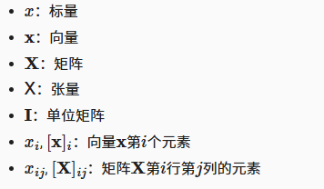
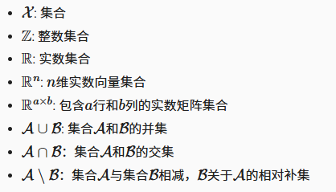
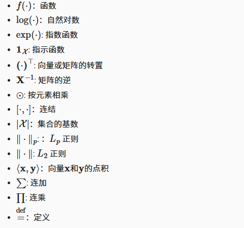
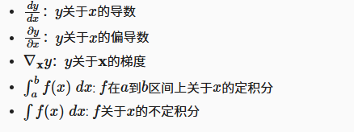
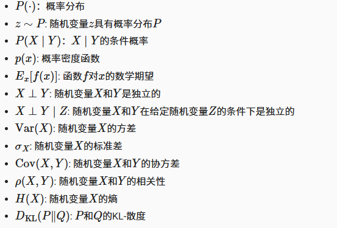

### 本书内容结构如下:


### 本书中常用的导入和引用模块
```py
#@save
import collections
import hashlib
import math
import os
import random
import re
import shutil
import sys
import tarfile
import time
import zipfile
from collections import defaultdict
import pandas as pd
import requests
from IPython import display
from matplotlib import pyplot as plt
from matplotlib_inline import backend_inline

d2l = sys.modules[__name__]
```

### 从pytorch中导入模块代码
```py
#@save
import numpy as np
import torch
import torchvision
from PIL import Image
from torch import nn
from torch.nn import functional as F
from torch.utils import data
from torchvision import transforms
```

## 环境配置

以下内容以 Windows11 操作系统、显卡 为 3060 为例

### [安装miniconda](https://conda.io/en/latest/miniconda.html)
安装完miniconda后使用以下命令创建以 `d2l` 命名的虚拟环境，并启动该虚拟环境

```sh
conda create --name d2l python=3.9 -y
conda activate d2l
```
PS:请务必使用以上命令中的 python 3.9，否则在后续的安装过程中会出现error

### 安装PyTorch
```sh
pip install torch==1.12.0
pip install torchvision==0.13.0
```
### 安装cuda

有独显需要安装[cuda](https://developer.nvidia.com/cuda-downloads)根据自己的显卡信息选择相应的cuda版本。
在cmd中使用 ``` nvidi-smi ``` 可以查看显卡信息。

### 安装d2l包
```sh
pip install d2l==0.17.6
```
### 下载本书的代码
```sh
mkdir d2l-zh && cd d2l-zh
curl https://zh-v2.d2l.ai/d2l-zh-2.0.0.zip -o d2l-zh.zip
unzip d2l-zh.zip && rm d2l-zh.zip
cd pytorch
```
在对应的目录下使用以下命令打开Jupyter笔记本
```sh
jupyter notebook
```
PS: 由于pip和conda默认下载的是无GPU版(版本后缀带CPU)，需要在PyTorch的官网中下载GPU版，通过以下命令可以下载。

```sh
pip install torch torchvision torchaudio --index-url https://download.pytorch.org/whl/cu126
```
验证环境配置是否完成如下:

```py
>>> import torch
>>> print(torch.__version__)
2.6.0+cu126
>>> torch.cuda.is_available()
True
```
最后出现True表示配置成功！

## 公式符号

### 数字：



### 集合论：



### 函数与运算符：



### 微积分：



### 概率与信号论：



### 复杂度：

