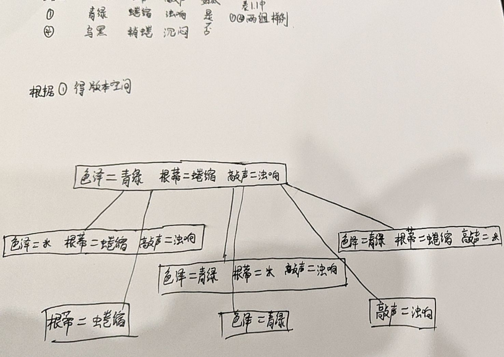

## P1:



## P2:

对于表1.1的西瓜问题，该数据集有3个属性，这些属性的特征值个数分别为2、3、3，所以当不存在通配符\*时，该数据集拥有2\*3\*3=18种合取式，存在通配符时的情况是冗余的。本人认为通过最多包含k个合取式的析合范式来表达西瓜问题的假设的种数就是从这18种合取式中选取合取式个数1到18进行排列组合。通过以下python代码进行答案求解

```py

def cal(l):
    ans = 1
    for i in l:
        ans *= i
    return ans

def C(k, n) -> int:
    total_up = cal([i for i in range(n - k + 1, n + 1)])
    total_down = cal([i for i in range(1, k + 1)])
    return total_up / total_down

def get_ans(n):
    ans = 0
    for i in range(1, n + 1):
        ans += C(i, n)
    return ans


# >>>get_ans(18)
# 262143.0
```

## P1.3

利用奥卡姆剃刀(Occam's razor)原则，选取最为简单的假设进行归纳偏好

## P1.4

## P1.5


