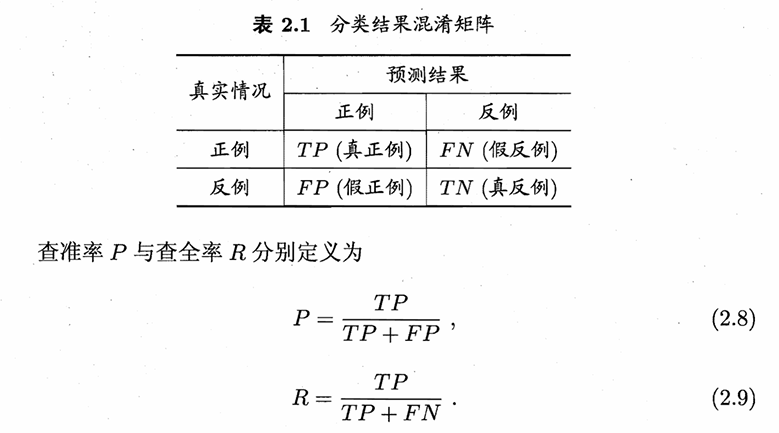
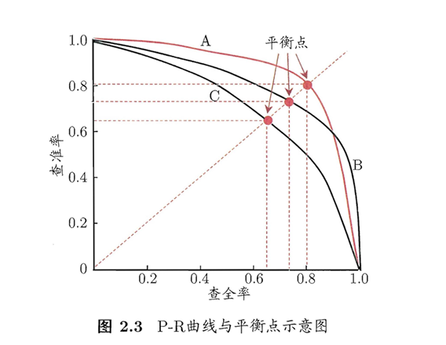
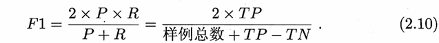
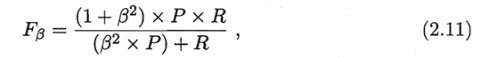

# 第二章 模型评估与选择

## 2.1 经验误差与过拟合

` 错误率 `：分类错误的样本数占样本总数的比例

` 精度 ` = 1 - 错误率

` 误差 `：学习器的实际预测输出与样本的真实输出之间的差异。(训练集上的叫训练误差，新样本上的叫泛化误差)

某些训练精度高的学习器，其泛化精度可能并不优秀，在训练集的训练过程中潜在将训练集中的普遍特点识别为新样本中的特点。此为 ` 过拟合 ` (与之相对的是欠拟合)。过拟合是无法避免的，只能缓解。

## 2.2 评估方法

使用` 测试集 `来测试学习器的泛化能力，以` 测试误差 `作为泛化误差的近似来评估学习器的能力。测试集与训练集应互斥

### 2.2.1 留出法：直接将数据集划分为两个互斥的集合分别作为训练集与测试集。（训练集与测试集类别的比例要相似，比列差别很大会产生误差，保留类别比例的采样方法称为“分层采样”）

关于测试集占数据集中的比例最好在2/3 ~ 4/5之间最好。

### 2.2.2 交叉验证法：将数据集平等地划分为k份的互斥子集，每个子集都通过分层采样进行划分，每次用k-1份子集进行训练，剩下那份作为测试。这样就得多k份训练/测试集。(k通常为10)

### 2.2.3 自助法：直接以自助采样，类似于有放回取球问题。每次在数据集中取一个数据样本，重复m次，有些样本可能被重复取，有些样本可能一直未被取。

$$\lim_{m \to \infty}(1 - \frac{1}{m})^m = e^{-1} $$

数据量充足的情况下，前两种方法更好，相反之，自助法有一定优势。

### 2.2.4 调参与最终模型：学习算法需要进行参数设定，简称“调参”。调参会影响最终模型性能。

## 2.3 性能度量

衡量模型泛化能力的评价标准便是性能度量。

回归任务最常用的性能度量是“均方误差”

### 2.3.1 错误率与精度：记录于2.1

### 2.3.2 查准率、查全率与F1

查准率与查全率是一对矛盾的度量。查准率可通俗的认为是预测准确率，查全率是正例中预测正确的比率

学习器的P-R 曲线被另一个学习器的曲线完全"包住" ， 则可断言后者的性能优于前者，所以学习器A的性能优于学习器C。PS:P-R曲线与坐标轴的面积应可以算评判学习性能的因素，但P-R曲线是许多离散点构成的，不是固定的单个函数，难以通过积分工具进行计算。

` 平衡点 `：P = R 时的点，可以理解与$ y = x $ 的交点，平衡点的数值越大，可以说明该学习器的性能越强

` F1度量 `：

` F1 度量的一般形式 `:  ß>O度量了查全率对查准率的相对重要性ß = 1时退化为标准的F1; ß> 1 时查全率有更大影响; ß < 1 时查准率有更大影响.

` 宏{度量单位名} `：例如：宏查准率就是多个矩阵计算出各自查准率，并计算平均值。

### 2.3.3 ROC与AUC