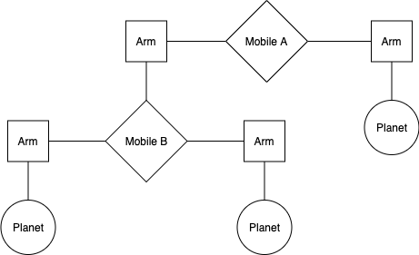
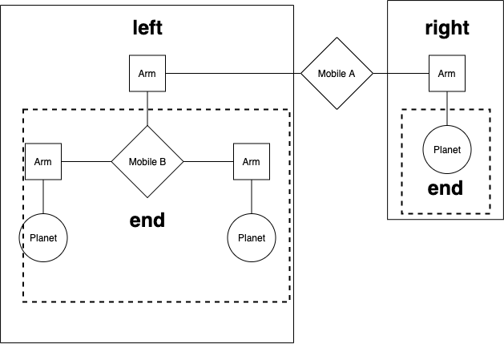
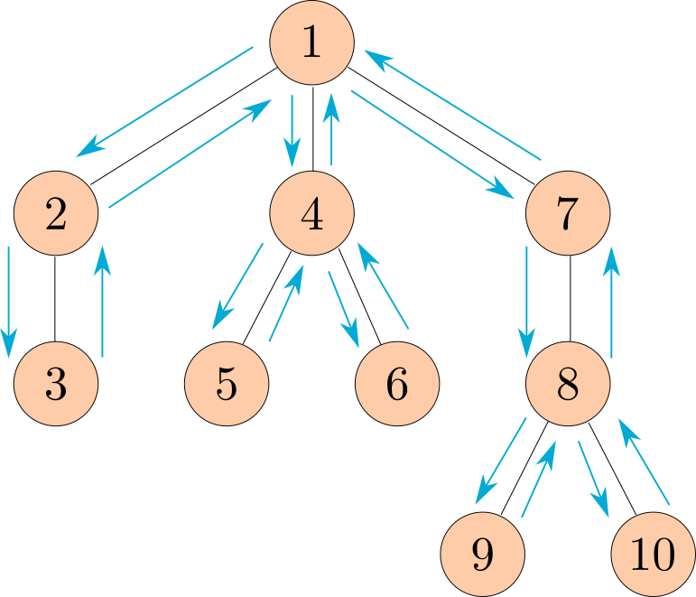

# Homework 3: Trees, Data Abstraction


> Adapted from cs61a of UC Berkeley.


## Instructions

**Readings:** You might find the following references useful:

- [Section 2.2](http://composingprograms.com/pages/22-data-abstraction.html)
- [Section 2.3](http://composingprograms.com/pages/23-sequences.html)


## Starter Files

Get your starter file by cloning the repository: https://github.com/JacyCui/sicp-hw03.git

```shell
git clone https://github.com/JacyCui/sicp-hw03.git
```

`hw03.zip` is the starter file you need, you might need to unzip the file to get the skeleton code.

```shell
unzip hw03.zip
```

`README.md` is the handout for this homework. `solution` is a probrab solution of the homework. However, I might not give my solution exactly when the homework is posted. You need to finish the task on your own first. If any problems occurs, please make use of the comment section.


## Required questions

### Abstraction

#### Mobiles



We are making a planetarium mobile. A mobile is a type of hanging sculpture. A binary mobile consists of two arms. Each arm is a rod of a certain length, from which hangs either a planet or another mobile. For example, the below diagram shows the left and right arms of Mobile A, and what hangs at the ends of each of those arms.



We will represent a binary mobile using the data abstractions below.

- A `mobile` must have both a left `arm` and a right `arm`.
- An `arm` has a positive length and must have something hanging at the end, either a `mobile` or `planet`.
- A `planet` has a positive size, and nothing hanging from it.

#### Arms-length recursion (sidenote)

Before we get started, a quick comment on recursion with tree data structures. Consider the following function.

```python
def min_depth(t):
    """A simple function to return the distance between t's root and its closest leaf"""
    if is_leaf(t):
        return 0 # Base case---the distance between a node and itself is zero
    h = float('inf') # Python's version of infinity
    for b in branches(t):
        if is_leaf(b): return 1 # !!!
        h = min(h, 1 + min_depth(b))
    return h
```

The line flagged with `!!!` is an "arms-length" recursion violation. Although our code works correctly when it is present, by performing this check we are doing work that should be done by the next level of recursion—we already have an if-statement that handles any inputs to `min_depth` that are leaves, so we should not include this line to eliminate redundancy in our code.

```python
def min_depth(t):
    """A simple function to return the distance between t's root and its closest leaf"""
    if is_leaf(t):
        return 0
    h = float('inf')
    for b in branches(t):
        # Still works fine!
        h = min(h, 1 + min_depth(b))
    return h
```

Arms-length recursion is not only redundant but often complicates our code and obscures the functionality of recursive functions, making writing recursive functions much more difficult. We always want our recursive case to be handling one and only one recursive level. We may or may not be checking your code periodically for things like this.


#### Q1: Weights

Implement the `planet` data abstraction by completing the `planet` constructor and the `size` selector so that a planet is represented using a two-element list where the first element is the string `'planet'` and the second element is its size. The `total_weight` example is provided to demonstrate use of the mobile, arm, and planet abstractions.

```python
def mobile(left, right):
    """Construct a mobile from a left arm and a right arm."""
    assert is_arm(left), "left must be a arm"
    assert is_arm(right), "right must be a arm"
    return ['mobile', left, right]

def is_mobile(m):
    """Return whether m is a mobile."""
    return type(m) == list and len(m) == 3 and m[0] == 'mobile'

def left(m):
    """Select the left arm of a mobile."""
    assert is_mobile(m), "must call left on a mobile"
    return m[1]

def right(m):
    """Select the right arm of a mobile."""
    assert is_mobile(m), "must call right on a mobile"
    return m[2]
```

```python
def arm(length, mobile_or_planet):
    """Construct a arm: a length of rod with a mobile or planet at the end."""
    assert is_mobile(mobile_or_planet) or is_planet(mobile_or_planet)
    return ['arm', length, mobile_or_planet]

def is_arm(s):
    """Return whether s is a arm."""
    return type(s) == list and len(s) == 3 and s[0] == 'arm'

def length(s):
    """Select the length of a arm."""
    assert is_arm(s), "must call length on a arm"
    return s[1]

def end(s):
    """Select the mobile or planet hanging at the end of a arm."""
    assert is_arm(s), "must call end on a arm"
    return s[2]
```

```python
def planet(size):
    """Construct a planet of some size."""
    assert size > 0
    "*** YOUR CODE HERE ***"

def size(w):
    """Select the size of a planet."""
    assert is_planet(w), 'must call size on a planet'
    "*** YOUR CODE HERE ***"

def is_planet(w):
    """Whether w is a planet."""
    return type(w) == list and len(w) == 2 and w[0] == 'planet'
```

```python
def total_weight(m):
    """Return the total weight of m, a planet or mobile.

    >>> t, u, v = examples()
    >>> total_weight(t)
    3
    >>> total_weight(u)
    6
    >>> total_weight(v)
    9
    >>> from construct_check import check
    >>> # checking for abstraction barrier violations by banning indexing
    >>> check(HW_SOURCE_FILE, 'total_weight', ['Index'])
    True
    """
    if is_planet(m):
        return size(m)
    else:
        assert is_mobile(m), "must get total weight of a mobile or a planet"
        return total_weight(end(left(m))) + total_weight(end(right(m)))
```

Use Ok to test your code:

```shell
python3 ok -q total_weight --local
```


#### Q2: Balanced

Implement the `balanced` function, which returns whether `m` is a balanced mobile. A mobile is balanced if two conditions are met:

1. The torque applied by its left arm is equal to that applied by its right arm. The torque of the left arm is the length of the left rod multiplied by the total weight hanging from that rod. Likewise for the right. For example, if the left arm has a length of `5`, and there is a `mobile` hanging at the end of the left arm of weight `10`, the torque on the left side of our mobile is `50`.
2. Each of the mobiles hanging at the end of its arms is balanced.

Planets themselves are balanced, as there is nothing hanging off of them.

```python
def balanced(m):
    """Return whether m is balanced.

    >>> t, u, v = examples()
    >>> balanced(t)
    True
    >>> balanced(v)
    True
    >>> w = mobile(arm(3, t), arm(2, u))
    >>> balanced(w)
    False
    >>> balanced(mobile(arm(1, v), arm(1, w)))
    False
    >>> balanced(mobile(arm(1, w), arm(1, v)))
    False
    >>> from construct_check import check
    >>> # checking for abstraction barrier violations by banning indexing
    >>> check(HW_SOURCE_FILE, 'balanced', ['Index'])
    True
    """
    "*** YOUR CODE HERE ***"
```

Use Ok to test your code:

```shell
python3 ok -q balanced --local
```


#### Q3:  Totals

Implement `totals_tree`, which takes a `mobile` (or `planet`) and returns a `tree` whose root is the total weight of the input. For a `planet`, `totals_tree` should return a leaf. For a `mobile`, `totals_tree` should return a tree whose label is that `mobile`'s total weight, and whose branches are `totals_tree`s for the ends of its arms.

```python
def totals_tree(m):
    """Return a tree representing the mobile with its total weight at the root.

    >>> t, u, v = examples()
    >>> print_tree(totals_tree(t))
    3
      2
      1
    >>> print_tree(totals_tree(u))
    6
      1
      5
        3
        2
    >>> print_tree(totals_tree(v))
    9
      3
        2
        1
      6
        1
        5
          3
          2
    >>> from construct_check import check
    >>> # checking for abstraction barrier violations by banning indexing
    >>> check(HW_SOURCE_FILE, 'totals_tree', ['Index'])
    True
    """
    "*** YOUR CODE HERE ***"
```

Use Ok to test your code:

```shell
python3 ok -q totals_tree --local
```


### Trees

#### Q4: Replace Leaf

Define `replace_leaf`, which takes a tree `t`, a value `find_value`, and a value `replace_value`. `replace_leaf` returns a new tree that's the same as `t` except that every leaf label equal to `find_value` has been replaced with `replace_value`.

```python
def replace_leaf(t, find_value, replace_value):
    """Returns a new tree where every leaf value equal to find_value has
    been replaced with replace_value.

    >>> yggdrasil = tree('odin',
    ...                  [tree('balder',
    ...                        [tree('thor'),
    ...                         tree('freya')]),
    ...                   tree('frigg',
    ...                        [tree('thor')]),
    ...                   tree('thor',
    ...                        [tree('sif'),
    ...                         tree('thor')]),
    ...                   tree('thor')])
    >>> laerad = copy_tree(yggdrasil) # copy yggdrasil for testing purposes
    >>> print_tree(replace_leaf(yggdrasil, 'thor', 'freya'))
    odin
      balder
        freya
        freya
      frigg
        freya
      thor
        sif
        freya
      freya
    >>> laerad == yggdrasil # Make sure original tree is unmodified
    True
    """
    "*** YOUR CODE HERE ***"
```

Use Ok to test your code:

```shell
python3 ok -q replace_leaf --local
```


#### Q5: Preorder

Define the function `preorder`, which takes in a tree as an argument and returns a list of all the entries in the tree in the order that `print_tree` would print them.

The following diagram shows the order that the nodes would get printed, with the arrows representing function calls.



> *Note*: This ordering of the nodes in a tree is called a preorder traversal.

```python
def preorder(t):
    """Return a list of the entries in this tree in the order that they
    would be visited by a preorder traversal (see problem description).

    >>> numbers = tree(1, [tree(2), tree(3, [tree(4), tree(5)]), tree(6, [tree(7)])])
    >>> preorder(numbers)
    [1, 2, 3, 4, 5, 6, 7]
    >>> preorder(tree(2, [tree(4, [tree(6)])]))
    [2, 4, 6]
    """
    "*** YOUR CODE HERE ***"
```

Use Ok to test your code:

```shell
python3 ok -q preorder --local
```


#### Q6: Has Path

Write a function `has_path` that takes in a tree `t` and a string `word`. It returns `True` if there is a path that starts from the root where the entries along the path spell out the `word`, and `False` otherwise. (This data structure is called a trie, and it has a lot of cool applications!---think autocomplete). You may assume that every node's `label` is exactly one character.

```python
def has_path(t, word):
    """Return whether there is a path in a tree where the entries along the path
    spell out a particular word.

    >>> greetings = tree('h', [tree('i'),
    ...                        tree('e', [tree('l', [tree('l', [tree('o')])]),
    ...                                   tree('y')])])
    >>> print_tree(greetings)
    h
      i
      e
        l
          l
            o
        y
    >>> has_path(greetings, 'h')
    True
    >>> has_path(greetings, 'i')
    False
    >>> has_path(greetings, 'hi')
    True
    >>> has_path(greetings, 'hello')
    True
    >>> has_path(greetings, 'hey')
    True
    >>> has_path(greetings, 'bye')
    False
    """
    assert len(word) > 0, 'no path for empty word.'
    "*** YOUR CODE HERE ***"
```

Use Ok to test your code:

```shell
python3 ok -q has_path --local
```


## Extra Questions

### Q7: Interval Abstraction

Alyssa's program is incomplete because she has not specified the implementation of the interval abstraction. She has implemented the constructor for you; fill in the implementation of the selectors.

```python
def interval(a, b):
    """Construct an interval from a to b."""
    return [a, b]

def lower_bound(x):
    """Return the lower bound of interval x."""
    "*** YOUR CODE HERE ***"

def upper_bound(x):
    """Return the upper bound of interval x."""
    "*** YOUR CODE HERE ***"
```

Use Ok to unlock and test your code:

```shell
python3 ok -q interval -u --local
python3 ok -q interval --local
```

Louis Reasoner has also provided an implementation of interval multiplication. Beware: there are some data abstraction violations, so help him fix his code before someone sets it on fire.

```python
def mul_interval(x, y):
    """Return the interval that contains the product of any value in x and any
    value in y."""
    p1 = x[0] * y[0]
    p2 = x[0] * y[1]
    p3 = x[1] * y[0]
    p4 = x[1] * y[1]
    return [min(p1, p2, p3, p4), max(p1, p2, p3, p4)]
```

Use Ok to unlock and test your code:

```shell
python3 ok -q mul_interval -u --local
python3 ok -q mul_interval --local
```


### Q8: Sub Interval

Using reasoning analogous to Alyssa's, define a subtraction function for intervals. Try to reuse functions that have already been implemented if you find yourself repeating code.

```python
def sub_interval(x, y):
    """Return the interval that contains the difference between any value in x
    and any value in y."""
    "*** YOUR CODE HERE ***"
```

Use Ok to unlock and test your code:

```shell
python3 ok -q sub_interval -u --local
python3 ok -q sub_interval --local
```


### Q9: Div Interval

Alyssa implements division below by multiplying by the reciprocal of `y`. Ben Bitdiddle, an expert systems programmer, looks over Alyssa's shoulder and comments that it is not clear what it means to divide by an interval that spans zero. Add an `assert` statement to Alyssa's code to ensure that no such interval is used as a divisor:

```python
def div_interval(x, y):
    """Return the interval that contains the quotient of any value in x divided by
    any value in y. Division is implemented as the multiplication of x by the
    reciprocal of y."""
    "*** YOUR CODE HERE ***"
    reciprocal_y = interval(1/upper_bound(y), 1/lower_bound(y))
    return mul_interval(x, reciprocal_y)
```

Use Ok to unlock and test your code:

```shell
python3 ok -q div_interval -u --local
python3 ok -q div_interval --local
```


### Q10: Par Diff

After considerable work, Alyssa P. Hacker delivers her finished system. Several years later, after she has forgotten all about it, she gets a frenzied call from an irate user, Lem E. Tweakit. It seems that Lem has noticed that the formula for parallel resistors can be written in two algebraically equivalent ways:

```python
par1(r1, r2) = (r1 * r2) / (r1 + r2)
```

or

```python
par2(r1, r2) = 1 / (1/r1 + 1/r2)
```

He has written the following two programs, each of which computes the `parallel_resistors` formula differently::

```python
def par1(r1, r2):
    return div_interval(mul_interval(r1, r2), add_interval(r1, r2))

def par2(r1, r2):
    one = interval(1, 1)
    rep_r1 = div_interval(one, r1)
    rep_r2 = div_interval(one, r2)
    return div_interval(one, add_interval(rep_r1, rep_r2))
```

Lem complains that Alyssa's program gives different answers for the two ways of computing. This is a serious complaint.

Demonstrate that Lem is right. Investigate the behavior of the system on a variety of arithmetic expressions. Make some intervals `r1` and `r2`, and show that `par1` and `par2` can give different results.

```python
def check_par():
    """Return two intervals that give different results for parallel resistors.

    >>> r1, r2 = check_par()
    >>> x = par1(r1, r2)
    >>> y = par2(r1, r2)
    >>> lower_bound(x) != lower_bound(y) or upper_bound(x) != upper_bound(y)
    True
    """
    r1 = interval(1, 1) # Replace this line!
    r2 = interval(1, 1) # Replace this line!
    return r1, r2
```

Use Ok to test your code:

```shell
python3 ok -q check_par --local
```


### Q11: Multiple References

Eva Lu Ator, another user, has also noticed the different intervals computed by different but algebraically equivalent expressions. She says that the problem is multiple references to the same interval.

The Multiple References Problem: a formula to compute with intervals using Alyssa's system will produce tighter error bounds if it can be written in such a form that no variable that represents an uncertain number is repeated.

Thus, she says, `par2` is a better program for parallel resistances than `par1` (see Q10: Par Diff for these functions!). Is she right? Why? Write a function that returns a string containing a written explanation of your answer:

Note: To make a multi-line string, you must use triple quotes `""" like this """`.

```python
def multiple_references_explanation():
    return """The multiple reference problem..."""
```


### Q12: Quadratic

Write a function `quadratic` that returns the interval of all values `f(t)` such that `t` is in the argument interval `x` and `f(t)` is a quadratic function:

```
f(t) = a*t*t + b*t + c
```

Make sure that your implementation returns the smallest such interval, one that does not suffer from the multiple references problem.

*Hint*: the derivative `f'(t) = 2*a*t + b`, and so the extreme point of the quadratic is `-b/(2*a)`:

```python
def quadratic(x, a, b, c):
    """Return the interval that is the range of the quadratic defined by
    coefficients a, b, and c, for domain interval x.

    >>> str_interval(quadratic(interval(0, 2), -2, 3, -1))
    '-3 to 0.125'
    >>> str_interval(quadratic(interval(1, 3), 2, -3, 1))
    '0 to 10'
    """
    "*** YOUR CODE HERE ***"
```

Use Ok to test your code:

```shell
python3 ok -q quadratic --local
```


Finally, you can run doctest to check your answer again.

```shell
python3 -m doctest hw03.py
```

