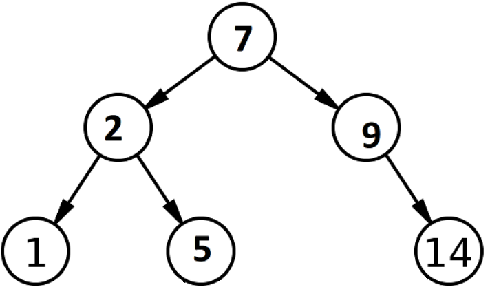

# Homework 5: Object-Oriented Programming, Linked Lists, Trees


> Adapted from cs61a of UC Berkeley.


## Readings

You might find the following references useful:

- [Section 2.5](http://composingprograms.com/pages/25-object-oriented-programming.html)
- [Section 2.9](http://composingprograms.com/pages/29-recursive-objects.html)


## Starter Files

Get your starter file by cloning the repository: https://github.com/JacyCui/sicp-hw05.git

```shell
git clone https://github.com/JacyCui/sicp-hw05.git
```

`hw05.zip` is the starter file you need, you might need to unzip the file to get the skeleton code.

```shell
unzip hw05.zip
```

`README.md` is the handout for this homework. `solution` is a probrab solution of the homework. However, I might not give my solution exactly when the homework is posted. You need to finish the task on your own first. If any problems occurs, please make use of the comment section.


## Required Questions

### OOP

#### Q1: Vending Machine

Create a class called `VendingMachine` that represents a vending machine for some product. A `VendingMachine` object returns strings describing its interactions.

Fill in the `VendingMachine` class, adding attributes and methods as appropriate, such that its behavior matches the following doctests:

```python
class VendingMachine:
    """A vending machine that vends some product for some price.

    >>> v = VendingMachine('candy', 10)
    >>> v.vend()
    'Inventory empty. Restocking required.'
    >>> v.add_funds(15)
    'Inventory empty. Restocking required. Here is your $15.'
    >>> v.restock(2)
    'Current candy stock: 2'
    >>> v.vend()
    'You must add $10 more funds.'
    >>> v.add_funds(7)
    'Current balance: $7'
    >>> v.vend()
    'You must add $3 more funds.'
    >>> v.add_funds(5)
    'Current balance: $12'
    >>> v.vend()
    'Here is your candy and $2 change.'
    >>> v.add_funds(10)
    'Current balance: $10'
    >>> v.vend()
    'Here is your candy.'
    >>> v.add_funds(15)
    'Inventory empty. Restocking required. Here is your $15.'

    >>> w = VendingMachine('soda', 2)
    >>> w.restock(3)
    'Current soda stock: 3'
    >>> w.restock(3)
    'Current soda stock: 6'
    >>> w.add_funds(2)
    'Current balance: $2'
    >>> w.vend()
    'Here is your soda.'
    """
    "*** YOUR CODE HERE ***"
```

> You may find [Python string formatting syntax](https://docs.python.org/2/library/stdtypes.html#str.format) useful. A quick example:
>
> ```python
> >>> ten, twenty, thirty = 10, 'twenty', [30]
> >>> '{0} plus {1} is {2}'.format(ten, twenty, thirty)
> '10 plus twenty is [30]'
> ```

Use Ok to test your code:

```shell
python3 ok -q VendingMachine --local
```


#### Q2: Mint

Complete the `Mint` and `Coin` classes so that the coins created by a mint have the correct year and worth.

- Each `Mint` instance has a `year` stamp. The `update` method sets the `year` stamp to the `current_year` class attribute of the `Mint` class.
- The `create` method takes a subclass of `Coin` and returns an instance of that class stamped with the `mint`'s year (which may be different from `Mint.current_year` if it has not been updated.)
- A `Coin`'s `worth` method returns the `cents` value of the coin plus one extra cent for each year of age beyond 50. A coin's age can be determined by subtracting the coin's year from the `current_year` class attribute of the `Mint` class.

```python
class Mint:
    """A mint creates coins by stamping on years.

    The update method sets the mint's stamp to Mint.current_year.

    >>> mint = Mint()
    >>> mint.year
    2020
    >>> dime = mint.create(Dime)
    >>> dime.year
    2020
    >>> Mint.current_year = 2100  # Time passes
    >>> nickel = mint.create(Nickel)
    >>> nickel.year     # The mint has not updated its stamp yet
    2020
    >>> nickel.worth()  # 5 cents + (80 - 50 years)
    35
    >>> mint.update()   # The mint's year is updated to 2100
    >>> Mint.current_year = 2175     # More time passes
    >>> mint.create(Dime).worth()    # 10 cents + (75 - 50 years)
    35
    >>> Mint().create(Dime).worth()  # A new mint has the current year
    10
    >>> dime.worth()     # 10 cents + (155 - 50 years)
    115
    >>> Dime.cents = 20  # Upgrade all dimes!
    >>> dime.worth()     # 20 cents + (155 - 50 years)
    125
    """
    current_year = 2020

    def __init__(self):
        self.update()

    def create(self, kind):
        "*** YOUR CODE HERE ***"

    def update(self):
        "*** YOUR CODE HERE ***"

class Coin:
    def __init__(self, year):
        self.year = year

    def worth(self):
        "*** YOUR CODE HERE ***"

class Nickel(Coin):
    cents = 5

class Dime(Coin):
    cents = 10
```

Use Ok to test your code:

```shell
python3 ok -q Mint --local
```


### Linked Lists

#### Q3: Store Digits

Write a function `store_digits` that takes in an integer `n` and returns a linked list where each element of the list is a digit of `n`.

> Note: do not use any string manipulation functions like `str` and `reversed`

```python
def store_digits(n):
    """Stores the digits of a positive number n in a linked list.

    >>> s = store_digits(1)
    >>> s
    Link(1)
    >>> store_digits(2345)
    Link(2, Link(3, Link(4, Link(5))))
    >>> store_digits(876)
    Link(8, Link(7, Link(6)))
    >>> # a check for restricted functions
    >>> import inspect, re
    >>> cleaned = re.sub(r"#.*\\n", '', re.sub(r'"{3}[\s\S]*?"{3}', '', inspect.getsource(store_digits)))
    >>> print("Do not use str or reversed!") if any([r in cleaned for r in ["str", "reversed"]]) else None
    """
    "*** YOUR CODE HERE ***"
```

Use Ok to test your code:

```shell
python3 ok -q store_digits --local
```


## Extra Questions

### Trees

#### Q4: Is BST

Write a function `is_bst`, which takes a Tree `t` and returns `True` if, and only if, `t` is a valid binary search tree, which means that:

- Each node has at most two children (a leaf is automatically a valid binary search tree)
- The children are valid binary search trees
- For every node, the entries in that node's left child are less than or equal to the label of the node
- For every node, the entries in that node's right child are greater than the label of the node

An example of a BST is:



Note that, if a node has only one child, that child could be considered either the left or right child. You should take this into consideration.

> *Hint:* It may be helpful to write helper functions `bst_min` and `bst_max` that return the minimum and maximum, respectively, of a Tree if it is a valid binary search tree.

```python
def is_bst(t):
    """Returns True if the Tree t has the structure of a valid BST.

    >>> t1 = Tree(6, [Tree(2, [Tree(1), Tree(4)]), Tree(7, [Tree(7), Tree(8)])])
    >>> is_bst(t1)
    True
    >>> t2 = Tree(8, [Tree(2, [Tree(9), Tree(1)]), Tree(3, [Tree(6)]), Tree(5)])
    >>> is_bst(t2)
    False
    >>> t3 = Tree(6, [Tree(2, [Tree(4), Tree(1)]), Tree(7, [Tree(7), Tree(8)])])
    >>> is_bst(t3)
    False
    >>> t4 = Tree(1, [Tree(2, [Tree(3, [Tree(4)])])])
    >>> is_bst(t4)
    True
    >>> t5 = Tree(1, [Tree(0, [Tree(-1, [Tree(-2)])])])
    >>> is_bst(t5)
    True
    >>> t6 = Tree(1, [Tree(4, [Tree(2, [Tree(3)])])])
    >>> is_bst(t6)
    True
    >>> t7 = Tree(2, [Tree(1, [Tree(5)]), Tree(4)])
    >>> is_bst(t7)
    False
    """
    "*** YOUR CODE HERE ***"
```

Use Ok to test your code:

```shell
python3 ok -q is_bst --local
```


#### Q5: Preorder

Define the function `preorder`, which takes in a tree as an argument and returns a list of all the entries in the tree in the order that `print_tree` would print them.

The following diagram shows the order that the nodes would get printed, with the arrows representing function calls.


> *Note*: This ordering of the nodes in a tree is called a preorder traversal.

```python
def preorder(t):
    """Return a list of the entries in this tree in the order that they
    would be visited by a preorder traversal (see problem description).

    >>> numbers = Tree(1, [Tree(2), Tree(3, [Tree(4), Tree(5)]), Tree(6, [Tree(7)])])
    >>> preorder(numbers)
    [1, 2, 3, 4, 5, 6, 7]
    >>> preorder(Tree(2, [Tree(4, [Tree(6)])]))
    [2, 4, 6]
    """
    "*** YOUR CODE HERE ***"
```

Use Ok to test your code:

```shell
python3 ok -q preorder --local
```


### Generators/Trees

#### Q6: Yield Paths

Define a generator function `path_yielder` which takes in a Tree `t`, a value `value`, and returns a generator object which yields each path from the root of `t` to a node that has label `value`.

`t` is implemented with a class, not as the function-based ADT.

Each path should be represented as a list of the labels along that path in the tree. You may yield the paths in any order.

We have provided a (partial) skeleton for you. You do not need to use this skeleton, but if your implementation diverges significantly from it, you might want to think about how you can get it to fit the skeleton.

```python
def path_yielder(t, value):
    """Yields all possible paths from the root of t to a node with the label value
    as a list.

    >>> t1 = Tree(1, [Tree(2, [Tree(3), Tree(4, [Tree(6)]), Tree(5)]), Tree(5)])
    >>> print(t1)
    1
      2
        3
        4
          6
        5
      5
    >>> next(path_yielder(t1, 6))
    [1, 2, 4, 6]
    >>> path_to_5 = path_yielder(t1, 5)
    >>> sorted(list(path_to_5))
    [[1, 2, 5], [1, 5]]

    >>> t2 = Tree(0, [Tree(2, [t1])])
    >>> print(t2)
    0
      2
        1
          2
            3
            4
              6
            5
          5
    >>> path_to_2 = path_yielder(t2, 2)
    >>> sorted(list(path_to_2))
    [[0, 2], [0, 2, 1, 2]]
    """

    "*** YOUR CODE HERE ***"

    for _______________ in _________________:
        for _______________ in _________________:

            "*** YOUR CODE HERE ***"
```

> Hint: If you're having trouble getting started, think about how you'd approach this problem if it wasn't a generator function. What would your recursive calls be? With a generator function, what happens if you make a "recursive call" within its body?

Use Ok to test your code:

```shell
python3 ok -q path_yielder --local
```


Finally, you can run doctest to check your answer again.

```shell
python3 -m doctest hw05.py
```
