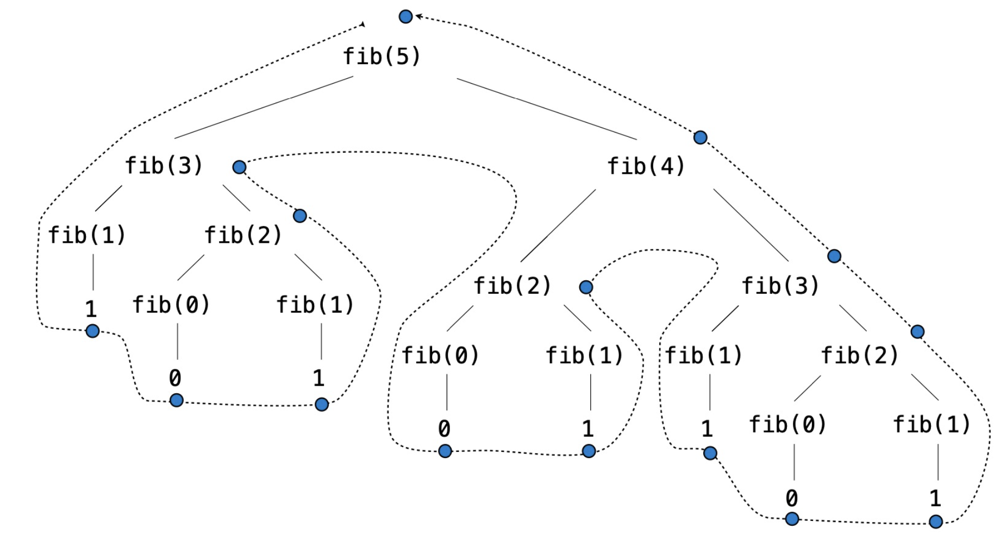
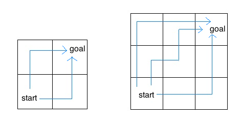

# Lab 4: Recursion, Tree Recursion, Python Lists


> Adapted from cs61a of UC Berkeley.


## Starter Files

Get your starter file by cloning the repository: https://github.com/JacyCui/sicp-lab04.git

```shell
git clone https://github.com/JacyCui/sicp-lab04.git
```

`lab04.zip` is the starter file you need, you might need to unzip the file to get the skeleton code.

```shell
unzip lab04.zip
```

`README.md` is the handout for this homework. `solution` is a probrab solution of the lab. However, I might not give my solution exactly when the lab is posted. You need to finish the task on your own first. If any problem occurs, please make use of the comment section.


## Topics

Consult this section if you need a refresher on the material for this lab. It's okay to skip directly to the questions and refer back here should you get stuck.


### Recursion

A recursive function is a function that calls itself in its body, either directly or indirectly. Recursive functions have three important components:

1. Base case(s), the simplest possible form of the problem you're trying to solve.
2. Recursive case(s), where the function calls itself with a *simpler argument* as part of the computation.
3. Using the recursive calls to solve the full problem.

Let's look at the canonical example, `factorial`.

> Factorial, denoted with the `!` operator, is defined as:
>
> ```python
> n! = n * (n-1) * ... * 1
> ```
>
> For example, `5! = 5 * 4 * 3 * 2 * 1 = 120`。

The recursive implementation for factorial is as follows:

```python
def factorial(n):
    if n == 0:
        return 1
    return n * factorial(n - 1)
```

We know from its definition that 0! is 1. Since `n == 0` is the smallest number we can compute the factorial of, we use it as our base case. The recursive step also follows from the definition of factorial, i.e., `n! = n * (n-1)!`.

The next few questions in lab will have you writing recursive functions. Here are some general tips:

- Paradoxically, to write a recursive function, you must assume that the function is fully functional before you finish writing it; this is called the *recursive leap of faith*.
- Consider how you can solve the current problem using the solution to a simpler version of the problem. The amount of work done in a recursive function can be deceptively little: remember to take the leap of faith and *trust the recursion* to solve the slightly smaller problem without worrying about how.
- Think about what the answer would be in the simplest possible case(s). These will be your base cases - the stopping points for your recursive calls. Make sure to consider the possibility that you're missing base cases (this is a common way recursive solutions fail).
- It may help to write an iterative version first.


### Tree Recursion

A tree recursive function is a recursive function that makes more than one call to itself, resulting in a tree-like series of calls.

A classic example of a tree recursion function is finding the nth Fibonacci number:

```python
def fib(n):
    if n == 0 or n == 1:
        return n
    return fib(n - 1) + fib(n - 2)
```

Calling `fib(5)` results in the following call structure:



Each `f(i)` node represents a recursive call to `fib`. Each recursive call makes another two recursive calls. `f(0)` and `f(1)` do not make any recursive calls because they are the base cases of the function. Because of these base cases, we are able to terminate the recursion and beginning accumulating the values.

Generally, tree recursion is effective when you want to explore multiple possibilities or choices at a single step. In these types of problems, you make a recursive call for each choice or for a group of choices. 


### Lists

Lists are Python data structures that can store multiple values. Each value can be any type and can even be another list! A list is written as a comma separated list of expressions within square brackets:

```python
>>> list_of_nums = [1, 2, 3, 4]
>>> list_of_bools = [True, True, False, False]
>>> nested_lists = [1, [2, 3], [4, [5]]]
```

Each element in a list is assigned an index. Lists are *zero-indexed*, meaning their indices start at `0` and increase in sequential order. To retrieve an element from a list, use list indexing:

```python
>>> lst = [6, 5, 4, 3, 2, 1]
>>> lst[0]
6
>>> lst[3]
3
```

Often times we need to know how long a list is when we're working with it. To find the length of a list, call the function `len` on it:

```python
>>> len([])
0
>>> len([2, 4, 6, 8, 10])
5
```

> **Tip:** Recall that empty lists, `[]`, are falsey values. Therefore, you can use an if statement like the following if you only want to do operations on non-empty lists:
>
> ```python
> if lst:
>     # Do stuff with the elements of list
> ```
>
> This is equivalent to:
>
> ```python
> if len(lst) > 0:
>     # Do stuff
> ```

You can also create a copy of some portion of the list using list slicing. To slice a list, use this syntax: `lst[<start index>:<end index>]`. This expression evaluates to a new list containing the elements of `lst` starting at and including the element at `<start index>` up to but not including the element at `end index`.

```python
>>> lst = [True, False, True, True, False]
>>> lst[1:4]
[False, True, True]
>>> lst[:3]  # Start index defaults to 0
[True, False, True]
>>> lst[3:]  # End index defaults to len(lst)
[True, False]
>>> lst[:]  # Creates a copy of the whole list
[True, False, True, True, False]
```


## Required Questions

### Lists Practice

#### Q1: List Indexing

> Use Ok to test your knowledge with the following "List Indexing" questions:
>
> ```shell
> python3 ok -q list-indexing -u --local
> ```

For each of the following lists, what is the list indexing expression that evaluates to `7`? For example, if `x = [7]`, then the answer would be `x[0]`. You can use the interpreter or Python Tutor to experiment with your answers. If the code would cause an error, type `Error`.

```python
>>> x = [1, 3, [5, 7], 9]
______

>>> x = [[3, [5, 7], 9]]
______
```

What would Python display? If you get stuck, try it out in the Python interpreter!

```python
>>> lst = [3, 2, 7, [84, 83, 82]]
>>> lst[4]
______

>>> lst[3][0]
______
```


### Recursion

#### Q2: Skip Add

Write a function `skip_add` that takes a single argument `n` and computes the sum of every other integer between `0` and `n`. Assume `n` is non-negative.

```python
this_file = __file__

def skip_add(n):
    """ Takes a number n and returns n + n-2 + n-4 + n-6 + ... + 0.

    >>> skip_add(5)  # 5 + 3 + 1 + 0
    9
    >>> skip_add(10) # 10 + 8 + 6 + 4 + 2 + 0
    30
    >>> # Do not use while/for loops!
    >>> from construct_check import check
    >>> # ban iteration
    >>> check(this_file, 'skip_add',
    ...       ['While', 'For'])
    True
    """
    "*** YOUR CODE HERE ***"
```

Use Ok to test your code:

```shell
python3 ok -q skip_add --local
```

#### Q3: Summation

Now, write a recursive implementation of `summation`, which takes a positive integer `n` and a function `term`. It applies `term` to every number from `1` to `n` including `n` and returns the sum of the results.

```python
def summation(n, term):

    """Return the sum of the first n terms in the sequence defined by term.
    Implement using recursion!

    >>> summation(5, lambda x: x * x * x) # 1^3 + 2^3 + 3^3 + 4^3 + 5^3
    225
    >>> summation(9, lambda x: x + 1) # 2 + 3 + 4 + 5 + 6 + 7 + 8 + 9 + 10
    54
    >>> summation(5, lambda x: 2**x) # 2^1 + 2^2 + 2^3 + 2^4 + 2^5
    62
    >>> # Do not use while/for loops!
    >>> from construct_check import check
    >>> # ban iteration
    >>> check(this_file, 'summation',
    ...       ['While', 'For'])
    True
    """
    assert n >= 1
    "*** YOUR CODE HERE ***"
```

Use Ok to test your code:

```shell
python3 ok -q summation --local
```


### Tree Recursion

#### Q4: Insect Combinatorics

Consider an insect in an *M* by *N* grid. The insect starts at the bottom left corner, *(0, 0)*, and wants to end up at the top right corner, *(M-1, N-1)*. The insect is only capable of moving right or up. Write a function `paths` that takes a grid length and width and returns the number of different paths the insect can take from the start to the goal.



For example, the 2 by 2 grid has a total of two ways for the insect to move from the start to the goal. For the 3 by 3 grid, the insect has 6 diferent paths (only 3 are shown above).

```python
def paths(m, n):
    """Return the number of paths from one corner of an
    M by N grid to the opposite corner.

    >>> paths(2, 2)
    2
    >>> paths(5, 7)
    210
    >>> paths(117, 1)
    1
    >>> paths(1, 157)
    1
    """
    "*** YOUR CODE HERE ***"
```

Use Ok to test your code:

```shell
python3 ok -q paths --local
```


#### Q5: Maximum Subsequence

A subsequence of a number is a series of (not necessarily contiguous) digits of the number. For example, 12345 has subsequences that include 123, 234, 124, 245, etc. Your task is to get the maximum subsequence below a certain length.

```python
def max_subseq(n, t):
    """
    Return the maximum subsequence of length at most t that can be found in the given number n.
    For example, for n = 20125 and t = 3, we have that the subsequences are
        2
        0
        1
        2
        5
        20
        21
        22
        25
        01
        02
        05
        12
        15
        25
        201
        202
        205
        212
        215
        225
        012
        015
        025
        125
    and of these, the maxumum number is 225, so our answer is 225.

    >>> max_subseq(20125, 3)
    225
    >>> max_subseq(20125, 5)
    20125
    >>> max_subseq(20125, 6) # note that 20125 == 020125
    20125
    >>> max_subseq(12345, 3)
    345
    >>> max_subseq(12345, 0) # 0 is of length 0
    0
    >>> max_subseq(12345, 1)
    5
    """
    "*** YOUR CODE HERE ***"
```

There are two key insights for this problem:

- You need to split into the cases where the ones digit is used and the one where it is not. In the case where it is, we want to reduce `t` since we used one of the digits, and in the case where it isn't we do not.
- In the case where we are using the ones digit, you need to put the digit back onto the end, and the way to attach a digit `d` to the end of a number `n` is `10 * n + d`.

Use Ok to test your code:

```shell
python3 ok -q max_subseq --local
```


## Optional Questions

> While "Add Characters" is optional, it is good practice for the Cats project and is thus highly recommended!

### Q6: Add Characters

Given two words, `w1` and `w2`, we say `w1` is a subsequence of `w2` if all the letters in `w1` appear in `w2` in the same order (but not necessarily all together). That is, you can add letters to any position in `w1` to get `w2`. For example, "sing" is a substring of "ab**s**orb**ing**" and "cat" is a substring of "**c**ontr**a**s**t**".

Implement `add_chars`, which takes in `w1` and `w2`, where `w1` is a substring of `w2`. This means that `w1` is shorter than `w2`. It should return a string containing the characters you need to add to `w1` to get `w2`. **Your solution must use recursion**.

In the example above, you need to add the characters "aborb" to "sing" to get "absorbing", and you need to add "ontrs" to "cat" to get "contrast".

The letters in the string you return should be in the order you have to add them from left to right. If there are multiple characters in the `w2` that could correspond to characters in `w1`, use the leftmost one. For example, `add_words("coy", "cacophony")` should return "acphon", not "caphon" because the first "c" in "coy" corresponds to the first "c" in "**c**ac**o**phon**y**".

```python
def add_chars(w1, w2):
    """
    Return a string containing the characters you need to add to w1 to get w2.

    You may assume that w1 is a subsequence of w2.

    >>> add_chars("owl", "howl")
    'h'
    >>> add_chars("want", "wanton")
    'on'
    >>> add_chars("rat", "radiate")
    'diae'
    >>> add_chars("a", "prepare")
    'prepre'
    >>> add_chars("resin", "recursion")
    'curo'
    >>> add_chars("fin", "effusion")
    'efuso'
    >>> add_chars("coy", "cacophony")
    'acphon'
    >>> from construct_check import check
    >>> # ban iteration and sets
    >>> check(LAB_SOURCE_FILE, 'add_chars',
    ...       ['For', 'While', 'Set', 'SetComp']) # Must use recursion
    True
    """
    "*** YOUR CODE HERE ***"
```

Use Ok to test your code:

```shell
python3 ok -q add_chars --local
```


In the end, run all the doctest to again verify your implementation.

```shell
python3 -m doctest lab04.py
```


