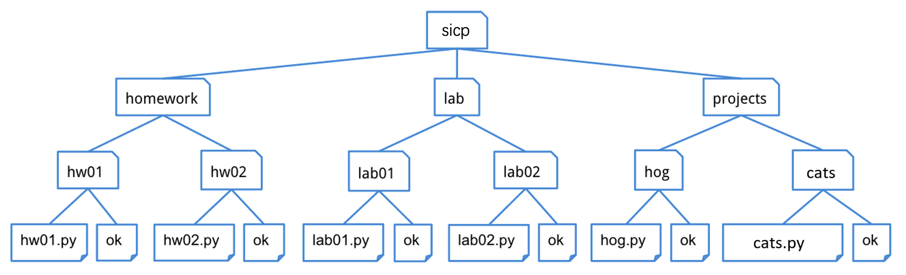

# Lab 5: Data Abstraction, Trees


> Adapted from cs61a of UC Berkeley.


## Starter Files

Get your starter file by cloning the repository: https://github.com/JacyCui/sicp-lab05.git

```shell
git clone https://github.com/JacyCui/sicp-lab05.git
```

`lab05.zip` is the starter file you need, you might need to unzip the file to get the skeleton code.

```shell
unzip lab05.zip
```

`README.md` is the handout for this homework. `solution` is a probrab solution of the lab. However, I might not give my solution exactly when the lab is posted. You need to finish the task on your own first. If any problem occurs, please make use of the comment section.


## Topics

Consult this section if you need a refresher on the material for this lab. It's okay to skip directly to the questions and refer back here should you get stuck.

### List Comprehensions

List comprehensions are a compact and powerful way of creating new lists out of sequences. The general syntax for a list comprehension is the following:

```python
[<expression> for <element> in <sequence> if <conditional>]
```

The syntax is designed to read like English: *"Compute the expression for each element in the sequence if the conditional is true for that element."*

Let's see it in action:

```python
>>> [i**2 for i in [1, 2, 3, 4] if i % 2 == 0]
[4, 16]
```

Here, for each element `i` in `[1, 2, 3, 4]` that satisfies `i % 2 == 0`, we evaluate the expression `i**2` and insert the resulting values into a new list. In other words, this list comprehension will create a new list that contains the square of each of the even elements of the original list.

If we were to write this using a for statement, it would look like this:

```python
>>> lst = []
>>> for i in [1, 2, 3, 4]:
...     if i % 2 == 0:
...         lst = lst + [i**2]
>>> lst
[4, 16]
```

> **Note:** The `if` clause in a list comprehension is optional. For example, you can just say:
>
> ```python
> >>> [i**2 for i in [1, 2, 3, 4]]
> [1, 4, 9, 16]
> ```

### Data Abstraction

Data abstraction is a powerful concept in computer science that allows programmers to treat code as objects -- for example, car objects, chair objects, people objects, etc. That way, programmers don't have to worry about *how* code is implemented -- they just have to know *what* it does.

Data abstraction mimics how we think about the world. When you want to drive a car, you don't need to know how the engine was built or what kind of material the tires are made of. You just have to know how to turn the wheel and press the gas pedal.

An abstract data type consists of two types of functions:

- **Constructors**: functions that build the abstract data type.
- **Selectors**: functions that retrieve information from the data type.

Programmers design ADTs to abstract away how information is stored and calculated such that the end user does *not* need to know how constructors and selectors are implemented. The nature of *abstract* data types allows whoever uses them to assume that the functions have been written correctly and work as described.

### Trees

A `tree` is a data structure that represents a hierarchy of information. A file system is a good example of a tree structure. For example, within your `sicp` folder, you have folders separating your `projects`, `lab` assignments, and `homework`. The next level is folders that separate different assignments, `hw01`, `lab01`, `hog`, etc., and inside those are the files themselves, including the starter files and `ok`. Below is an incomplete diagram of what your `sicp` directory might look like.



As you can see, unlike trees in nature, the tree abstract data type is drawn with the root at the top and the leaves at the bottom.

Some tree terminology:

- **root**: the node at the top of the tree
- **label**: the value in a node, selected by the `label` function
- **branches**: a list of trees directly under the tree's root, selected by the `branches` function
- **leaf**: a tree with zero branches
- **node**: any location within the tree (e.g., root node, leaf nodes, etc.)

Our `tree` abstract data type consists of a root and a list of its `branches`. To create a tree and access its root value and branches, use the following constructor and selectors:

- Constructor
    - `tree(label, branches=[])`: creates a tree object with the given `label` value at its root node and list of `branches`. Notice that the second argument to this constructor, `branches`, is optional - if you want to make a tree with no branches, leave this argument empty.
- Selectors
    - `label(tree)`: returns the value in the root node of `tree`.
    - `branches(tree)`: returns the list of branches of the given `tree`.
- Convenience function
    - `is_leaf(tree)`: returns `True` if `tree`'s list of `branches` is empty, and `False` otherwise.

For example, the tree generated by

```python
number_tree = tree(1,
         [tree(2),
          tree(3,
               [tree(4),
                tree(5)]),
          tree(6,
               [tree(7)])])
```

would look like this:

```shell
   1
 / | \
2  3  6
  / \  \
 4   5  7
```

To extract the number `3` from this tree, which is the label of the root of its second branch, we would do this:

```python
label(branches(number_tree)[1])
```

The `print_tree` function prints out a tree in a human-readable form. The exact form follows the pattern illustrated above, where the root is unindented, and each of its branches is indented one level further.

```python
def print_tree(t, indent=0):
    """Print a representation of this tree in which each node is
    indented by two spaces times its depth from the root.

    >>> print_tree(tree(1))
    1
    >>> print_tree(tree(1, [tree(2)]))
    1
      2
    >>> numbers = tree(1, [tree(2), tree(3, [tree(4), tree(5)]), tree(6, [tree(7)])])
    >>> print_tree(numbers)
    1
      2
      3
        4
        5
      6
        7
    """
    print('  ' * indent + str(label(t)))
    for b in branches(t):
        print_tree(b, indent + 1)
```


## Required Questions

### List Comprehensions

#### Q1: Couple

Implement the function `couple`, which takes in two lists and returns a list that contains lists with i-th elements of two sequences coupled together. You can assume the lengths of two sequences are the same. Try using a list comprehension.

> *Hint*: You may find the built in range function helpful.

```python
def couple(s, t):
    """Return a list of two-element lists in which the i-th element is [s[i], t[i]].

    >>> a = [1, 2, 3]
    >>> b = [4, 5, 6]
    >>> couple(a, b)
    [[1, 4], [2, 5], [3, 6]]
    >>> c = ['c', 6]
    >>> d = ['s', '1']
    >>> couple(c, d)
    [['c', 's'], [6, '1']]
    """
    assert len(s) == len(t)
    "*** YOUR CODE HERE ***"
```

Use Ok to test your code:

```shell
python3 ok -q couple --local
```


### Data Abstraction

Say we have an abstract data type for cities. A city has a name, a latitude coordinate, and a longitude coordinate.

Our ADT has one **constructor**:

- `make_city(name, lat, lon)`: Creates a city object with the given name, latitude, and longitude.

We also have the following **selectors** in order to get the information for each city:

- `get_name(city)`: Returns the city's name
- `get_lat(city)`: Returns the city's latitude
- `get_lon(city)`: Returns the city's longitude

Here is how we would use the constructor and selectors to create cities and extract their information:

```python
>>> berkeley = make_city('Berkeley', 122, 37)
>>> get_name(berkeley)
'Berkeley'
>>> get_lat(berkeley)
122
>>> new_york = make_city('New York City', 74, 40)
>>> get_lon(new_york)
40
```

All of the selector and constructor functions can be found in the lab file, if you are curious to see how they are implemented. However, the point of data abstraction is that we do not need to know how an abstract data type is implemented, but rather just how we can interact with and use the data type.

#### Q2: Distance

We will now implement the function `distance`, which computes the distance between two city objects. Recall that the distance between two coordinate pairs `(x1, y1)` and `(x2, y2)` can be found by calculating the `sqrt` of `(x1 - x2)**2 + (y1 - y2)**2`. We have already imported `sqrt` for your convenience. Use the latitude and longitude of a city as its coordinates; you'll need to use the selectors to access this info!

```python
from math import sqrt
def distance(city_a, city_b):
    """
    >>> city_a = make_city('city_a', 0, 1)
    >>> city_b = make_city('city_b', 0, 2)
    >>> distance(city_a, city_b)
    1.0
    >>> city_c = make_city('city_c', 6.5, 12)
    >>> city_d = make_city('city_d', 2.5, 15)
    >>> distance(city_c, city_d)
    5.0
    """
    "*** YOUR CODE HERE ***"
```

Use Ok to test your code:

```shell
python3 ok -q distance --local
```


#### Q3: Closer city

Next, implement `closer_city`, a function that takes a latitude, longitude, and two cities, and returns the name of the city that is relatively closer to the provided latitude and longitude.

You may only use the selectors and constructors introduced above and the `distance` function you just defined for this question.

> **Hint**: How can you use your `distance` function to find the distance between the given location and each of the given cities?

```python
def closer_city(lat, lon, city_a, city_b):
    """
    Returns the name of either city_a or city_b, whichever is closest to
    coordinate (lat, lon). If the two cities are the same distance away
    from the coordinate, consider city_b to be the closer city.

    >>> berkeley = make_city('Berkeley', 37.87, 112.26)
    >>> stanford = make_city('Stanford', 34.05, 118.25)
    >>> closer_city(38.33, 121.44, berkeley, stanford)
    'Stanford'
    >>> bucharest = make_city('Bucharest', 44.43, 26.10)
    >>> vienna = make_city('Vienna', 48.20, 16.37)
    >>> closer_city(41.29, 174.78, bucharest, vienna)
    'Bucharest'
    """
    "*** YOUR CODE HERE ***"
```

Use Ok to test your code:

```shell
python3 ok -q closer_city --local
```


#### Q4: Don't violate the abstraction barrier!

> Note: this question has no code-writing component (if you implemented `distance` and `closer_city` correctly!)

When writing functions that use an ADT, we should use the constructor(s) and selector(s) whenever possible instead of assuming the ADT's implementation. Relying on a data abstraction's underlying implementation is known as *violating the abstraction barrier*, and we never want to do this!

It's possible that you passed the doctests for `distance` and `closer_city` even if you violated the abstraction barrier. To check whether or not you did so, run the following command:

Use Ok to test your code:

```shell
python3 ok -q check_city_abstraction --local
```

The `check_city_abstraction` function exists only for the doctest, which swaps out the implementations of the `city` abstraction with something else, runs the tests from the previous two parts, then restores the original abstraction.

The nature of the abstraction barrier guarantees that changing the implementation of an ADT shouldn't affect the functionality of any programs that use that ADT, as long as the constructors and selectors were used properly.

If you passed the Ok tests for the previous questions but not this one, the fix is simple! Just replace any code that violates the abstraction barrier, i.e. creating a city with a new list object or indexing into a city, with the appropriate constructor or selector.

Make sure that your functions pass the tests with both the first and the second implementations of the City ADT and that you understand why they should work for both before moving on.


### Trees

#### Q5: Finding Berries!

The squirrels on campus need your help! There are a lot of trees on campus and the squirrels would like to know which ones contain berries. Define the function `berry_finder`, which takes in a tree and returns `True` if the tree contains a node with the value `'berry'` and `False` otherwise.

*Hint:* Considering using a for loop to iterate through each of the branches recursively!

```python
def berry_finder(t):
    """Returns True if t contains a node with the value 'berry' and 
    False otherwise.

    >>> scrat = tree('berry')
    >>> berry_finder(scrat)
    True
    >>> sproul = tree('roots', [tree('branch1', [tree('leaf'), tree('berry')]), tree('branch2')])
    >>> berry_finder(sproul)
    True
    >>> numbers = tree(1, [tree(2), tree(3, [tree(4), tree(5)]), tree(6, [tree(7)])])
    >>> berry_finder(numbers)
    False
    >>> t = tree(1, [tree('berry',[tree('not berry')])])
    >>> berry_finder(t)
    True
    """
    "*** YOUR CODE HERE ***"
```

Use Ok to test your code:

```shell
python3 ok -q berry_finder --local
```


#### Q6: Sprout leaves

Define a function `sprout_leaves` that takes in a tree, `t`, and a list of leaves, `leaves`. It produces a new tree that is identical to `t`, but where each old leaf node has new branches, one for each leaf in `leaves`.

For example, say we have the tree `t = tree(1, [tree(2), tree(3, [tree(4)])])`:

```shell
  1
 / \
2   3
    |
    4
```

If we call `sprout_leaves(t, [5, 6])`, the result is the following tree:

```shell
       1
     /   \
    2     3
   / \    |
  5   6   4
         / \
        5   6
```

```python
def sprout_leaves(t, leaves):
    """Sprout new leaves containing the data in leaves at each leaf in
    the original tree t and return the resulting tree.

    >>> t1 = tree(1, [tree(2), tree(3)])
    >>> print_tree(t1)
    1
      2
      3
    >>> new1 = sprout_leaves(t1, [4, 5])
    >>> print_tree(new1)
    1
      2
        4
        5
      3
        4
        5

    >>> t2 = tree(1, [tree(2, [tree(3)])])
    >>> print_tree(t2)
    1
      2
        3
    >>> new2 = sprout_leaves(t2, [6, 1, 2])
    >>> print_tree(new2)
    1
      2
        3
          6
          1
          2
    """
    "*** YOUR CODE HERE ***"
```

Use Ok to test your code:

```shell
python3 ok -q sprout_leaves --local
```


#### Q7: Don't violate the abstraction barrier!

> Note: this question has no code-writing component (if you implemented `berry_finder` and `sprout_leaves` correctly!)

When writing functions that use an ADT, we should use the constructor(s) and selector(s) whenever possible instead of assuming the ADT's implementation. Relying on a data abstraction's underlying implementation is known as *violating the abstraction barrier*, and we never want to do this!

It's possible that you passed the doctests for `berry_finder` and `sprout_leaves` even if you violated the abstraction barrier. To check whether or not you did so, run the following command:

Use Ok to test your code:

```shell
python3 ok -q check_abstraction --local
```

The `check_abstraction` function exists only for the doctest, which swaps out the implementations of the `tree` abstraction with something else, runs the tests from the previous two parts, then restores the original abstraction.

The nature of the abstraction barrier guarantees that changing the implementation of an ADT shouldn't affect the functionality of any programs that use that ADT, as long as the constructors and selectors were used properly.

If you passed the Ok tests for the previous questions but not this one, the fix is simple! Just replace any code that violates the abstraction barrier, i.e. creating a tree with a new list object or indexing into a tree, with the appropriate constructor or selector.

Make sure that your functions pass the tests with both the first and the second implementations of the Tree ADT and that you understand why they should work for both before moving on.


## Optional Questions

### Q8: Coordinates

Implement a function `coords` that takes a function `fn`, a sequence `seq`, and a `lower` and `upper` bound on the output of the function. `coords` then returns a list of coordinate pairs (lists) such that:

- Each (x, y) pair is represented as `[x, fn(x)]`
- The x-coordinates are elements in the sequence
- The result contains only pairs whose y-coordinate is within the upper and lower bounds (inclusive)

See the doctest for examples.

> *Note*: your answer can only be *one line long*. You should make use of list comprehensions!

```python
def coords(fn, seq, lower, upper):
    """
    >>> seq = [-4, -2, 0, 1, 3]
    >>> fn = lambda x: x**2
    >>> coords(fn, seq, 1, 9)
    [[-2, 4], [1, 1], [3, 9]]
    """
    "*** YOUR CODE HERE ***"
    return ______
```

Use Ok to test your code:

```shell
python3 ok -q coords --local
```


### Q9: Riffle Shuffle

The familiar riffle shuffle of a deck of cards (or in our case, of a sequence of things) results in a new configuration of cards in which the top card is followed by the middle card, then by the second card, then the card after the middle, and so forth. Assuming the deck (sequence) contains an even number of cards, write a list comprehension that produces the shuffled sequence.

*Hint:* To write this as a single comprehension, you may find the expression `k%2`, which evaluates to 0 on even numbers and 1 on odd numbers, to be useful. Consider how you can use the 0 or 1 returned by `k%2` to alternatively access the beginning and the middle of the list.

```python
def riffle(deck):
    """Produces a single, perfect riffle shuffle of DECK, consisting of
    DECK[0], DECK[M], DECK[1], DECK[M+1], ... where M is position of the
    second half of the deck.  Assume that len(DECK) is even.
    >>> riffle([3, 4, 5, 6])
    [3, 5, 4, 6]
    >>> riffle(range(20))
    [0, 10, 1, 11, 2, 12, 3, 13, 4, 14, 5, 15, 6, 16, 7, 17, 8, 18, 9, 19]
    """
    "*** YOUR CODE HERE ***"
    return _______
```

Use Ok to test your code:

```shell
python3 ok -q riffle --local
```


### Q10: Add trees

Define the function `add_trees`, which takes in two trees and returns a new tree where each corresponding node from the first tree is added with the node from the second tree. If a node at any particular position is present in one tree but not the other, it should be present in the new tree as well.

> *Hint*: You may want to use the built-in zip function to iterate over multiple sequences at once.
>
> *Note*: If you feel that this one's a lot harder than the previous tree problems, that's totally fine! This is a pretty difficult problem, but you can do it! Talk about it with others, make use of the comment section, and come back to it if you need to.

```python
def add_trees(t1, t2):
    """
    >>> numbers = tree(1,
    ...                [tree(2,
    ...                      [tree(3),
    ...                       tree(4)]),
    ...                 tree(5,
    ...                      [tree(6,
    ...                            [tree(7)]),
    ...                       tree(8)])])
    >>> print_tree(add_trees(numbers, numbers))
    2
      4
        6
        8
      10
        12
          14
        16
    >>> print_tree(add_trees(tree(2), tree(3, [tree(4), tree(5)])))
    5
      4
      5
    >>> print_tree(add_trees(tree(2, [tree(3)]), tree(2, [tree(3), tree(4)])))
    4
      6
      4
    >>> print_tree(add_trees(tree(2, [tree(3, [tree(4), tree(5)])]), \
    tree(2, [tree(3, [tree(4)]), tree(5)])))
    4
      6
        8
        5
      5
    """
    "*** YOUR CODE HERE ***"
```

Use Ok to test your code:

```shell
python3 ok -q add_trees --local
```


## Fun Question!

### Shakespeare and Dictionaries

We will use dictionaries to approximate the entire works of Shakespeare! We're going to use a bigram language model. Here's the idea: We start with some word -- we'll use "The" as an example. Then we look through all of the texts of Shakespeare and for every instance of "The" we record the word that follows "The" and add it to a list, known as the *successors* of "The". Now suppose we've done this for every word Shakespeare has used, ever.

Let's go back to "The". Now, we randomly choose a word from this list, say "cat". Then we look up the successors of "cat" and randomly choose a word from that list, and we continue this process. This eventually will terminate in a period (".") and we will have generated a Shakespearean sentence!

The object that we'll be looking things up in is called a "successor table", although really it's just a dictionary. The keys in this dictionary are words, and the values are lists of successors to those words.

#### Q11: Successor Tables

Here's an incomplete definition of the `build_successors_table` function. The input is a list of words (corresponding to a Shakespearean text), and the output is a successors table. (By default, the first word is a successor to "."). See the example below.

> Note: there are two places where you need to write code, denoted by the two `"*** YOUR CODE HERE ***"`

```python
def build_successors_table(tokens):
    """Return a dictionary: keys are words; values are lists of successors.

    >>> text = ['We', 'came', 'to', 'investigate', ',', 'catch', 'bad', 'guys', 'and', 'to', 'eat', 'pie', '.']
    >>> table = build_successors_table(text)
    >>> sorted(table)
    [',', '.', 'We', 'and', 'bad', 'came', 'catch', 'eat', 'guys', 'investigate', 'pie', 'to']
    >>> table['to']
    ['investigate', 'eat']
    >>> table['pie']
    ['.']
    >>> table['.']
    ['We']
    """
    table = {}
    prev = '.'
    for word in tokens:
        if prev not in table:
            "*** YOUR CODE HERE ***"
        "*** YOUR CODE HERE ***"
        prev = word
    return table
```

Use Ok to test your code:

```shell
python3 ok -q build_successors_table --local
```


#### Q12: Construct the Sentence

Let's generate some sentences! Suppose we're given a starting word. We can look up this word in our table to find its list of successors, and then randomly select a word from this list to be the next word in the sentence. Then we just repeat until we reach some ending punctuation.

> *Hint*: to randomly select from a list, import the Python random library with `import random` and use the expression `random.choice(my_list)`

This might not be a bad time to play around with adding strings together as well. Let's fill in the `construct_sent` function!

```python
def construct_sent(word, table):
    """Prints a random sentence starting with word, sampling from
    table.

    >>> table = {'Wow': ['!'], 'Sentences': ['are'], 'are': ['cool'], 'cool': ['.']}
    >>> construct_sent('Wow', table)
    'Wow!'
    >>> construct_sent('Sentences', table)
    'Sentences are cool.'
    """
    import random
    result = ''
    while word not in ['.', '!', '?']:
        "*** YOUR CODE HERE ***"
    return result.strip() + word
```

Use Ok to test your code:

```shell
python3 ok -q construct_sent --local
```


### Putting it all together

Great! Now let's try to run our functions with some actual data. The following snippet included in the skeleton code will return a list containing the words in all of the works of Shakespeare.

> *Warning*: Do **NOT** try to print the return result of this function.

```python
def shakespeare_tokens(path='shakespeare.txt', url='http://composingprograms.com/shakespeare.txt'):
    """Return the words of Shakespeare's plays as a list."""
    import os
    from urllib.request import urlopen
    if os.path.exists(path):
        return open(path, encoding='ascii').read().split()
    else:
        shakespeare = urlopen(url)
        return shakespeare.read().decode(encoding='ascii').split()
```

Uncomment the following two lines to run the above function and build the successors table from those tokens.

```python
# Uncomment the following two lines
# tokens = shakespeare_tokens()
# table = build_successors_table(tokens)
```

Next, let's define a utility function that constructs sentences from this successors table:

```python
>>> def sent():
...     return construct_sent('The', table)
>>> sent()
" The plebeians have done us must be news-cramm'd."

>>> sent()
" The ravish'd thee , with the mercy of beauty!"

>>> sent()
" The bird of Tunis , or two white and plucker down with better ; that's God's sake."
```

Notice that all the sentences start with the word "The". With a few modifications, we can make our sentences start with a random word. The following `random_sent` function (defined in your starter file) will do the trick:

```python
def random_sent():
    import random
    return construct_sent(random.choice(table['.']), table)
```

Go ahead and load your file into Python (be sure to use the `-i` flag). You can now call the `random_sent` function to generate random Shakespearean sentences!

```python
>>> random_sent()
' Long live by thy name , then , Dost thou more angel , good Master Deep-vow , And tak'st more ado but following her , my sight Of speaking false!'

>>> random_sent()
' Yes , why blame him , as is as I shall find a case , That plays at the public weal or the ghost.'
```


Congratulations! You've finished all problems of the lab. Feel free to run doctest to verify your answer again.

```shell
python3 -m doctest lab05.py
```


