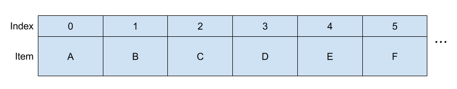
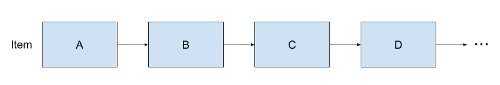
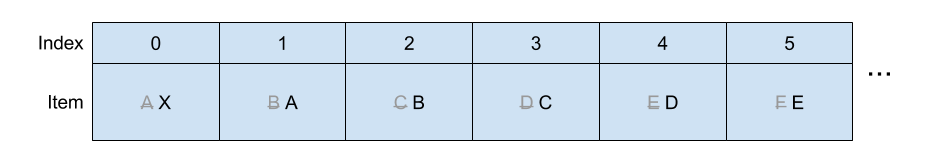
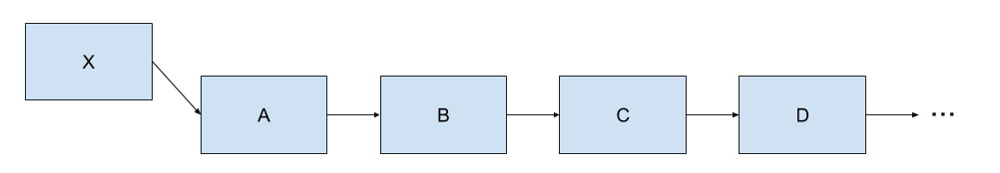

# Lab 8: Linked Lists, Trees


> Adapted from cs61a of UC Berkeley.


## Starter Files

Get your starter file by cloning the repository: https://github.com/JacyCui/sicp-lab08.git

```shell
git clone https://github.com/JacyCui/sicp-lab08.git
```

`lab08.zip` is the starter file you need, you might need to unzip the file to get the skeleton code.

```shell
unzip lab08.zip
```

`README.md` is the handout for this homework. `solution` is a probrab solution of the lab. However, I might not give my solution exactly when the lab is posted. You need to finish the task on your own first. If any problem occurs, please make use of the comment section.


## Topics

Consult this section if you need a refresher on the material for this lab. It's okay to skip directly to the questions and refer back here should you get stuck.

### Linked Lists

We've learned that a Python list is one way to store sequential values. Another type of list is a linked list. A Python list stores all of its elements in a single object, and each element can be accessed by using its index. A linked list, on the other hand, is a recursive object that only stores two things: its first value and a reference to the rest of the list, which is another linked list.

We can implement a class, `Link`, that represents a linked list object. Each instance of `Link` has two instance attributes, `first` and `rest`.

```python
class Link:
    """A linked list.

    >>> s = Link(1)
    >>> s.first
    1
    >>> s.rest is Link.empty
    True
    >>> s = Link(2, Link(3, Link(4)))
    >>> s.first = 5
    >>> s.rest.first = 6
    >>> s.rest.rest = Link.empty
    >>> s                                    # Displays the contents of repr(s)
    Link(5, Link(6))
    >>> s.rest = Link(7, Link(Link(8, Link(9))))
    >>> s
    Link(5, Link(7, Link(Link(8, Link(9)))))
    >>> print(s)                             # Prints str(s)
    <5 7 <8 9>>
    """
    empty = ()

    def __init__(self, first, rest=empty):
        assert rest is Link.empty or isinstance(rest, Link)
        self.first = first
        self.rest = rest

    def __repr__(self):
        if self.rest is not Link.empty:
            rest_repr = ', ' + repr(self.rest)
        else:
            rest_repr = ''
        return 'Link(' + repr(self.first) + rest_repr + ')'

    def __str__(self):
        string = '<'
        while self.rest is not Link.empty:
            string += str(self.first) + ' '
            self = self.rest
        return string + str(self.first) + '>'
```

A valid linked list can be one of the following:

1. An empty linked list (`Link.empty`)
2. A `Link` object containing the first value of the linked list and a reference to the rest of the linked list

What makes a linked list recursive is that the `rest` attribute of a single `Link` instance is another linked list! In the big picture, each `Link` instance stores a single value of the list. When multiple `Link`s are linked together through each instance's `rest` attribute, an entire sequence is formed.

> *Note*: This definition means that the `rest` attribute of any `Link` instance *must* be either `Link.empty` or another `Link` instance! This is enforced in `Link.__init__`, which raises an `AssertionError` if the value passed in for `rest` is neither of these things.

To check if a linked list is empty, compare it against the class attribute `Link.empty`. For example, the function below prints out whether or not the link it is handed is empty:

```python
def test_empty(link):
    if link is Link.empty:
        print('This linked list is empty!')
    else:
        print('This linked list is not empty!')
```

### Motivation: Why linked lists

Since you are already familiar with Python's built-in lists, you might be wondering why we are teaching you another list representation. There are historical reasons, along with practical reasons. Later in the course, you'll be programming in Scheme, which is a programming language that uses linked lists for almost everything.

For now, let's compare linked lists and Python lists by looking at two common sequence operations: inserting an item and indexing.

Python's built-in list is like a sequence of containers with indices on them:



Linked lists are a list of items pointing to their neighbors. Notice that there's no explicit index for each item.



Suppose we want to add an item at the head of the list.

- With Python's built-in list, if you want to put an item into the container labeled with index 0, you must move **all the items** in the list into its neighbor containers to make room for the first item;



- With a linked list, you tell Python that the neighbor of the new item is the old beginning of the list.



Now, let's take a look at indexing. Say we want the item at index 3 from a list.

- In the built-in list, you can use Python list indexing, e.g. `lst[3]`, to easily get the item at index 3.
- In the linked list, you need to start at the first item and repeatedly follow the `rest` attribute, e.g. `link.rest.rest.first`. How does this scale if the index you were trying to access was very large?

Can you think of situations where you would want to use one type of list over another? In this class, we aren't too worried about performance. However, in future computer science courses, you'll learn how to make performance tradeoffs in your programs by choosing your data structures carefully.

### Trees

Recall that a tree is a recursive abstract data type that has a `label` (the value stored in the root of the tree) and `branches` (a list of trees directly underneath the root).

We saw one way to implement the tree ADT -- using constructor and selector functions that treat trees as lists. Another, more formal, way to implement the tree ADT is with a class. Here is part of the class definition for `Tree`, which can be found in `lab07.py`:

```python
class Tree:
    """
    >>> t = Tree(3, [Tree(2, [Tree(5)]), Tree(4)])
    >>> t.label
    3
    >>> t.branches[0].label
    2
    >>> t.branches[1].is_leaf()
    True
    """
    def __init__(self, label, branches=[]):
        for b in branches:
            assert isinstance(b, Tree)
        self.label = label
        self.branches = list(branches)

    def is_leaf(self):
        return not self.branches
```

Even though this is a new implementation, everything we know about the tree ADT remains true. That means that solving problems involving trees as objects uses the same techniques that we developed when first studying the tree ADT (e.g. we can still use recursion on the branches!). The main difference, aside from syntax, is that tree objects are mutable.

Here is a summary of the differences between the tree ADT implemented using functions and lists vs. implemented using a class:

| -                            | Tree constructor and selector functions                      | Tree class                                                   |
| :--------------------------- | :----------------------------------------------------------- | :----------------------------------------------------------- |
| Constructing a tree          | To construct a tree given a `label` and a list of `branches`, we call `tree(label, branches)` | To construct a tree object given a `label` and a list of `branches`, we call `Tree(label, branches)` (which calls the `Tree.__init__` method) |
| Label and branches           | To get the label or branches of a tree `t`, we call `label(t)` or `branches(t)` respectively | To get the label or branches of a tree `t`, we access the instance attributes `t.label` or `t.branches` respectively |
| Mutability                   | The tree ADT is immutable because we cannot assign values to call expressions | The `label` and `branches` attributes of a `Tree` instance can be reassigned, mutating the tree |
| Checking if a tree is a leaf | To check whether a tree `t` is a leaf, we call the convenience function `is_leaf(t)` | To check whether a tree `t` is a leaf, we call the bound method `t.is_leaf()`. This method can only be called on `Tree` objects. |


## Required Questions

### What Would Python Display?

#### Q1: WWPD: Linked Lists

Read over the `Link` class in `lab08.py`. Make sure you understand the doctests.

> Use Ok to test your knowledge with the following "What Would Python Display?" questions:
>
> ```shell
> python3 ok -q link -u --local
> ```
>
> Enter `Function` if you believe the answer is `<function ...>`, `Error` if it errors, and `Nothing` if nothing is displayed.
>
> If you get stuck, try drawing out the box-and-pointer diagram for the linked list on a piece of paper or loading the `Link` class into the interpreter with `python3 -i lab09.py`.

```python
>>> from lab08 import *
>>> link = Link(1000)
>>> link.first
______

>>> link.rest is Link.empty
______

>>> link = Link(1000, 2000)
______

>>> link = Link(1000, Link())
______
```

```python
>>> from lab08 import *
>>> link = Link(1, Link(2, Link(3)))
>>> link.first
______

>>> link.rest.first
______

>>> link.rest.rest.rest is Link.empty
______

>>> link.first = 9001
>>> link.first
______

>>> link.rest = link.rest.rest
>>> link.rest.first
______

>>> link = Link(1)
>>> link.rest = link
>>> link.rest.rest.rest.rest.first
______

>>> link = Link(2, Link(3, Link(4)))
>>> link2 = Link(1, link)
>>> link2.first
______

>>> link2.rest.first
______
```

```python
>>> from lab08 import *
>>> link = Link(5, Link(6, Link(7)))
>>> link                  # Look at the __repr__ method of Link
______

>>> print(link)          # Look at the __str__ method of Link
______
```


### Linked Lists

#### Q2: Convert Link

Write a function `convert_link` that takes in a linked list and returns the sequence as a Python list. You may assume that the input list is shallow; none of the elements is another linked list.

Try to find both an iterative and recursive solution for this problem!

```python
def convert_link(link):
    """Takes a linked list and returns a Python list with the same elements.

    >>> link = Link(1, Link(2, Link(3, Link(4))))
    >>> convert_link(link)
    [1, 2, 3, 4]
    >>> convert_link(Link.empty)
    []
    """
    "*** YOUR CODE HERE ***"
```

Use Ok to test your code:

```shell
python3 ok -q convert_link --local
```


#### Q3: Every Other

Implement `every_other`, which takes a linked list `s`. It mutates `s` such that all of the odd-indexed elements (using 0-based indexing) are removed from the list. For example:

```python
>>> s = Link('a', Link('b', Link('c', Link('d'))))
>>> every_other(s)
>>> s.first
'a'
>>> s.rest.first
'c'
>>> s.rest.rest is Link.empty
True
```

If `s` contains fewer than two elements, `s` remains unchanged.

> Do not return anything! `every_other` should mutate the original list.

```python
def every_other(s):
    """Mutates a linked list so that all the odd-indiced elements are removed
    (using 0-based indexing).

    >>> s = Link(1, Link(2, Link(3, Link(4))))
    >>> every_other(s)
    >>> s
    Link(1, Link(3))
    >>> odd_length = Link(5, Link(3, Link(1)))
    >>> every_other(odd_length)
    >>> odd_length
    Link(5, Link(1))
    >>> singleton = Link(4)
    >>> every_other(singleton)
    >>> singleton
    Link(4)
    """
    "*** YOUR CODE HERE ***"
```

Use Ok to test your code:

```shell
python3 ok -q every_other --local
```


### Trees

#### Q4: Cumulative Mul

Write a function `cumulative_mul` that mutates the Tree `t` so that each node's label becomes the product of all labels in the subtree rooted at the node.

```python
def cumulative_mul(t):
    """Mutates t so that each node's label becomes the product of all labels in
    the corresponding subtree rooted at t.

    >>> t = Tree(1, [Tree(3, [Tree(5)]), Tree(7)])
    >>> cumulative_mul(t)
    >>> t
    Tree(105, [Tree(15, [Tree(5)]), Tree(7)])
    """
    "*** YOUR CODE HERE ***"
```

Use Ok to test your code:

```shell
python3 ok -q cumulative_mul --local
```


## Optional Problems

### Q5: Cycles

The `Link` class can represent lists with cycles. That is, a list may contain itself as a sublist.

```python
>>> s = Link(1, Link(2, Link(3)))
>>> s.rest.rest.rest = s
>>> s.rest.rest.rest.rest.rest.first
3
```

Implement `has_cycle`,that returns whether its argument, a `Link` instance, contains a cycle.

> *Hint*: Iterate through the linked list and try keeping track of which `Link` objects you've already seen.

```python
def has_cycle(link):
    """Return whether link contains a cycle.

    >>> s = Link(1, Link(2, Link(3)))
    >>> s.rest.rest.rest = s
    >>> has_cycle(s)
    True
    >>> t = Link(1, Link(2, Link(3)))
    >>> has_cycle(t)
    False
    >>> u = Link(2, Link(2, Link(2)))
    >>> has_cycle(u)
    False
    """
    "*** YOUR CODE HERE ***"
```

Use Ok to test your code:

```shell
python3 ok -q has_cycle --local
```

As an extra challenge, implement `has_cycle_constant` with only [constant space](http://composingprograms.com/pages/28-efficiency.html#growth-categories). (If you followed the hint above, you will use linear space.) The solution is short (less than 20 lines of code), but requires a clever idea. Try to discover the solution yourself before asking around:

```python
def has_cycle_constant(link):
    """Return whether link contains a cycle.

    >>> s = Link(1, Link(2, Link(3)))
    >>> s.rest.rest.rest = s
    >>> has_cycle_constant(s)
    True
    >>> t = Link(1, Link(2, Link(3)))
    >>> has_cycle_constant(t)
    False
    """
    "*** YOUR CODE HERE ***"
```

Use Ok to test your code:

```shell
python3 ok -q has_cycle_constant --local
```


### Q6: Reverse Other

Write a function `reverse_other` that mutates the tree such that **labels** on *every other* (odd-depth) level are reversed. For example, `Tree(1,[Tree(2, [Tree(4)]), Tree(3)])` becomes `Tree(1,[Tree(3, [Tree(4)]), Tree(2)])`. Notice that the nodes themselves are *not* reversed; only the labels are.

```python
def reverse_other(t):
    """Mutates the tree such that nodes on every other (odd-depth) level
    have the labels of their branches all reversed.

    >>> t = Tree(1, [Tree(2), Tree(3), Tree(4)])
    >>> reverse_other(t)
    >>> t
    Tree(1, [Tree(4), Tree(3), Tree(2)])
    >>> t = Tree(1, [Tree(2, [Tree(3, [Tree(4), Tree(5)]), Tree(6, [Tree(7)])]), Tree(8)])
    >>> reverse_other(t)
    >>> t
    Tree(1, [Tree(8, [Tree(3, [Tree(5), Tree(4)]), Tree(6, [Tree(7)])]), Tree(2)])
    """
    "*** YOUR CODE HERE ***"
```

Use Ok to test your code:

```shell
python3 ok -q reverse_other --local
```


Congratulations! You've finished all problems of the lab. Feel free to run doctest to verify your answer again.

```shell
python3 -m doctest lab08.py
```


