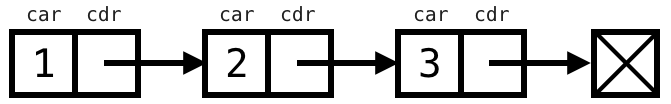
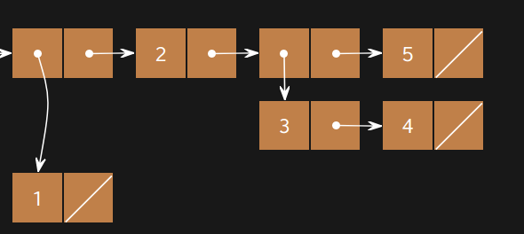

# Lab 10: Scheme


> Adapted from cs61a of UC Berkeley.


## Starter Files

Get your starter file by cloning the repository: https://github.com/JacyCui/sicp-lab10.git

```shell
git clone https://github.com/JacyCui/sicp-lab10.git
```

`lab10.zip` is the starter file you need, you might need to unzip the file to get the skeleton code.

```shell
unzip lab10.zip
```

`README.md` is the handout for this homework. `solution` is a probrab solution of the lab. However, I might not give my solution exactly when the lab is posted. You need to finish the task on your own first. If any problem occurs, please make use of the comment section.


## Topics

Consult this section if you need a refresher on the material for this lab. It's okay to skip directly to the questions and refer back here should you get stuck.

### Scheme

Scheme is a famous functional programming language from the 1970s. It is a dialect of Lisp (which stands for LISt Processing). The first observation most people make is the unique syntax, which uses a prefix notation and (often many) nested parentheses (see http://xkcd.com/297/). Scheme features first-class functions and optimized tail-recursion, which were relatively new features at the time.

> Our course uses a custom version of Scheme (which you will build for Project 4) included in the starter ZIP archive. To start the interpreter, type `python3 scheme`. To run a Scheme program interactively, type `python3 scheme -i <file.scm>`. To exit the Scheme interpreter, type `(exit)`.

You may find it useful to try [code.cs61a.org/scheme](https://code.cs61a.org/scheme) when working through problems, as it can draw environment and box-and-pointer diagrams and it lets you walk your code step-by-step (similar to Python Tutor). Don't forget to submit your code through Ok though!

#### Scheme Editor

As you're writing your code, you can debug using the Scheme Editor. In your `scheme` folder you will find a new editor. To run this editor, run `python3 editor`. This should pop up a window in your browser; if it does not, please navigate to [localhost:31415](localhost:31415) and you should see it.

Make sure to run `python3 ok` in a separate tab or window so that the editor keeps running.

If you find that your code works in the online editor but not in your own interpreter, it's possible you have a bug in code from an earlier part that you'll have to track down.

> As we can run `python3 scheme -i <file.scm>`, it is ok to use vscode or any other local editor to write your code.


### Expressions

#### Atomic Expressions

Just like in Python, atomic, or primitive, expressions in Scheme take a single step to evaluate. These include numbers, booleans, symbols.

```scheme
scm> 1234    ; integer
1234
scm> 123.4   ; real number
123.4
```

##### Symbols

Out of these, the symbol type is the only one we didn't encounter in Python. A **symbol** acts a lot like a Python name, but not exactly. Specifically, a symbol in Scheme is also a type of value. On the other hand, in Python, names only serve as expressions; a Python expression can never evaluate to a name.

```scheme
scm> quotient      ; A name bound to a built-in procedure
#[quotient]
scm> 'quotient     ; An expression that evaluates to a symbol
quotient
scm> 'hello-world!
hello-world!
```

##### Booleans

In Scheme, *all* values except the special boolean value `#f` are interpreted as true values (unlike Python, where there are some false-y values like `0`). Our particular version of the Scheme interpreter allows you to write `True` and `False` in place of `#t` and `#f`. This is not standard.

```scheme
scm> #t
#t
scm> #f
#f
```

#### Call expressions

Like Python, the operator in a Scheme call expression comes before all the operands. Unlike Python, the operator is included within the parentheses and the operands are separated by spaces rather than with commas. However, evaluation of a Scheme call expression follows the exact same rules as in Python:

1. Evaluate the operator. It should evaluate to a procedure.
2. Evaluate the operands, left to right.
3. Apply the procedure to the evaluated operands.

Here are some examples using built-in procedures:

```scheme
scm> (+ 1 2)
3
scm> (- 10 (/ 6 2))
7
scm> (modulo 35 4)
3
scm> (even? (quotient 45 2))
#t
```

#### Special forms

The operator of a special form expression is a special form. What makes a special form "special" is that they do not follow the three rules of evaluation stated in the previous section. Instead, each special form follows its own special rules for execution, such as short-circuiting before evaluating all the operands.

Some examples of special forms that we'll study today are the `if`, `cond`, `define`, and `lambda` forms. Read their corresponding sections below to find out what their rules of evaluation are!


### Control Structures

#### `if` Expressions

The `if` special form allows us to evaluate one of two expressions based on a predicate. It takes in two required arguments and an optional third argument:

```scheme
(if <predicate> <if-true> [if-false])
```

The first operand is what's known as a **predicate** expression in Scheme, an expression whose value is interpreted as either `#t` or `#f`.

The rules for evaluating an `if` special form expression are as follows:

1. Evaluate `<predicate>`.
2. If `<predicate>` evaluates to a truth-y value, evaluate and return the value if the expression `<if-true>`. Otherwise, evaluate and return the value of `[if-false]` if it is provided.

Can you see why this expression is a special form? Compare the rules between a regular call expression and an `if` expression. What is the difference?

> Step 2 of evaluating call expressions requires evaluating all of the operands in order. However, an `if` expression will only evaluate two of its operands, the conditional expression and either `<true-result>` or `<false-result>`. Because we don't evaluate all the operands in an `if` expression, it is a special form.

Let's compare a Scheme `if` expression with a Python `if` statement:

- **Scheme**

    - ```scheme
        scm> (if (> x 3)
                 1
                 2)
        ```

- **Python**

    - ```python
        >>> if x > 3:
        ...     1
        ... else:
        ...     2
        ```

Although the code may look the same, what happens when each block of code is evaluated is actually very different. Specifically, the Scheme expression, given that it is an expression, evaluates to some value. However, the Python `if` statement simply directs the flow of the program.

Another difference between the two is that it's possible to add more lines of code into the suites of the Python `if` statement, while a Scheme `if` expression expects just a single expression for each of the true result and the false result.

One final difference is that in Scheme, you cannot write `elif` cases. If you want to have multiple cases using the `if` expression, you would need multiple branched `if` expressions:

- **Scheme**

    - ```scheme
        scm> (if (< x 0)
                 'negative
                 (if (= x 0)
                     'zero
                     'positive
                 )
         )
        ```

- **Python**

    - ```python
        >>> if x < 0:
        ...     'negative'
        ... else:
        ...     if x == 0:
        ...         'zero'
        ...     else:
        ...         'positive'
        ```

#### `cond` Expressions

Using nested `if` expressions doesn't seem like a very practical way to take care of multiple cases. Instead, we can use the `cond` special form, a general conditional expression similar to a multi-clause if/elif/else conditional expression in Python. `cond` takes in an arbitrary number of arguments known as *clauses*. A clause is written as a list containing two expressions: `(<p> <e>)`.

```scheme
(cond
    (<p1> <e1>)
    (<p2> <e2>)
    ...
    (<pn> <en>)
    [(else <else-expression>)])
```

The first expression in each clause is a predicate. The second expression in the clause is the return expression corresponding to its predicate. The optional `else` clause has no predicate.

The rules of evaluation are as follows:

1. Evaluate the predicates `<p1>`, `<p2>`, ..., `<pn>` in order until you reach one that evaluates to a truth-y value.
2. If you reach a predicate that evaluates to a truth-y value, evaluate and return the corresponding expression in the clause.
3. If none of the predicates are truth-y and there is an `else` clause, evaluate and return `<else-expression>`.

As you can see, `cond` is a special form because it does not evaluate its operands in their entirety; the predicates are evaluated separately from their corresponding return expression. In addition, the expression short circuits upon reaching the first predicate that evaluates to a truth-y value, leaving the remaining predicates unevaluated.

The following code is roughly equivalent (see the explanation in the if expression section):

- **Scheme**

    - ```scheme
        scm> (cond
                ((> x 0) 'positive)
                ((< x 0) 'negative)
                (else 'zero))
        ```

- **Python**

    - ```python
        >>> if x > 0:
        ...     'positive'
        ... elif x < 0:
        ...     'negative'
        ... else:
        ...     'zero'
        ```


### Lists

> As you read through this section, it may be difficult to understand the differences between the various representations of Scheme containers. We recommend that you use [the cs61a online Scheme interpreter](http://scheme.cs61a.org/) to see the box-and-pointer diagrams of pairs and lists that you're having a hard time visualizing! (Use the command `(autodraw)` to toggle the automatic drawing of diagrams.)

#### Lists

Scheme lists are very similar to the linked lists we've been working with in Python. Just like how a linked list is constructed of a series of `Link` objects, a Scheme list is constructed with a series of pairs, which are created with the constructor `cons`.

Scheme lists require that the `cdr` is either another list or `nil`, an empty list. A list is displayed in the interpreter as a sequence of values (similar to the `__str__` representation of a `Link` object). For example,

```scheme
scm> (cons 1 (cons 2 (cons 3 nil)))
(1 2 3)
```

Here, we've ensured that the second argument of each `cons` expression is another `cons` expression or `nil`.



We can retrieve values from our list with the `car` and `cdr` procedures, which now work similarly to the Python `Link`'s `first` and `rest` attributes. (Curious about where these weird names come from? [Check out their etymology.](https://en.wikipedia.org/wiki/CAR_and_CDR))

> If you're not able to use wikipedia, turning to Baidu may be a choice.

```scheme
scm> (define a (cons 1 (cons 2 (cons 3 nil))))  ; Assign the list to the name a
a
scm> a
(1 2 3)
scm> (car a)
1
scm> (cdr a)
(2 3)
scm> (car (cdr (cdr a)))
3
```

If you do not pass in a pair or nil as the second argument to `cons`, it will error:

```scheme
scm> (cons 1 2)
Error
```

#### `list` Procedure

There are a few other ways to create lists. The `list` procedure takes in an arbitrary number of arguments and constructs a list with the values of these arguments:

```scheme
scm> (list 1 2 3)
(1 2 3)
scm> (list 1 (list 2 3) 4)
(1 (2 3) 4)
scm> (list (cons 1 (cons 2 nil)) 3 4)
((1 2) 3 4)
```

Note that all of the operands in this expression are evaluated before being put into the resulting list.

#### Quote Form

We can also use the quote form to create a list, which will construct the exact list that is given. Unlike with the `list` procedure, the argument to `'` is *not* evaluated.

```scheme
scm> '(1 2 3)
(1 2 3)
scm> '(cons 1 2)           ; Argument to quote is not evaluated
(cons 1 2)
scm> '(1 (2 3 4))
(1 (2 3 4))
```

#### Built-In Procedures for Lists

There are a few other built-in procedures in Scheme that are used for lists. Try them out in the interpreter!

```scheme
scm> (null? nil)                ; Checks if a value is the empty list
True
scm> (append '(1 2 3) '(4 5 6)) ; Concatenates two lists
(1 2 3 4 5 6)
scm> (length '(1 2 3 4 5))      ; Returns the number of elements in a list
5
```


### Defining procedures

The special form `define` is used to define variables and functions in Scheme. There are two versions of the `define` special form. To define variables, we use the `define` form with the following syntax:

```scheme
(define <name> <expression>)
```

The rules to evaluate this expression are

1. Evaluate the `<expression>`.
2. Bind its value to the `<name>` in the current frame.
3. Return `<name>`.

The second version of `define` is used to define procedures:

```scheme
(define (<name> <param1> <param2> ...) <body> )
```

To evaluate this expression:

1. Create a lambda procedure with the given parameters and `<body>`.
2. Bind the procedure to the `<name>` in the current frame.
3. Return `<name>`.

The following two expressions are equivalent:

```scheme
scm> (define foo (lambda (x y) (+ x y)))
foo
scm> (define (foo x y) (+ x y))
foo
```

`define` is a special form because its operands are not evaluated at all! For example, `<body>` is not evaluated when a procedure is defined, but rather when it is called. `<name>` and the parameter names are all names that should not be evaluated when executing this `define` expression.


### Lambdas

All Scheme procedures are lambda procedures. To create a lambda procedure, we can use the `lambda` special form:

```scheme
(lambda (<param1> <param2> ...) <body>)
```

This expression will create and return a function with the given parameters and body, but it will not alter the current environment. This is very similar to a `lambda` expression in Python!

```scheme
scm> (lambda (x y) (+ x y))        ; Returns a lambda function, but doesn't assign it to a name
(lambda (x y) (+ x y))
scm> ((lambda (x y) (+ x y)) 3 4)  ; Create and call a lambda function in one line
7
```

A procedure may take in any number of parameters. The `<body>` may contain multiple expressions. There is not an equivalent version of a Python `return` statement in Scheme. The function will simply return the value of the last expression in the body.


## Required Questions

### What Would Scheme Display?

#### Q1: Combinations

Let's familiarize ourselves with some built-in Scheme procedures and special forms!

> Use Ok to unlock the following "What would Scheme print?" questions:
>
> ```shell
> python3 ok -q combinations -u --local
> ```

```scheme
scm> (- 10 4)

scm> (* 7 6)

scm> (+ 1 2 3 4)

scm> (/ 8 2 2)

scm> (quotient 29 5)

scm> (modulo 29 5)

```

```scheme
scm> (= 1 3)                    ; Scheme uses '=' instead of '==' for comparison

scm> (< 1 3)

scm> (or #t #f)                 ; or special form short circuits

scm> (and #t #f (/ 1 0))

scm> (not #t)

```

```scheme
scm> (define x 3)

scm> x

scm> (define y (+ x 4))

scm> y

scm> (define x (lambda (y) (* y 2)))

scm> (x y)

```

```scheme
scm> (if (print 1) (print 2) (print 3))

scm> (* (if (> 3 2) 1 2) (+ 4 5))

scm> (define foo (lambda (x y z) (if x y z)))

scm> (foo 1 2 (print 'hi))

scm> ((lambda (a) (print 'a)) 100)

```


### Coding Questions

#### Q2: Over or Under

Define a procedure `over-or-under` which takes in a number `num1` and a number `num2` and returns the following:

- -1 if `num1` is less than `num2`
- 0 if `num1` is equal to `num2`
- 1 if `num1` is greater than `num2`

```scheme
(define (over-or-under num1 num2)
  'YOUR-CODE-HERE
)

;;; Tests
(over-or-under 1 2)
; expect -1
(over-or-under 2 1)
; expect 1
(over-or-under 1 1)
; expect 0
```

Use Ok to unlock and test your code:

```shell
python3 ok -q over_or_under -u --local
python3 ok -q over_or_under --local
```


#### Q3: Make Adder

Write the procedure `make-adder` which takes in an initial number, `num`, and then returns a procedure. This returned procedure takes in a number `inc` and returns the result of `num + inc`.

*Hint*: To return a procedure, you can either return a `lambda` expression or `define` another nested procedure. Remember that Scheme will automatically return the last clause in your procedure.

```scheme
(define (make-adder num)
  'YOUR-CODE-HERE
)

;;; Tests
(define adder (make-adder 5))
(adder 8)
; expect 13
```

Use Ok to unlock and test your code:

```shell
python3 ok -q make_adder -u --local
python3 ok -q make_adder --local
```


#### Q4: Compose

Write the procedure `composed`, which takes in procedures `f` and `g` and outputs a new procedure. This new procedure takes in a number `x` and outputs the result of calling `f` on `g` of `x`.

```scheme
(define (composed f g)
  'YOUR-CODE-HERE
)
```

Use Ok to unlock and test your code:

```shell
python3 ok -q composed -u --local
python3 ok -q composed --local
```


## Optional Questions

> The following questions are for **extra practice**. However, they are in scope and we recommend you do them if you have time.

### Q5: Make a List

Create the list with the following box-and-pointer diagram:



```scheme
(define lst
  'YOUR-CODE-HERE
)
```

Use Ok to unlock and test your code:

```shell
python3 ok -q make_structure -u --local
python3 ok -q make_structure --local
```


### Q6: Remove

Implement a procedure `remove` that takes in a list and returns a new list with *all* instances of `item` removed from `lst`. You may assume the list will only consist of numbers and will not have nested lists.

*Hint*: You might find the `filter-lst` procedure useful.

```scheme
(define (remove item lst)
  'YOUR-CODE-HERE
)


;;; Tests
(remove 3 nil)
; expect ()
(remove 3 '(1 3 5))
; expect (1 5)
(remove 5 '(5 3 5 5 1 4 5 4))
; expect (3 1 4 4)
```

Use Ok to unlock and test your code:

```shell
python3 ok -q remove -u --local
python3 ok -q remove --local
```


Finally, you can test manually to check your answer again.

```shell
python3 scheme lab10.scm
```

