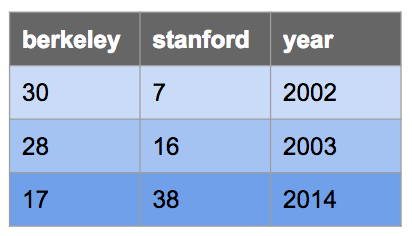
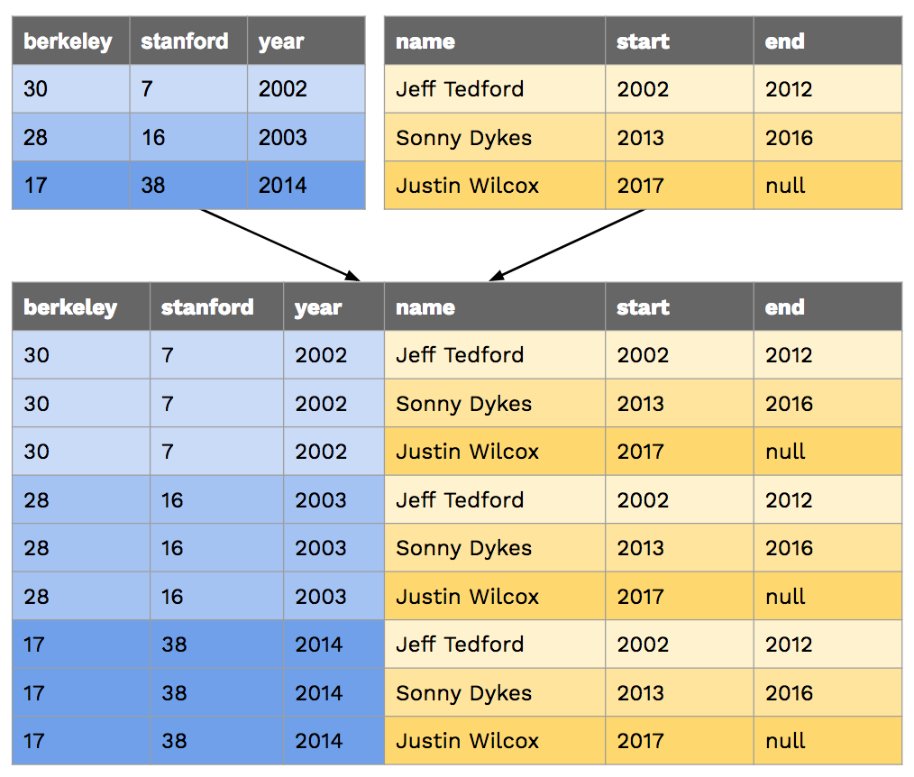

# Lab 12: SQL


> Adapted from cs61a of UC Berkeley.


## Starter Files

Get your starter file by cloning the repository: https://github.com/JacyCui/sicp-lab12.git

```shell
git clone https://github.com/JacyCui/sicp-lab12.git
```

`lab12.zip` is the starter file you need, you might need to unzip the file to get the skeleton code.

```shell
unzip lab12.zip
```

`README.md` is the handout for this homework. `solution` is a probrab solution of the lab. However, I might not give my solution exactly when the lab is posted. You need to finish the task on your own first. If any problem occurs, please make use of the comment section.


## Topics

Consult this section if you need a refresher on the material for this lab, or if you're having trouble running SQL or SQLite on your computer. It's okay to skip directly to the questions and refer back here should you get stuck.

### SQL Basics

#### Creating Tables

You can create SQL tables either from scratch or from existing tables.

The following statement creates a table by specifying column names and values without referencing another table. Each `SELECT` clause specifies the values for one row, and `UNION` is used to join rows together. The `AS` clauses give a name to each column; it need not be repeated in subsequent rows after the first.

```sql
CREATE TABLE [table_name] AS
  SELECT [val1] AS [column1], [val2] AS [column2], ... UNION
  SELECT [val3]             , [val4]             , ... UNION
  SELECT [val5]             , [val6]             , ...;
```

Let's say we want to make the following table called `big_game` which records the scores for the Big Game each year. This table has three columns: `berkeley`, `stanford`, and `year`.



We could do so with the following `CREATE TABLE` statement:

```sql
CREATE TABLE big_game AS
  SELECT 30 AS berkeley, 7 AS stanford, 2002 AS year UNION
  SELECT 28,             16,            2003         UNION
  SELECT 17,             38,            2014;
```

#### Selecting From Tables

More commonly, we will create new tables by selecting specific columns that we want from existing tables by using a `SELECT` statement as follows:

```sql
SELECT [columns] FROM [tables] WHERE [condition] ORDER BY [columns] LIMIT [limit];
```

Let's break down this statement:

- `SELECT [columns]` tells SQL that we want to include the given columns in our output table; `[columns]` is a comma-separated list of column names, and `*` can be used to select all columns
- `FROM [table]` tells SQL that the columns we want to select are from the given table; see the joins section to see how to select from multiple tables
- `WHERE [condition]` filters the output table by only including rows whose values satisfy the given `[condition]`, a boolean expression
- `ORDER BY [columns]` orders the rows in the output table by the given comma-separated list of columns
- `LIMIT [limit]` limits the number of rows in the output table by the integer `[limit]`

> *Note:* We capitalize SQL keywords purely because of style convention. It makes queries much easier to read, though they will still work if you don't capitalize keywords.

Here are some examples:

Select all of Berkeley's scores from the `big_game` table, but only include scores from years past 2002:

```sql
sqlite> SELECT berkeley FROM big_game WHERE year > 2002;
28
17
```

Select the scores for both schools in years that Berkeley won:

```sql
sqlite> SELECT berkeley, stanford FROM big_game WHERE berkeley > stanford;
30|7
28|16
```

Select the years that Stanford scored more than 15 points:

```sql
sqlite> SELECT year FROM big_game WHERE stanford > 15;
2003
2014
```

#### SQL operators

Expressions in the `SELECT`, `WHERE`, and `ORDER BY` clauses can contain one or more of the following operators:

- comparison operators: `=`, `>`, `<`, `<=`, `>=`, `<>` or `!=` ("not equal")
- boolean operators: `AND`, `OR`
- arithmetic operators: `+`, `-`, `*`, `/`
- concatenation operator: `||`

Here are some examples:

Output the ratio of Berkeley's score to Stanford's score each year:

```sql
sqlite> select berkeley * 1.0 / stanford from big_game;
0.447368421052632
1.75
4.28571428571429
```

Output the sum of scores in years where both teams scored over 10 points:

```sql
sqlite> select berkeley + stanford from big_game where berkeley > 10 and stanford > 10;
55
44
```

Output a table with a single column and single row containing the value "hello world":

```sql
sqlite> SELECT "hello" || " " || "world";
hello world
```


### Joins

To select data from multiple tables, we can use joins. There are many types of joins, but the only one we'll worry about is the inner join. To perform an inner join on two on more tables, simply list them all out in the `FROM` clause of a `SELECT` statement:

```sql
SELECT [columns] FROM [table1], [table2], ... WHERE [condition] ORDER BY [columns] LIMIT [limit];
```

We can select from multiple different tables or from the same table multiple times.

Let's say we have the following table that contains the names head football coaches at Cal since 2002:

```sql
CREATE TABLE coaches AS
  SELECT "Jeff Tedford" AS name, 2002 as start, 2012 as end UNION
  SELECT "Sonny Dykes"         , 2013         , 2016        UNION
  SELECT "Justin Wilcox"       , 2017         , null;
```

When we join two or more tables, the default output is a [cartesian product](https://en.wikipedia.org/wiki/Cartesian_product). For example, if we joined `big_game` with `coaches`, we'd get the following:



If we want to match up each game with the coach that season, we'd have to compare columns from the two tables in the `WHERE` clause:

```sql
sqlite> SELECT * FROM big_game, coaches WHERE year >= start AND year <= end;
17|38|2014|Sonny Dykes|2013|2016
28|16|2003|Jeff Tedford|2002|2012
30|7|2002|Jeff Tedford|2002|2012
```

The following query outputs the coach and year for each Big Game win recorded in `big_game`:

```sql
sqlite> SELECT name, year FROM big_game, coaches
...>        WHERE berkeley > stanford AND year >= start AND year <= end;
Jeff Tedford|2003
Jeff Tedford|2002
```

In the queries above, none of the column names are ambiguous. For example, it is clear that the `name` column comes from the `coaches` table because there isn't a column in the `big_game` table with that name. However, if a column name exists in more than one of the tables being joined, or if we join a table with itself, we must disambiguate the column names using *aliases*.

For examples, let's find out what the score difference is for each team between a game in `big_game` and any previous games. Since each row in this table represents one game, in order to compare two games we must join `big_game` with itself:

```sql
sqlite> SELECT b.Berkeley - a.Berkeley, b.Stanford - a.Stanford, a.Year, b.Year
...>        FROM big_game AS a, big_game AS b WHERE a.Year < b.Year;
-11|22|2003|2014
-13|21|2002|2014
-2|9|2002|2003
```

In the query above, we give the alias `a` to the first `big_game` table and the alias `b` to the second `big_game` table. We can then reference columns from each table using dot notation with the aliases, e.g. `a.Berkeley`, `a.Stanford`, and `a.Year` to select from the first table.


### Troubleshooting

Python already comes with a built-in SQLite database engine to process SQL. However, it doesn't come with a "shell" to let you interact with it from the terminal. Because of this, until now, you have been using a simplified SQLite shell written by us. However, you may find the shell is old, buggy, or lacking in features. In that case, you may want to download and use the official SQLite executable.

If running `python3 sqlite_shell.py` didn't work, you can download a precompiled sqlite directly by following the following instructions and then use `sqlite3` and `./sqlite3` instead of `python3 sqlite_shell.py` based on which is specified for your platform.

Another way to start using SQLite is to download a precompiled binary from the [SQLite website](http://www.sqlite.org/download.html). The latest version of SQLite at the time of writing is 3.28.0, but you can check for additional updates on the website.

However, before proceeding, please remove (or rename) any SQLite executables (`sqlite3`, `sqlite_shell.py`, and the like) from the current folder, or they may conflict with the official one you download below. Similarly, if you wish to switch back later, please remove or rename the one you downloaded and restore the files you removed.

#### Windows

1. Visit the download page linked above and navigate to the section Precompiled Binaries for Windows. Click on the link **sqlite-tools-win32-x86-\*.zip** to download the binary.

2. Unzip the file. There should be a `sqlite3.exe` file in the directory after extraction.

3. Navigate to the folder containing the `sqlite3.exe` file and check that the version is at least 3.8.3:

    ```shell
    $ cd path/to/sqlite
    $ ./sqlite3 --version
    3.12.1 2016-04-08 15:09:49 fe7d3b75fe1bde41511b323925af8ae1b910bc4d
    ```

#### macOS Yosemite (10.10) or newer

SQLite comes pre-installed. Check that you have a version that's greater than 3.8.3:

```shell
$ sqlite3
SQLite version 3.8.10.2
```

#### Mac OS X Mavericks (10.9) or older

SQLite comes pre-installed, but it is the wrong version.

1. Visit the download page linked above and navigate to the section **Precompiled Binaries for Mac OS X (x86)**. Click on the link **sqlite-tools-osx-x86-\*.zip** to download the binary.

2. Unzip the file. There should be a `sqlite3` file in the directory after extraction.

3. Navigate to the folder containing the `sqlite3` file and check that the version is at least 3.8.3:

    ```shell
    $ cd path/to/sqlite
    $ ./sqlite3 --version
    3.12.1 2016-04-08 15:09:49 fe7d3b75fe1bde41511b323925af8ae1b910bc4d
    ```

#### Ubuntu

The easiest way to use SQLite on Ubuntu is to install it straight from the native repositories (the version will be slightly behind the most recent release):

```shell
$ sudo apt install sqlite3
$ sqlite3 --version
3.8.6 2014-08-15 11:46:33 9491ba7d738528f168657adb43a198238abde19e
```


## Usage

First, check that a file named `sqlite_shell.py` exists alongside the assignment files. If you don't see it, or if you encounter problems with it, scroll down to the Troubleshooting section to see how to download an official precompiled SQLite binary before proceeding.

> **Note**: The default `sqlite_shell.py` is empty, which is to encourage you to manually config a sqlite environment. However, to make the ok autograder work, you need a version of `sqlite_shell.py` as support. I have provided it in the `solution` folder, you may need to copy and paste the content of `solution/sqlite_shell.py`  to get your ok autograder to work.

You can start an interactive SQLite session in your Terminal or Git Bash with the following command:

```shell
python3 sqlite_shell.py
```

While the interpreter is running, you can type `.help` to see some of the commands you can run.

To exit out of the SQLite interpreter, type `.exit` or `.quit` or press `Ctrl-C`. Remember that if you see `...>` after pressing enter, you probably forgot a `;`.

You can also run all the statements in a `.sql` file by doing the following:

1. Runs your code and then exits SQLite immediately afterwards.

    ```shell
    python3 sqlite_shell.py < lab12.sql
    ```

2. Runs your code and then opens an interactive SQLite session, which is similar to running Python code with the interactive `-i` flag.

    ```shell
    python3 sqlite_shell.py --init lab12.sql
    ```


## The Survey Data!

In this lab, we will interact with the results of a survey by using SQL queries to see if we can find interesting things in the data.

First, take a look at `data.sql` and examine the table defined in it. Note its structure. You will be working with:

- `students`: The main results of the survey. Each column represents a different question from the survey, except for the first column, which is the time of when the result was submitted. This time is a unique identifier for each of the rows in the table.

    | Column Name  | Question                                                     |
    | :----------- | :----------------------------------------------------------- |
    | `time`       | The unique timestamp that identifies the submission          |
    | `number`     | What's your favorite number between 1 and 100?               |
    | `color`      | What is your favorite color?                                 |
    | `seven`      | Choose the number 7 below. Options:<br />7<br />Choose this option instead<br />seven<br />the number 7 below.<br />I find this question condescending |
    | `song`       | If you could listen to only one of these songs for the rest of your life, which would it be? Options:<br /> "Everytime we Touch" by Cascada<br />"The Middle" by Zedd<br />"Clair de Lune" by Claude Debussy<br />"Smells Like Teen Spirit" by Nirvana<br />"Dancing Queen" by ABBA<br />"All I Want for Christmas is you" by Mariah Carey<br />"Down With The Sickness" by Disturbed<br />"thank u, next" by Ariana Grande |
    | `date`       | Pick a day of the year!                                      |
    | `pet`        | If you could have any animal in the world as a pet, what would it be? |
    | `instructor` | Choose your favorite photo of John DeNero (Options shown under Question 3) |
    | `smallest`   | Try to guess the smallest unique positive INTEGER that anyone will put! |

- `numbers`: The results from the survey in which students could select more than one option from the numbers listed, which ranged from 0 to 10 and included 2018, 9000, and 9001. Each row has a time (which is again a unique identifier) and has the value `'True'` if the student selected the column or `'False'` if the student did not. The column names in this table are the following strings, referring to each possible number: `'0'`, `'1'`, `'2'`, `'4'`, `'5'`, `'6'`, `'7'`, `'8'`, `'9'`, `'10'`, `'2018'`, `'9000'`, `'9001'`.

Since the survey was anonymous, we used the timestamp that a survey was submitted as a unique identifier. A time in `students` matches up with a time in `numbers`. For example, a row in `students` whose `time` value is `"2019/08/06 4:19:18 PM CDT"` matches up with the row in `numbers` whose `time` value is `"2019/08/06 4:19:18 PM CDT"`. These entries come from the same Google form submission and thus belong to the same student.

> *Note*: If you are looking for your personal response within the data, you may have noticed that some of your answers are slightly different from what you had inputted. In order to make SQLite accept our data, and to optimize for as many matches as possible during our joins, we did the following things to clean up the data:
>
> - `color` and `pet`: We converted all the strings to be completely lowercase.
> - For some of the more "free-spirited" responses, we escaped the special characters so that they could be properly parsed.

You will write all of your solutions in the starter file `lab12.sql` provided. As with other labs, you can test your solutions with OK.


## Questions

### Q1: What Would SQL print?

> Note: there is no test for this question.

First, load the tables into sqlite3.

```shell
$ python3 sqlite_shell.py --init lab12.sql
```

Before we start, inspect the schema of the tables that we've created for you:

```sql
sqlite> .schema
```

This tells you the name of each of our tables and their attributes.

Let's also take a look at some of the entries in our table. There are a lot of entries though, so let's just output the first 20:

```sql
sqlite> SELECT * FROM students LIMIT 20;
```

If you're curious about some of the answers students put into the Google form, open up `data.sql` in your favorite text editor and take a look!

For each of the SQL queries below, think about what the query is looking for, then try running the query yourself and see!

```sql
sqlite> SELECT * FROM students LIMIT 30; -- This is a comment. * is shorthand for all columns!
______
sqlite> SELECT color FROM students WHERE number = 7;
______
sqlite> SELECT song, pet FROM students WHERE color = "blue" AND date = "12/25";
______
```

Remember to end each statement with a `;`! To exit out of SQLite, type `.exit` or `.quit` or hit `Ctrl-C`.


### Q2: Go Bears! (And Dogs?)

Now that we have learned how to select columns from a SQL table, let's filter the results to see some more interesting results!

It turns out that SICP students have a lot of school spirit: the most popular favorite color was `'blue'`. You would think that this school spirit would carry over to the pet answer, and everyone would want a pet bear! Unfortunately, this was not the case, and the majority of students opted to have a pet `'dog'` instead. That is the more sensible choice, I suppose...

Write a SQL query to create a table that contains both the column `color` and the column `pet`, using the keyword `WHERE` to restrict the answers to the most popular results of color being `'blue'` and pet being `'dog'`.

You should get the following output:

```sql
sqlite> SELECT * FROM bluedog;
blue|dog
blue|dog
blue|dog
blue|dog
blue|dog
blue|dog
blue|dog
blue|dog
blue|dog
blue|dog
blue|dog
blue|dog
blue|dog
blue|dog
blue|dog
blue|dog
blue|dog
blue|dog
blue|dog
blue|dog
blue|dog
blue|dog
blue|dog
blue|dog
blue|dog
blue|dog
```

```sql
CREATE TABLE bluedog AS
  SELECT "REPLACE THIS LINE WITH YOUR SOLUTION";
```

This isn't a very exciting table, though. Each of these rows represents a different student, but all this table can really tell us is how many students both like the color blue and want a dog as a pet, because we didn't select for any other identifying characteristics. Let's create another table, `bluedog_songs`, that looks just like `bluedog` but also tells us how each student answered the `song` question.

You should get the following output:

```sql
sqlite> SELECT * FROM bluedog_songs;
blue|dog|Smells like Teen Spirit
blue|dog|The Middle
blue|dog|Clair De Lune
blue|dog|Smells like Teen Spirit
blue|dog|Everytime We Touch
blue|dog|Dancing Queen
blue|dog|Clair De Lune
blue|dog|Clair De Lune
blue|dog|The Middle
blue|dog|Down With The Sickness
blue|dog|thank u, next
blue|dog|All I want for Christmas is you
blue|dog|Everytime We Touch
blue|dog|Clair De Lune
blue|dog|Everytime We Touch
blue|dog|thank u, next
blue|dog|All I want for Christmas is you
blue|dog|Smells like Teen Spirit
blue|dog|The Middle
blue|dog|Clair De Lune
blue|dog|Dancing Queen
blue|dog|All I want for Christmas is you
blue|dog|Dancing Queen
blue|dog|Clair De Lune
blue|dog|Dancing Queen
blue|dog|Dancing Queen
```

```sql
CREATE TABLE bluedog_songs AS
  SELECT "REPLACE THIS LINE WITH YOUR SOLUTION";
```

This distribution of songs actually largely represents the distribution of song choices that the total group of students made, so perhaps all we've learned here is that there isn't a correlation between a student's favorite color and desired pet, and what song they could spend the rest of their life listening to. Even demonstrating that there is no correlation still reveals facts about our data though!

Use Ok to test your code:

```shell
python3 ok -q bluedog --local
```


### Q3: The Smallest Unique Positive Integer

Who successfully managed to guess the smallest unique positive integer value? Let's find out!

While we could find out the smallest unique integer using aggregation, for now let's just try hand-inspecting the data. An anonymous elf has informed us that the smallest unique positive value is greater than 2.

Write an SQL query to create a table with the columns `time` and `smallest` that we can inspect to determine what the smallest integer value is. In order to make it easier for us to inspect these values, use `WHERE` to restrict the answers to numbers greater than 2, `ORDER BY` to sort the numerical values, and `LIMIT` your result to the first 20 values that are greater than the number 2.

**Note:** Unfortunately, the smallest unique integer doesn't exist in the first 20 values greater than 2. For fun, you can try some new SQL queries (for example, looking at values larger than 10) to see if you can find the smallest unique integer!

```sql
CREATE TABLE smallest_int AS
  SELECT "REPLACE THIS LINE WITH YOUR SOLUTION";
```

Use Ok to test your code:

```shell
python3 ok -q smallest-int --local
```

After you've successfully passed the Ok test, take a look at the table `smallest_int` that you just created and manually find the smallest unique integer value!

To do this, try the following:

```shell
$ sqlite3 --init lab12.sql
sqlite> SELECT * FROM smallest_int; -- No LIMIT this time!
```


### Q4: Matchmaker, Matchmaker

Did you take SICP with the hope of finding your quarantine romance? Well you're in luck! With all this data in hand, it's easy for us to find your perfect match. If two students want the same pet and have the same taste in music, they are clearly meant to be together! In order to provide some more information for the potential lovebirds to converse about, let's include the favorite colors of the two individuals as well!

In order to match up students, you will have to do a join on the `students` table with itself. When you do a join, SQLite will match every single row with every single other row, so make sure you do not match anyone with themselves, or match any given pair twice!

> **Important Note:** When pairing the first and second person, make sure that the first person responded first (i.e. they have an earlier `time`). This is to ensure your output matches our tests.
>
> *Hint:* When joining table names where column names are the same, use dot notation to distinguish which columns are from which table: `[table_name].[column name]`. This sometimes may get verbose, so it’s stylistically better to give tables an alias using the `AS` keyword. The syntax for this is as follows:
>
> ```sql
> SELECT <[alias1].[column name1], [alias2].[columnname2]...>
>     FROM <[table_name1] AS [alias1],[table_name2] AS [alias2]...> ...
> ```
>
> The query in the football example from Joins section uses this syntax.

Write a SQL query to create a table that has 4 columns:

- The shared preferred `pet` of the couple
- The shared favorite `song` of the couple
- The favorite `color` of the first person
- The favorite `color` of the second person

```sql
CREATE TABLE matchmaker AS
  SELECT "REPLACE THIS LINE WITH YOUR SOLUTION";
```

Use Ok to test your code:

```shell
python3 ok -q matchmaker --local
```


### Q5: Sevens

Let's take a look at data from both of our tables, `students` and `numbers`, to find out if students that really like the number 7 also chose `'7'` for the obedience question. Specifically, we want to look at the students that fulfill the below conditions and see if they also chose `'7'` in the question that asked students to choose the number 7 (column `seven` in `students`).

Conditions:

- reported that their favorite number (column `number` in `students`) was 7
- have `'True'` in column `'7'` in `numbers`, meaning they checked the number `7` during the survey

In order to examine rows from both the `students` and the `numbers` table, we will need to perform a join.

How would you specify the `WHERE` clause to make the `SELECT` statement only consider rows in the joined table whose values all correspond to the same student? If you find that your output is massive and overwhelming, then you are probably missing the necessary condition in your `WHERE` clause to ensure this.

> *Note:* The columns in the `numbers` table are strings with the associated number, so you must put quotes around the column name to refer to it. For example if you alias the table as `a`, to get the column to see if a student checked 9001, you must write `a.'9001'`.

**Write a SQL query to create a table with just the column `seven` from `students`, filtering first for students who said their favorite number (column `number`) was 7 in the `students` table and who checked the box for seven (column `'7'`) in the `numbers` table.**

```sql
CREATE TABLE sevens AS
  SELECT "REPLACE THIS LINE WITH YOUR SOLUTION";
```

Use Ok to test your code:

```shell
python3 ok -q sevens --local
```


Finally, you can run all the ok tests to verify your answer again.

```shell
python3 ok --local
```

