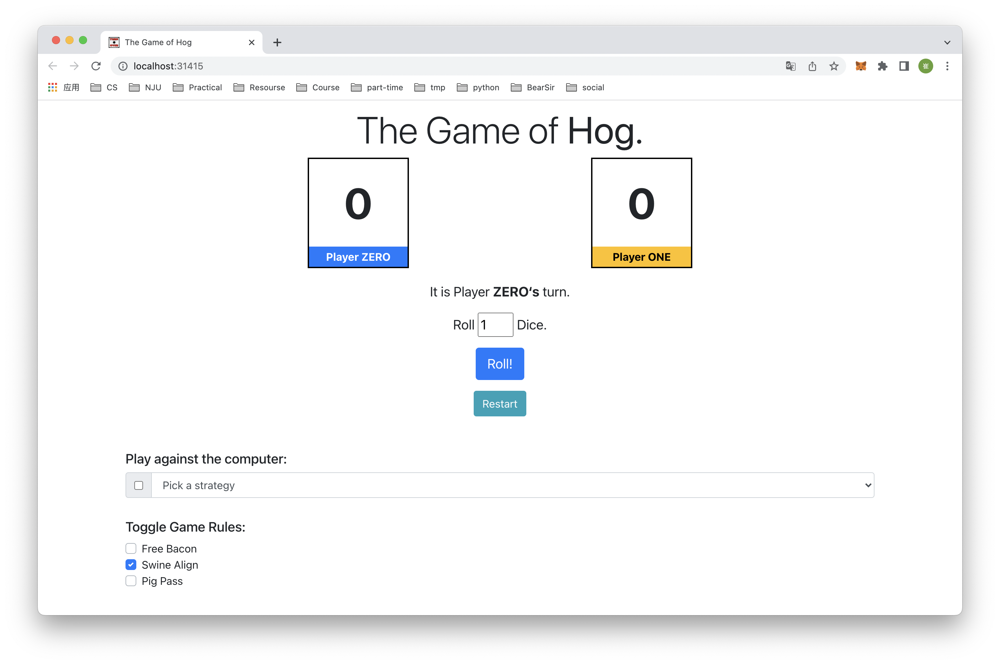
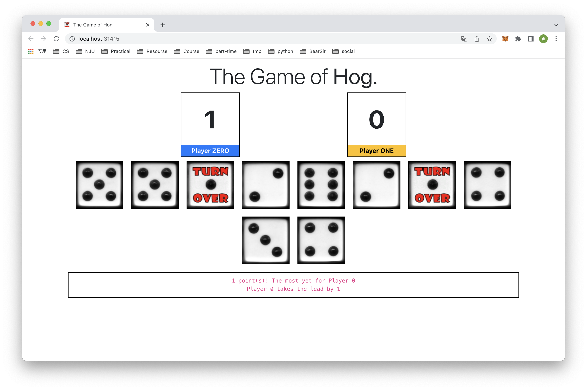

# Project 1: The Game of Hog


> Adapted from cs61a of UC Berkeley.


<center>I know! I'll use my Higher-order functions to Order higher rolls.</center>


## Introduction

In this project, you will develop a simulator and multiple strategies for the dice game Hog. You will need to use *control statements* and *higher-order functions* together, as described in Sections 1.2 through 1.6 of [Composing Programs](http://composingprograms.com/).


### Rules

In Hog, two players alternate turns trying to be the first to end a turn with at least 100 total points. On each turn, the current player chooses some number of dice to roll, up to 10. That player's score for the turn is the sum of the dice outcomes. However, a player who rolls too many dice risks:

- **Pig Out**. If any of the dice outcomes is a 1, the current player's score for the turn is 1.
    - *Example 1*: The current player rolls 7 dice, 5 of which are 1's. They score 1 point for the turn.
    - *Example 2*: The current player rolls 4 dice, all of which are 3's. Since Pig Out did not occur, they score 12 points for the turn.

In a normal game of Hog, those are all the rules. To spice up the game, we'll include some special rules:

- **Free Bacon**. A player who chooses to roll zero dice scores `k+3` points, where `k` is the `n`th digit of pi after the decimal point, and `n` is the total score of their opponent. As a special case, if the opponent's score is `n = 0`, then `k = 3` (the digit of pi before the decimal point).
    - *Example 1*: The opponent has a score of 0, and the current player rolls zero dice. The current player will receive `3 + 3 = 6` points.
    - *Example 2*: The opponent has a score of 1, and the current player rolls zero dice. The current player will receive `1 + 3 = 4` points.
    - *Example 3*: The opponent has a score of 2, and the current player rolls zero dice. The current player will receive `4 + 3 = 7` points.
    - *Example 4*: The opponent has a score of 42, and the current player rolls zero dice. The current player will receive `9 + 3 = 12` points.
- **Swine Align**. After points for the turn are added to the current player's score, if both players have a positive score and the Greatest Common Divisor (GCD) of the current player's score and the opponent's score is at least 10, take another turn.
    - *Example 1*: At the end of the first player's turn, the players have scores of 8 and 36. The GCD of the scores is 4, so the first player does not take another turn due to swine align.
    - *Example 2*: At the end of the first player's turn, the players have scores of 20 and 30. The GCD of the scores is 10, so the first player takes an extra turn.
    - *Example 3*: At the end of the first player's turn, the players have scores of 24 and 36. The GCD of the scores is 12, so the first player takes an extra turn. The first player rolls a 12 and the scores are now 36 and 36. The GCD of the scores is 36, so the first player takes yet another turn.
    - *Example 4*: At the end of the first player's turn, the players have scores of 15 and 0. Swine align only applies when both player scores are positive (not zero), so the first player does not take another turn due to swine align.
- **Pig Pass**. After points for the turn are added to the current player's score, if the current player's score is lower than the opponent's score and the difference between them is less than 3, the current player takes another turn.
    - *Example 1*: At the end of the first player's turn, The opponent has a score of 10 and the current player has a score of 11. Since 11 > 10, the current player does not take another turn due to Pig Pass.
    - *Example 2*: At the end of the first player's turn, The opponent has a score of 10 and the current player has a score of 7. Because `10 - 7 = 3 >= 3`, the current player does not take another turn due to Pig Passn.
    - *Example 3*: At the end of the first player's turn, The opponent has a score of 30 and the current player has a score of 28. Because `30 - 28 = 2 < 3`, the current player takes another turn.
    - *Example 4*: At the end of the first player's turn, The opponent has a score of 30 and the current player has a score of 28. Like in Example 3, the current player takes another turn. If the current player then rolls a 1 and now has a score of 29, Pig Pass activates again and the current player takes yet another turn.


## Final Product

After the first project, you will implement a dice rolling game with multiple strategies.

You can have an exploration of it by doing this:

```shell
cd solution
python3 hog_gui.py
```

> You will get a graphic user interface in your local browser with game logic implemented in my solution.






## Download starter files

To get started, download all of the project code.

```shell
git clone https://github.com/JacyCui/sicp-proj01.git
cd sicp-proj01
unzip hog.zip
```

Below is a list of all the files you will see in the archive `hog.zip`. However, you only have to make changes to `hog.py`.

- `hog.py`: A starter implementation of Hog

- `dice.py`: Functions for rolling dice

- `hog_gui.py`: A graphical user interface (GUI) for Hog

- `ucb.py`: Utility functions for SICP

    > UCB stands for UC Berkeley.

- `ok`: SICP autograder

- `tests`: A directory of tests used by `ok`

- `gui_files`: A directory of various things used by the web GUI

In the folder `solution` is my version of solution for hog project. You may not refer to it before you've finished the entire project.


## Logistics

For the functions that we ask you to complete, there may be some initial code that we provide. If you would rather not use that code, feel free to delete it and start from scratch. You may also add new function definitions as you see fit.

However, please do **not** modify any other functions. Doing so may result in your code failing our autograder tests. Also, please do not change any function signatures (names, argument order, or number of arguments).

Throughout this project, you should be testing the correctness of your code. It is good practice to test often, so that it is easy to isolate any problems. However, you should not be testing *too* often, to allow yourself time to think through problems.

We have provided an **autograder** called `ok` to help you with testing your code and tracking your progress. 

The primary purpose of `ok` is to test your implementations.

As you are not a student of UC Berkeley, You should always run `ok` like this:

```shell
python3 ok --local
```

If you want to test your code interactively, you can run

```shell
python3 ok -q [question number] -i --local
```

with the appropriate question number (e.g. `01`) inserted. This will run the tests for that question until the first one you failed, then give you a chance to test the functions you wrote interactively.

You can also use the debug printing feature in OK by writing

```python
print("DEBUG:", x) 
```

which will produce an output in your terminal without causing OK tests to fail with extra output.


## Graphical User Interface

A **graphical user interface** (GUI, for short) is provided for you. At the moment, it doesn't work because you haven't implemented the game logic. Once you complete the `play` function, you will be able to play a fully interactive version of Hog!

Once you've done that, you can run the GUI from your terminal:

```shell
python3 hog_gui.py
```

The GUI is an [open-source project hosted on Github](https://github.com/Cal-CS-61A-Staff/hog-gui).


## Phase 1: Simulator

In the first phase, you will develop a simulator for the game of Hog.

### Problem 0

The `dice.py` file represents dice using non-pure zero-argument functions. These functions are non-pure because they may have different return values each time they are called. The documentation of `dice.py` describes the two different types of dice used in the project:

- Dice can be fair, meaning that they produce each possible outcome with equal probability. Example: `six_sided`.
- For testing functions that use dice, deterministic test dice always cycle through a fixed sequence of values that are passed as arguments to the `make_test_dice` function.

Before writing any code, read over the `dice.py` file and check your understanding by unlocking the following tests.

```shell
python3 ok -q 00 -u --local
```

This should display a prompt that looks like this:

```shell
=====================================================================
Assignment: Project 1: Hog
Ok, version v1.5.2
=====================================================================

~~~~~~~~~~~~~~~~~~~~~~~~~~~~~~~~~~~~~~~~~~~~~~~~~~~~~~~~~~~~~~~~~~~~~
Unlocking tests

At each "? ", type what you would expect the output to be.
Type exit() to quit

---------------------------------------------------------------------
Question 0 > Suite 1 > Case 1
(cases remaining: 1)

>>> test_dice = make_test_dice(4, 1, 2)
>>> test_dice()
?
```

You should type in what you expect the output to be. To do so, you need to first figure out what `test_dice` will do, based on the description above.

You can exit the unlocker by typing `exit()`. **Typing Ctrl-C on Windows to exit out of the unlocker has been known to cause problems, so avoid doing so.**


### Problem 1

Implement the `roll_dice` function in `hog.py`. It takes two arguments: a positive integer called `num_rolls` giving the number of dice to roll and a `dice` function. It returns the number of points scored by rolling the dice that number of times in a turn: either the sum of the outcomes or 1 (*Pig Out*).

> The Pig Out rule:
>
> - **Pig Out**. If any of the dice outcomes is a 1, the current player's score for the turn is 1.
>     - *Example 1*: The current player rolls 7 dice, 5 of which are 1's. They score 1 point for the turn.
>     - *Example 2*: The current player rolls 4 dice, all of which are 3's. Since Pig Out did not occur, they score 12 points for the turn.

To obtain a single outcome of a dice roll, call `dice()`. You should call `dice()` exactly `num_rolls` times in the body of `roll_dice`. **Remember to call `dice()` exactly `num_rolls` times even if *Pig Out* happens in the middle of rolling.** In this way, you correctly simulate rolling all the dice together.

**Understand the problem**:

Before writing any code, unlock the tests to verify your understanding of the question. **Note: you will not be able to test your code using OK until you unlock the test cases for the corresponding question**.

```shell
python3 ok -q 01 -u --local
```

**Write code and check your work**:

Once you are done unlocking, begin implementing your solution. You can check your correctness with:

```shell
python3 ok -q 01 --local
```

#### Debugging Tips

If the tests don't pass, it's time to debug. You can observe the behavior of your function using Python directly. First, start the Python interpreter and load the `hog.py` file.

```shell
python3 -i hog.py
```

Then, you can call your `roll_dice` function on any number of dice you want. The `roll_dice` function has a [default argument value](http://composingprograms.com/pages/14-designing-functions.html#default-argument-values) for `dice` that is a random six-sided dice function. Therefore, the following call to `roll_dice` simulates rolling four fair six-sided dice.

```python
>>> roll_dice(4)
```

You will find that the previous expression may have a different result each time you call it, since it is simulating random dice rolls. You can also use test dice that fix the outcomes of the dice in advance. For example, rolling twice when you know that the dice will come up 3 and 4 should give a total outcome of 7.

```python
>>> fixed_dice = make_test_dice(3, 4)
>>> roll_dice(2, fixed_dice)
7
```

> On most systems, you can evaluate the same expression again by pressing the up arrow, then pressing enter or return. To evaluate earlier commands, press the up arrow repeatedly.
>
> If you find a problem, you need to change your `hog.py` file, save it, quit Python, start Python again, and then start evaluating expressions. Pressing the up arrow should give you access to your previous expressions, even after restarting Python.

Continue debugging your code and running the `ok` tests until they all pass. You should follow this same procedure of understanding the problem, implementing a solution, testing, and debugging for all the problems in this project.

> One more debugging tip: to start the interactive interpreter automatically upon failing an `ok` test, use `-i`. For example, `python3 ok -q 01 -i --local` will run the tests for question 1, then start an interactive interpreter with `hog.py` loaded if a test fails.


### Problem 2

Implement `free_bacon`, which takes the opponent's current `score` and returns the number of points scored by rolling 0 dice. Assume that `score` is less than 100.

> The Free Bacon rule:
>
> - **Free Bacon**. A player who chooses to roll zero dice scores `k+3` points, where `k` is the `n`th digit of pi after the decimal point, and `n` is the total score of their opponent. As a special case, if the opponent's score is `n = 0`, then `k = 3` (the digit of pi before the decimal point).
>     - *Example 1*: The opponent has a score of 0, and the current player rolls zero dice. The current player will receive `3 + 3 = 6` points.
>     - *Example 2*: The opponent has a score of 1, and the current player rolls zero dice. The current player will receive `1 + 3 = 4` points.
>     - *Example 3*: The opponent has a score of 2, and the current player rolls zero dice. The current player will receive `4 + 3 = 7` points.
>     - *Example 4*: The opponent has a score of 42, and the current player rolls zero dice. The current player will receive `9 + 3 = 12` points.

The provided code includes the `FIRST_101_DIGITS_OF_PI` as an integer, which is stored locally as `pi`. One way to solve this problem is to trim `pi` until it has only `score+1` digits, then return 3 more than the last digit of `pi`.

**Hint:** An integer `n` has `k+1` digits if `n` is less than `pow(10, k+1)` but greater than or equal to `pow(10, k)`.

You are allowed to implement this function in any way you want. You don't have to follow this recommended method or use the provided starter code. However, **You may not use for loops or square brackets `[` `]` in your implementation, since we haven't covered those yet.**

Before writing any code, unlock the tests to verify your understanding of the question.

```shell
python3 ok -q 02 -u --local
```

Once you are done unlocking, begin implementing your solution. You can check your correctness with:

```shell
python3 ok -q 02 --local
```

You can also test `free_bacon` interactively by entering `python3 -i hog.py` in the terminal and then calling `free_bacon` with various inputs.


### Problem 3

Implement the `take_turn` function, which returns the number of points scored for a turn by rolling the given `dice` `num_rolls` times.

Your implementation of `take_turn` should call both `roll_dice` and `free_bacon` when possible.

Before writing any code, unlock the tests to verify your understanding of the question.

```shell
python3 ok -q 03 -u --local
```

Once you are done unlocking, begin implementing your solution. You can check your correctness with:

```shell
python3 ok -q 03 --local
```


### Problem 4a

Implement `swine_align`, which takes the current player and opponent scores and returns whether the current player will take another turn due to Swine Align. **Note:** In the special case where one score is 0, return `False`.

> The Swine Align rule:
>
> - **Swine Align**. After points for the turn are added to the current player's score, if both players have a positive score and the Greatest Common Divisor (GCD) of the current player's score and the opponent's score is at least 10, take another turn.
>     - *Example 1*: At the end of the first player's turn, the players have scores of 8 and 36. The GCD of the scores is 4, so the first player does not take another turn due to swine align.
>     - *Example 2*: At the end of the first player's turn, the players have scores of 20 and 30. The GCD of the scores is 10, so the first player takes an extra turn.
>     - *Example 3*: At the end of the first player's turn, the players have scores of 24 and 36. The GCD of the scores is 12, so the first player takes an extra turn. The first player rolls a 12 and the scores are now 36 and 36. The GCD of the scores is 36, so the first player takes yet another turn.
>     - *Example 4*: At the end of the first player's turn, the players have scores of 15 and 0. Swine align only applies when both player scores are positive (not zero), so the first player does not take another turn due to swine align.

> **Hint**: The expression `n % d == 0` is true if and only if `n` is a multiple of `d`.

Before writing any code, unlock the tests to verify your understanding of the question.

```shell
python3 ok -q 04a -u --local
```

Once you are done unlocking, begin implementing your solution. You can check your correctness with:

```shell
python3 ok -q 04a --local
```


### Problem 4b

Implement `pig_pass`, which takes the current player and opponent scores and returns whether the current player will take an extra turn due to Pig Pass.

> The Pig Pass rule:
>
> - **Pig Pass**. After points for the turn are added to the current player's score, if the current player's score is lower than the opponent's score and the difference between them is less than 3, the current player takes another turn.

Before writing any code, unlock the tests to verify your understanding of the question.

```shell
python3 ok -q 04b -u --local
```

Once you are done unlocking, begin implementing your solution. You can check your correctness with:

```shell
python3 ok -q 04b --local
```


### Problem 5

Implement the `play` function, which simulates a full game of Hog. Players alternate turns rolling dice until one of the players reaches the `goal` score.

To determine how many dice are rolled each turn, each player uses their respective strategy (Player 0 uses `strategy0` and Player 1 uses `strategy1`). A *strategy* is a function that, given a player's score and their opponent's score, returns the number of dice that the current player will roll in the turn. **Only call a strategy function once per turn (or risk breaking the GUI).** Don't worry about implementing strategies yet. You'll do that in Phase 3.

When the game ends, `play` returns the final total scores of both players, with Player 0's score first and Player 1's score second.

Hints:

- You should call the functions you have implemented already.
- Call `take_turn` with three arguments. Only call `take_turn` once per turn.
- Call `extra_turn` to determine if the current player will take another turn, either due to Swine Align or Pig Pass.
- You can get the number of the other player (either 0 or 1) by calling the provided function `other`.
- You can ignore the `say` argument to the `play` function for now. You will use it in Phase 2 of the project.

**Rules Clarification**: A player can take more than two consecutive turns. For example, if the score after their first turn is 10 vs 20, they go again due to Swine Align. If they score 8 points and now the score is 18 vs 20, they go a third time due to Pig Pass. If they score 12 points and now the score is 30 vs 20, they go a fourth time in a row.

**Note**: It's not mathematically possible for Swine Align and Pig Pass to be active simultaneously.

Before writing any code, unlock the tests to verify your understanding of the question.

```shell
python3 ok -q 05 -u --local
```

Once you are done unlocking, begin implementing your solution. You can check your correctness with:

```shell
python3 ok -q 05 --local
```

Once you are finished, you will be able to play a graphical version of the game. We have provided a file called `hog_gui.py` that you can run from the terminal:

```shell
python3 hog_gui.py
```

The GUI relies on your implementation, so if you have any bugs in your code, they will be reflected in the GUI. This means you can also use the GUI as a debugging tool; however, it's better to run the tests first.

Congratulations! You have finished Phase 1 of this project!


## Phase 2: Commentary

In the second phase, you will implement commentary functions that print remarks about the game after each turn, such as, `"22 points! That's the biggest gain yet for Player 1."`

A commentary function takes two arguments, Player 0's current score and Player 1's current score. It can print out commentary based on either or both current scores and any other information in its parent environment. Since commentary can differ from turn to turn depending on the current point situation in the game, a commentary function always returns another commentary function to be called on the next turn. The only side effect of a commentary function should be to print.

### Commentary examples

The function `say_scores` in `hog.py` is an example of a commentary function that simply announces both players' scores. Note that `say_scores` returns itself, meaning that the same commentary function will be called each turn.

```python
def say_scores(score0, score1):
    """A commentary function that announces the score for each player."""
    print("Player 0 now has", score0, "and Player 1 now has", score1)
    return say_scores
```

The function `announce_lead_changes` is an example of a higher-order function that returns a commentary function that tracks lead changes. A different commentary function will be called each turn.

```python
def announce_lead_changes(last_leader=None):
    """Return a commentary function that announces lead changes.

    >>> f0 = announce_lead_changes()
    >>> f1 = f0(5, 0)
    Player 0 takes the lead by 5
    >>> f2 = f1(5, 12)
    Player 1 takes the lead by 7
    >>> f3 = f2(8, 12)
    >>> f4 = f3(8, 13)
    >>> f5 = f4(15, 13)
    Player 0 takes the lead by 2
    """
    def say(score0, score1):
        if score0 > score1:
            leader = 0
        elif score1 > score0:
            leader = 1
        else:
            leader = None
        if leader != None and leader != last_leader:
            print('Player', leader, 'takes the lead by', abs(score0 - score1))
        return announce_lead_changes(leader)
    return say
```

You should also understand the function `both`, which takes two commentary functions (`f` and `g`) and returns a *new* commentary function. This returned commentary function returns *another* commentary function which calls the functions returned by calling `f` and `g`, in that order.

```python
def both(f, g):
    """Return a commentary function that says what f says, then what g says.

    NOTE: the following game is not possible under the rules, it's just
    an example for the sake of the doctest

    >>> h0 = both(say_scores, announce_lead_changes())
    >>> h1 = h0(10, 0)
    Player 0 now has 10 and Player 1 now has 0
    Player 0 takes the lead by 10
    >>> h2 = h1(10, 8)
    Player 0 now has 10 and Player 1 now has 8
    >>> h3 = h2(10, 17)
    Player 0 now has 10 and Player 1 now has 17
    Player 1 takes the lead by 7
    """
    def say(score0, score1):
        return both(f(score0, score1), g(score0, score1))
    return say
```


### Problem 6

Update your `play` function so that a commentary function is called at the end of each turn. The return value of calling a commentary function gives you the commentary function to call on the next turn.

For example, `say(score0, score1)` should be called at the end of the first turn. Its return value (another commentary function) should be called at the end of the second turn. Each consecutive turn, call the function that was returned by the call to the previous turn's commentary function.

Before writing any code, unlock the tests to verify your understanding of the question.

```shell
python3 ok -q 06 -u --local
```

Once you are done unlocking, begin implementing your solution. You can check your correctness with:

```shell
python3 ok -q 06 --local
```


### Problem 7

Implement the `announce_highest` function, which is a higher-order function that returns a commentary function. This commentary function announces whenever a particular player gains more points in a turn than ever before. E.g., `announce_highest(1)` ignores Player 0 entirely and just print information about Player 1. (So does its return value; another commentary function about only Player 1. To compute the gain, it must compare the score from last turn (`last_score`) to the score from this turn for the player of interest, which is designated by the `who` argument. This function must also keep track of the highest gain for the player so far, which is store as `running_high`.

The way in which `announce_highest` announces is very specific, and your implementation should match the doctests provided. Don't worry about singular versus plural when announcing point gains; you should simply use "point(s)" for both cases.

> **Hint:** The `announce_lead_changes` function provided to you is an example of how to keep track of information using commentary functions. If you are stuck, first make sure you understand how `announce_lead_changes` works.

> **Hint.** If you're getting a `local variable [var] reference before assignment` error:
>
> This happens because in Python, you aren't normally allowed to modify variables defined in parent frames. Instead of reassigning `[var]`, the interpreter thinks you're trying to define a new variable within the current frame. We'll learn about how to work around this in a future lecture, but it is not required for this problem.
>
> To fix this, you have two options:
>
> 1) Rather than reassigning `[var]` to its new value, create a new variable to hold that new value. Use that new variable in future calculations.
>
> 2) For this problem specifically, avoid this issue entirely by not using assignment statements at all. Instead, pass new values in as arguments to a call to `announce_highest`.

Before writing any code, unlock the tests to verify your understanding of the question.

```shell
python3 ok -q 07 -u --local
```

Once you are done unlocking, begin implementing your solution. You can check your correctness with:

```shell
python3 ok -q 07 --local
```

When you are done, you will see commentary in the GUI:

```shell
python3 hog_gui.py
```

The commentary in the GUI is generated by passing the following function as the `say` argument to `play`.

```python
both(announce_highest(0), both(announce_highest(1), announce_lead_changes()))
```

Great work! You just finished Phase 2 of the project!


## Phase 3: Strategies

In the third phase, you will experiment with ways to improve upon the basic strategy of always rolling a fixed number of dice. First, you need to develop some tools to evaluate strategies.

### Problem 8

Implement the `make_averaged` function, which is a higher-order function that takes a function `original_function` as an argument. It returns another function that takes the same number of arguments as `original_function` (the function originally passed into `make_averaged`). This returned function differs from the input function in that it returns the average value of repeatedly calling `original_function` on the same arguments. This function should call `original_function` a total of `trials_count` times and return the average of the results.

To implement this function, you need a new piece of Python syntax! You must write a function that accepts an arbitrary number of arguments, then calls another function using exactly those arguments. Here's how it works.

Instead of listing formal parameters for a function, you can write `*args`. To call another function using exactly those arguments, you call it again with `*args`. For example,

```python
>>> def printed(f):
...     def print_and_return(*args):
...         result = f(*args)
...         print('Result:', result)
...         return result
...     return print_and_return
>>> printed_pow = printed(pow)
>>> printed_pow(2, 8)
Result: 256
256
>>> printed_abs = printed(abs)
>>> printed_abs(-10)
Result: 10
10
```

Read the docstring for `make_averaged` carefully to understand how it is meant to work.

Before writing any code, unlock the tests to verify your understanding of the question.

```shell
python3 ok -q 08 -u --local
```

Once you are done unlocking, begin implementing your solution. You can check your correctness with:

```shell
python3 ok -q 08 --local
```


### Problem 9

Implement the `max_scoring_num_rolls` function, which runs an experiment to determine the number of rolls (from 1 to 10) that gives the maximum average score for a turn. Your implementation should use `make_averaged` and `roll_dice`.

If two numbers of rolls are tied for the maximum average score, return the lower number. For example, if both 3 and 6 achieve a maximum average score, return 3.

Before writing any code, unlock the tests to verify your understanding of the question.

```shell
python3 ok -q 09 -u --local
```

Once you are done unlocking, begin implementing your solution. You can check your correctness with:

```shell
python3 ok -q 09 --local
```

To run this experiment on randomized dice, call `run_experiments` using the `-r` option:

```shell
python3 hog.py -r
```

**Running experiments** For the remainder of this project, you can change the implementation of `run_experiments` as you wish. By calling `average_win_rate`, you can evaluate various Hog strategies. For example, change the first `if False:` to `if True:` in order to evaluate `always_roll(8)` against the baseline strategy of `always_roll(6)`.

Some of the experiments may take up to a minute to run. You can always reduce the number of trials in your call to `make_averaged` to speed up experiments.


### Problem 10

A strategy can try to take advantage of the *Free Bacon* rule by rolling 0 when it is most beneficial to do so. Implement `bacon_strategy`, which returns 0 whenever rolling 0 would give **at least** `cutoff` points and returns `num_rolls` otherwise.

Before writing any code, unlock the tests to verify your understanding of the question.

```shell
python3 ok -q 10 -u --local
```

Once you are done unlocking, begin implementing your solution. You can check your correctness with:

```shell
python3 ok -q 10 --local
```

Once you have implemented this strategy, change `run_experiments` to evaluate your new strategy against the baseline. Is it better than just rolling 4?


### Problem 11

A strategy can also take advantage of the *Pig Pass* and *Swine Align* rules. The extra turn strategy always rolls 0 if doing so triggers an extra turn. In other cases, it rolls 0 if rolling 0 would give **at least** `cutoff` points. Otherwise, the strategy rolls `num_rolls`.

> **Hint**: You can use the function `bacon_strategy` you defined in Problem 10.

Before writing any code, unlock the tests to verify your understanding of the question.

```shell
python3 ok -q 11 -u --local
```

Once you are done unlocking, begin implementing your solution. You can check your correctness with:

```shell
python3 ok -q 11 --local
```

Once you have implemented this strategy, update `run_experiments` to evaluate your new strategy against the baseline. You should find that it gives a significant edge over `always_roll(4)`.


### Optional: Problem 12

Implement `final_strategy`, which combines these ideas and any other ideas you have to achieve a high win rate against the `always_roll(4)` strategy. Some suggestions:

- `extra_turn_strategy` is a good default strategy to start with.
- There's no point in scoring more than 100. Check whether you can win by rolling 0, 1 or 2 dice. If you are in the lead, you might take fewer risks.
- Try to force extra turns.
- Choose the `num_rolls` and `cutoff` arguments carefully.
- Take the action that is most likely to win the game.

You can check that your final strategy is valid by running Ok.

```shell
python3 ok -q 12 --local
```


## Conclusion

At this point, run the entire autograder to see if there are any tests that don't pass.

```shell
python3 ok --local
```

You can also play against your final strategy with the graphical user interface:

```shell
python3 hog_gui.py
```

The GUI will alternate which player is controlled by you.

My version of implementation is in `solution` directory. Having a look at it may help you write better codes.

Congratulations, you have reached the end of your first SICP project! If you haven't already, relax and enjoy a few games of Hog with a friend using the version implemented in `solution`.


