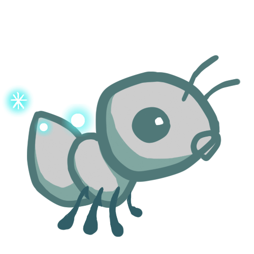

# Project 3: Ants Vs. SomeBees


> Adapted from cs61a of UC Berkeley.


<center>Bees are coming! Create a better soldier with inherit-ants.</center>


## Introduction

In this project, you will create a tower defense game called *Ants Vs. SomeBees*. As the ant queen, you populate your colony with the bravest ants you can muster. Your ants must protect their queen from the evil bees that invade your territory. Irritate the bees enough by throwing leaves at them, and they will be vanquished. Fail to pester the airborne intruders adequately, and your queen will succumb to the bees' wrath. This game is inspired by PopCap Games' *Plants Vs. Zombies*.

This project combines functional and object-oriented programming paradigms, focusing on the material from [Chapter 2.5](http://composingprograms.com/pages/25-object-oriented-programming.html) of Composing Programs. The project also involves understanding, extending, and testing a large program.


## Final Product

When you finish the project, you'll have implemented a significant part of this game yourself!

**Note** that since the graphical interface requires support from Berkeley's remote server, you need to enable the proxy on your computer to run the graphical interface properly.

You can have an exploration of it by doing this:

```shell
cd solution
python3 gui.py -w --food 10 -d normal
```

> You will get a graphic user interface in your local browser with game logic implemented in my solution.


## Download starter files

To get started, download all of the project code.

```shell
git clone https://github.com/JacyCui/sicp-proj03.git
cd sicp-proj03
unzip ants.zip
```

Below is a list of all the files you will see in the archive `ants.zip`. However, you only have to make changes to `ants.py`.

- `ants.py`: The game logic of Ants Vs. SomeBees
- `ants_gui.py`: The original GUI for Ants Vs. SomeBees
- `gui.py:` A new GUI for Ants Vs. SomeBees.
- `graphics.py`: Utilities for displaying simple two-dimensional animations
- `utils.py`: Some functions to facilitate the game interface
- `ucb.py`: Utility functions for CS 61A
- `state.py`: Abstraction for gamestate for gui.py
- `assets`: A directory of images and files used by `gui.py`
- `img`: A directory of images used by `ants_gui.py`
- `ok`: The autograder
- `proj3.ok`: The `ok` configuration file
- `tests`: A directory of tests used by `ok`


## Logistics

You will turn in the following files:

- `ants.py`

You do not need to modify or turn in any other files to complete the project.

For the functions that we ask you to complete, there may be some initial code that we provide. If you would rather not use that code, feel free to delete it and start from scratch. You may also add new function definitions as you see fit.

However, please do **not** modify any other functions. Doing so may result in your code failing our autograder tests. Also, please do not change any function signatures (names, argument order, or number of arguments).

Throughout this project, you should be testing the correctness of your code. It is good practice to test often, so that it is easy to isolate any problems. However, you should not be testing *too* often, to allow yourself time to think through problems.

We have provided an **autograder** called `ok` to help you with testing your code and tracking your progress.

The primary purpose of `ok` is to test your implementations.

As you are not a student of UC Berkeley, You should always run `ok` like this:

```shell
python3 ok --local
```

If you want to test your code interactively, you can run

```shell
 python3 ok -q [question number] -i --local
```

with the appropriate question number (e.g. `01`) inserted. This will run the tests for that question until the first one you failed, then give you a chance to test the functions you wrote interactively.

You can also use the debug printing feature in OK by writing

```python
 print("DEBUG:", x)
```

which will produce an output in your terminal without causing OK tests to fail with extra output.


## The Game

A game of Ants Vs. SomeBees consists of a series of turns. In each turn, new bees may enter the ant colony. Then, new ants are placed to defend their colony. Finally, all insects (ants, then bees) take individual actions. Bees either try to move toward the end of the tunnel or sting ants in their way. Ants perform a different action depending on their type, such as collecting more food, or throwing leaves at the bees. The game ends either when a bee reaches the end of the tunnel (you lose), the bees destroy the `QueenAnt` if it exists (you lose), or the entire bee fleet has been vanquished (you win).


### Core concepts

**The Colony**. This is where the game takes place. The colony consists of several *places* that are chained together to form a tunnel where bees can travel through. The colony has some quantity of food that can be expended to deploy ant troops.

**Places**. A place links to another place to form a tunnel. The player can place a single ant into each place. However, there can be many bees in a single place.

**The Hive**. This is the place where bees originate. Bees exit the beehive to enter the ant colony.

**Ants**. Ants are the usable troops in the game that the player places into the colony. Each type of ant takes a different action and requires a different amount of food to place. The two most basic ant types are the `HarvesterAnt`, which adds one food to the colony during each turn, and the `ThrowerAnt`, which throws a leaf at a bee each turn. You will be implementing many more.

**Bees**. Bees are the antagonistic troops in the game that the player must defend the colony from. Each turn, a bee either advances to the next place in the tunnel if no ant is in its way, or it stings the ant in its way. Bees win when at least one bee reaches the end of a tunnel.

### Core classes

The concepts described above each have a corresponding class that encapsulates the logic for that concept. Here is a summary of the main classes involved in this game:

- **`GameState`**: Represents the colony and some state information about the game, including how much food is available, how much time has elapsed, where the `AntHomeBase` is, and all the `Place`s in the game.
- **`Place`**: Represents a single place that holds insects. At most one `Ant` can be in a single place, but there can be many `Bee`s in a single place. `Place` objects have an `exit` to the left and an `entrance` to the right, which are also places. Bees travel through a tunnel by moving to a `Place`'s `exit`.
- **`Hive`**: Represents the place where `Bee`s start out (on the right of the tunnel).
- **`AntHomeBase`**: Represents the place `Ant`s are defending (on the left of the tunnel). If Bees get here, they win :(
- **`Insect`**: A superclass for `Ant` and `Bee`. All insects have `health` attribute, representing their remaining health, and a `place` attribute, representing the `Place` where they are currently located. Each turn, every active `Insect` in the game performs its `action`.
- **`Ant`**: Represents ants. Each `Ant` subclass has special attributes or a special `action` that distinguish it from other `Ant` types. For example, a `HarvesterAnt` gets food for the colony and a `ThrowerAnt` attacks `Bee`s. Each ant type also has a `food_cost` attribute that indicates how much it costs to deploy one unit of that type of ant.
- **`Bee`**: Represents bees. Each turn, a bee either moves to the `exit` of its current `Place` if the `Place` is not `blocked` by an ant, or stings the ant occupying its same `Place`.

### Game Layout

Below is a visualization of a GameState. As you work through the unlocking tests and problems, we recommend drawing out similar diagrams to help your understanding.


### Playing the game

The game can be run in two modes: as a text-based game or using a graphical user interface (GUI). The game logic is the same in either case, but the GUI enforces a turn time limit that makes playing the game more exciting. The text-based interface is provided for debugging and development.

The files are separated according to these two modes. `ants.py` knows nothing of graphics or turn time limits.

To start a text-based game, run

```shell
python3 ants_text.py
```

To start a graphical game, run

```shell
python3 gui.py
```

When you start the graphical version, a new browser window should appear. In the starter implementation, you have unlimited food and your ants can only throw leaves at bees in their current `Place`. Before you complete Problem 2, the GUI may crash since it doesn't have a full conception of what a Place is yet! Try playing the game anyway! You'll need to place a lot of `ThrowerAnt`s (the second type) in order to keep the bees from reaching your queen.

The game has several options that you will use throughout the project, which you can view with `python3 ants_text.py --help`.

```shell
usage: ants_text.py [-h] [-d DIFFICULTY] [-w] [--food FOOD]

Play Ants vs. SomeBees

optional arguments:
  -h, --help     show this help message and exit
  -d DIFFICULTY  sets difficulty of game (test/easy/normal/hard/extra-hard)
  -w, --water    loads a full layout with water
  --food FOOD    number of food to start with when testing
```


## Phase 1: Basic gameplay

In the first phase you will complete the implementation that will allow for basic gameplay with the two basic `Ant`s: the `HarvesterAnt` and the `ThrowerAnt`.

### Problem 0

Answer the following questions after you have read the *entire* `ants.py` file.

To test your answers, run

```shell
python3 ok -q 00 -u --local
```

If you cannot answer these questions, read the file again, consult the core concepts/classes sections above, or make use of the comment section.

1. What is the significance of an Insect's `health` attribute? Does this value change? If so, how?
2. Which of the following is a class attribute of the `Insect` class?
3. Is the `health` attribute of the `Ant` class an instance attribute or class attribute? Why?
4. Is the `damage` attribute of an `Ant` subclass (such as `ThrowerAnt`) an instance attribute or class attribute? Why?
5. Which class do both `Ant` and `Bee` inherit from?
6. What do instances of `Ant` and instances of `Bee` have in common?
7. How many insects can be in a single `Place` at any given time (before Problem 8)?
8. What does a `Bee` do during one of its turns?
9. When is the game lost?

Remember to run

```shell
python3 ok -q 00 -u --local
```


### Problem 1

Before writing any code, read the instructions and test your understanding of the problem:

```shell
python3 ok -q 01 -u --local
```

**Part A**: Currently, there is no cost for placing any type of `Ant`, and so there is no challenge to the game. The base class `Ant` has a `food_cost` of zero. Override this class attribute for `HarvesterAnt` and `ThrowerAnt` according to the "Food cost" column in the table below.

| **Class**                                                    | **Food Cost** | **Health** |
| ------------------------------------------------------------ | ------------- | ---------- |
|  `HarvesterAnt` | 2             | 1          |
|  `ThrowerAnt` | 3             | 1          |

**Part B**: Now that placing an `Ant` costs food, we need to be able to gather more food! To fix this issue, implement the `HarvesterAnt` class. A `HarvesterAnt` is a type of `Ant` that adds one food to the `gamestate.food` total as its `action`.

After writing code, test your implementation:

```shell
python3 ok -q 01 --local
```

Try playing the game by running `python3 gui.py`. Once you have placed a `HarvesterAnt`, you should accumulate food each turn. You can also place `ThrowerAnt`s, but you'll see that they can only attack bees that are in their `Place`, so it'll be a little difficult to win.


### Problem 2

Before writing any code, read the instructions and test your understanding of the problem:

```shell
python3 ok -q 02 -u --local
```

In this problem, you'll complete `Place.__init__` by adding code that tracks entrances. Right now, a `Place` keeps track only of its `exit`. We would like a `Place` to keep track of its entrance as well. A `Place` needs to track only one `entrance`. Tracking entrances will be useful when an `Ant` needs to see what `Bee`s are in front of it in the tunnel.

However, simply passing an entrance to a `Place` constructor will be problematic; we would need to have both the exit and the entrance before creating a `Place`! (It's a chicken or the egg problem.) To get around this problem, we will keep track of entrances in the following way instead. `Place.__init__` should use this logic:

- A newly created `Place` always starts with its `entrance` as `None`.
- If the `Place` has an `exit`, then the `exit`'s `entrance` is set to that `Place`.

> *Hint:* Remember that when the `__init__` method is called, the first parameter, `self`, is bound to the newly created object

> *Hint:* Try drawing out two `Place`s next to each other if things get confusing. In the GUI, a place's `entrance` is to its right while the `exit` is to its left.

As a reminder, the game layout is as follows:


After writing code, test your implementation:

```shell
python3 ok -q 02 --local
```


### Problem 3

Before writing any code, read the instructions and test your understanding of the problem:

```shell
python3 ok -q 03 -u --local
```

In order for a `ThrowerAnt` to throw a leaf, it must know which bee to hit. The provided implementation of the `nearest_bee` method in the `ThrowerAnt` class only allows them to hit bees in the same `Place`. Your job is to fix it so that a `ThrowerAnt` will `throw_at` the nearest bee in front of it **that is not still in the `Hive`.**

Change `nearest_bee` so that it returns a random `Bee` from the nearest place that contains bees. Your implementation should follow this logic:

- Start from the current `Place` of the `ThrowerAnt`.
- For each place, return a random bee if there is any, and if not, inspect the place in front of it (stored as the current place's `entrance`).
- If there is no bee to attack, return `None`.

> *Hint*: The `bee_selector` function provided in `ants.py` returns a random bee from a list of bees or `None` if the list is empty.

> *Hint*: Having trouble visualizing the test cases? Try drawing them out on paper! The sample diagram provided in Game Layout shows the first test case for this problem.

After writing code, test your implementation:

```shell
python3 ok -q 03 --local
```

After implementing `nearest_bee`, a `ThrowerAnt` should be able to `throw_at` a `Bee` in front of it that is not still in the `Hive`. Make sure that your ants do the right thing! To start a game with ten food (for easy testing):

```shell
python3 gui.py --food 10
```


## Phase 2: Ants!

Now that you've implemented basic gameplay with two types of `Ant`s, let's add some flavor to the ways ants can attack bees. In this phase, you'll be implementing several different `Ant`s with different attack strategies.

After you implement each `Ant` subclass in this section, you'll need to set its `implemented` class attribute to `True` so that that type of ant will show up in the GUI. Feel free to try out the game with each new ant to test the functionality!

With your Phase 2 ants, try `python3 gui.py -d easy` to play against a full swarm of bees in a multi-tunnel layout and try `-d normal`, `-d hard`, or `-d extra-hard` if you want a real challenge! If the bees are too numerous to vanquish, you might need to create some new ants.

### Problem 4

Before writing any code, read the instructions and test your understanding of the problem:

```shell
python3 ok -q 04 -u --local
```

A `ThrowerAnt` is a powerful threat to the bees, but it has a high food cost. In this problem, you'll implement two subclasses of `ThrowerAnt` that are less costly but have constraints on the distance they can throw:

- The `LongThrower` can only `throw_at` a `Bee` that is found after following at least 5 `entrance` transitions. It cannot hit `Bee`s that are in the same `Place` as it or the first 4 `Place`s in front of it. If there are two `Bees`, one too close to the `LongThrower` and the other within its range, the `LongThrower` should only throw at the farther `Bee`, which is within its range, instead of trying to hit the closer `Bee`.
- The `ShortThrower` can only `throw_at` a `Bee` that is found after following at most 3 `entrance` transitions. It cannot throw at any ants further than 3 `Place`s in front of it.

Neither of these specialized throwers can `throw_at` a `Bee` that is exactly 4 `Place`s away.

| Class                                                        | Food Cost | Health |
| ------------------------------------------------------------ | --------- | ------ |
| `ShortThrower` | 2         | 1      |
| `LongThrower` | 2         | 1      |

To implement these new throwing ants, your `ShortThrower` and `LongThrower` classes should inherit the `nearest_bee` method from the base `ThrowerAnt` class. The logic of choosing which bee a thrower ant will attack is essentially the same, except the `ShortThrower` and `LongThrower` ants have maximum and minimum ranges, respectively.

Then, modify the `nearest_bee` method to reference `min_range` and `max_range` attributes, and only return a bee that is in range.

Make sure to give these `min_range` and `max_range` sensible values in `ThrowerAnt` that do not change its behavior. Then, implement the subclasses `LongThrower` and `ShortThrower` with appropriately constrained ranges.

> *Hint:* `float('inf')` returns an infinite positive value represented as a float that can be compared with other numbers.

> *Hint:* You can chain inequalities in Python: e.g. `2 < x < 6` will check if `x` is between 2 and 6. Also, `min_range` and `max_range` should mark an inclusive range.

> Important! Please make sure your class attributes are called `max_range` and `min_range` rather than `maximum_range` and `minimum_range` or something. The tests directly reference this attribute name.

Don't forget to set the `implemented` class attribute of `LongThrower` and `ShortThrower` to `True`.

After writing code, test your implementation (rerun the tests for 03 to make sure they still work):

```shell
python3 ok -q 03 --local
python3 ok -q 04 --local
```


### Problem 5

Before writing any code, read the instructions and test your understanding of the problem:

```shell
python3 ok -q 05 -u --local
```

Implement the `FireAnt`, which does damage when it receives damage. Specifically, if it is damaged by `amount` health units, it does a damage of `amount` to all bees in its place (this is called *reflected damage*). If it dies, it does an additional amount of damage, as specified by its `damage` attribute.

To implement this, override `FireAnt`'s `reduce_health` method. Your overriden method should call the `reduce_health` method inherited from `Ant`, which is itself inherited from `Insect` to reduce the current `FireAnt` instance's health. That base `reduce_health` method reduces the insect's `health` by the given `amount` and remove the insect from its place if `health` reaches zero or lower.

Your method needs to also include the reflective damage logic, however:

- Determine the reflective damage amount, by starting with the `amount` inflicted on the ant, and then adding `damage` if the ant's health has dropped to 0.
- For each bee in the place, damage them with the total amount by calling the `reduce_health` method inherited from `Insect`.

The `FireAnt` must do its damage *before* being removed from its `place`, so pay careful attention to the order of your logic in the overriden method.

| **Class**                               | **Food Cost** | **Health** |
| --------------------------------------- | ------------- | ---------- |
|  `FireAnt` | 5             | 3          |

> *Hint:* Do *not* call `self.reduce_health`, or you'll end up stuck in a recursive loop. (Can you see why?)
>
> *Hint:* Damaging a bee may cause it to be removed from its place. If you iterate over a list, but change the contents of that list at the same time, you [may not visit all the elements](https://docs.python.org/3/tutorial/controlflow.html#for-statements). This can be prevented by making a copy of the list. You can either use a list slice, or use the built-in `list` function.
>
> ```python
> >>> lst = [1,2,3,4]
>  >>> lst[:]
> [1, 2, 3, 4]
>  >>> list(lst)
>  [1, 2, 3, 4]
>  >>> lst[:] is not lst and list(lst) is not lst
>  True
> ```

Once you've finished implementing the `FireAnt`, give it a class attribute `implemented` with the value `True`.

> Even though you are overriding the `Insect.reduce_health` function, you can still use it in your implementation by calling it directly (rather than via `self`). Note that this is not recursion (why?)

After writing code, test your implementation:

```shell
python3 ok -q 05 --local
```

You can also test your program by playing a game or two! A `FireAnt` should destroy all co-located Bees when it is stung. To start a game with ten food (for easy testing):

```shell
python3 gui.py --food 10
```


**Congratulations! You have finished Phases 1 and 2 of this project!**


## Phase 3: More Ants!

We now have some great offensive troops to help vanquish the bees, but let's make sure we're also keeping our defensive efforts up. In this phase you will implement ants that have special defensive capabilities such as increased health and the ability to protect other ants.

### Problem 6

Before writing any code, read the instructions and test your understanding of the problem:

```shell
python3 ok -q 06 -u --local
```

We are going to add some protection to our glorious home base by implementing the `WallAnt`, which is an ant that does nothing each turn. A `WallAnt` is useful because it has a large `health` value.

| **Class**                               | **Food Cost** | **Health** |
| --------------------------------------- | ------------- | ---------- |
|  `WallAnt` | 4             | 4          |

Unlike with previous ants, we have not provided you with a class header. Implement the `WallAnt` class from scratch. Give it a class attribute `name` with the value `'Wall'` (so that the graphics work) and a class attribute `implemented` with the value `True` (so that you can use it in a game).

After writing code, test your implementation:

```shell
python3 ok -q 06 --local
```


### Problem 7

Before writing any code, read the instructions and test your understanding of the problem:

```shell
python3 ok -q 07 -u --local
```

Implement the `HungryAnt`, which will select a random `Bee` from its `place` and eat it whole. After eating a `Bee`, it must spend 3 turns chewing before eating again. If there is no bee available to eat, it will do nothing.

We have not provided you with a class header. Implement the `HungryAnt` class from scratch. Give it a class attribute `name` with the value `'Hungry'` (so that the graphics work) and a class attribute `implemented` with the value `True` (so that you can use it in a game).

| **Class**                                     | **Food Cost** | **Health** |
| --------------------------------------------- | ------------- | ---------- |
|  `HungryAnt` | 4             | 1          |

Give `HungryAnt` a `chew_duration` class attribute that stores the number of turns that it takes a `HungryAnt` to chew (set to 3). Also, give each `HungryAnt` an instance attribute `chewing` that counts the number of turns it has left to chew (initialized to 0, since it hasn't eaten anything at the beginning).

Implement the `action` method of the `HungryAnt` to check if it is chewing; if so, decrement its `chewing` counter. Otherwise, eat a random `Bee` in its `place` by reducing the `Bee`'s health to 0 and restart the `chewing` timer.

> *Hint*: Other than the `action` method, make sure you implement the `__init__` method too so the `HungryAnt` starts off with the appropriate amount of `health`!

After writing code, test your implementation:

```shell
python3 ok -q 07 --local
```

We now have some great offensive troops to help vanquish the bees, but let's make sure we're also keeping our defensive efforts up. In this phase you will implement ants that have special defensive capabilities such as increased health and the ability to protect other ants.


### Problem 8

Before writing any code, read the instructions and test your understanding of the problem:

```shell
python3 ok -q 08 -u --local
```

Right now, our ants are quite frail. We'd like to provide a way to help them last longer against the onslaught of the bees. Enter the `BodyguardAnt`.

| **Class**                                                    | **Food Cost** | **Health** |
| ------------------------------------------------------------ | ------------- | ---------- |
|  `BodyguardAnt` | 4             | 2          |

A `BodyguardAnt` differs from a normal ant because it is a `ContainerAnt`; it can contain another ant and protect it, all in one `Place`. When a `Bee` stings the ant in a `Place` where one ant contains another, only the container is damaged. The ant inside the container can still perform its original action. If the container perishes, the contained ant still remains in the place (and can then be damaged).

Each `ContainerAnt` has an instance attribute `contained_ant` that stores the ant it contains. It initially starts off as `None`, to indicate that no ant is being protected. Implement the `contain_ant` method so that it sets the bodyguard's `contained_ant` instance attribute to the passed in `ant` argument. Also implement the `ContainerAnt`'s `action` method to perform its `contained_ant`'s action if it is currently containing an ant.

In addition, you will need to make the following modifications throughout your program so that a container and its contained ant can both occupy a place at the same time (a maximum of two ants per place), but only if exactly one is a container:

1. Implement the method `ContainerAnt.can_contain` which takes an `other` ant as an argument and returns `True` if:

    - This ant does not already contain another ant.
    - The other ant is not a container.

    Currently `Ant.can_contain` returns False; it needs to be overridden in `ContainerAnt`

2. Modify `Ant.add_to` to allow a container and a non-container ant to occupy the same place according to the following rules:

    - If the ant originally occupying a place can contain the ant being added, then both ants occupy the place and the original ant contains the ant being added.
    - If the ant being added can contain the ant originally in the space, then both ants occupy the place and the ant being added contains the original ant.
    - If neither `Ant` can contain the other, raise the same `AssertionError` as before (the one already present in the starter code).

3. Add a `BodyguardAnt.__init__` that sets the initial amount of health for the ant.

> Hint: You may find the `is_container` instance method that each `Ant` has useful for checking if a specific `Ant` is a container.
>
> The constructor of `ContainerAnt.__init__` is implemented as follows:
>
> ```python
>     def __init__(self, *args, **kwargs):
>         Ant.__init__(self, *args, **kwargs)
>         self.contained_ant = None
> ```
>
> As we saw in Hog, `args` is bound to all positional arguments (that is all arguments not passed with keywords), and `kwargs` is bound to all the keyword arguments. This ensures that both sets of arguments are passed to the Ant constructor.
>
> Effectively, this means the constructor is exactly the same as `Ant.__init__` but sets `self.contained_ant = None`

Once you've finished implementing the `BodyguardAnt`, give it a class attribute `implemented` with the value `True`.

After writing code, test your implementation:

```shell
python3 ok -q 08 --local
```


### Problem 9

Before writing any code, read the instructions and test your understanding of the problem:

```shell
python3 ok -q 09 -u --local
```

The `BodyguardAnt` provides great defense, but they say the best defense is a good offense. The `TankAnt` is a container that protects an ant in its place and also deals 1 damage to all bees in its place each turn.

| **Class**                                                    | **Food Cost** | **Health** |
| ------------------------------------------------------------ | ------------- | ---------- |
|  `TankAnt` | 6             | 2          |

We have not provided you with a class header. Implement the `TankAnt` class from scratch. Give it a class attribute `name` with the value `'Tank'` (so that the graphics work) and a class attribute `implemented` with the value `True` (so that you can use it in a game).

You should not need to modify any code outside of the `TankAnt` class. If you find yourself needing to make changes elsewhere, look for a way to write your code for the previous question such that it applies not just to `BodyguardAnt` and `TankAnt` objects, but to container ants in general.

> *Hint*: The only methods you need to override from `TankAnt`'s parent class are `__init__` and `action`.

After writing code, test your implementation:

```shell
python3 ok -q 09 --local
```


## Phase 4: Water and Might

In the final phase, you're going to add one last kick to the game by introducing a new type of place and new ants that are able to occupy this place. One of these ants is the most important ant of them all: the queen of the colony (although the game is completely playable without the queen ant, as it is extra credit).

### Problem 10

Before writing any code, read the instructions and test your understanding of the problem:

```shell
python3 ok -q 10 -u --local
```

Let's add water to the colony! Currently there are only two types of places, the `Hive` and a basic `Place`. To make things more interesting, we're going to create a new type of `Place` called `Water`.

Only an insect that is watersafe can be placed in `Water`. In order to determine whether an `Insect` is watersafe, add a new class attribute to the `Insect` class named `is_watersafe` that is set to `False`. Since bees can fly, set their `is_watersafe` attribute to `True`, overriding the inherited value.

Now, implement the `add_insect` method for `Water`. First, add the insect to the place regardless of whether it is watersafe. Then, if the insect is not watersafe, reduce the insect's health to 0. *Do not repeat code from elsewhere in the program.* Instead, use methods that have already been defined; this will be checked for composition scores!

After writing code, test your implementation:

```shell
python3 ok -q 10 --local
```

Once you've finished this problem, play a game that includes water. To access the `wet_layout`, which includes water, add the `--water` option (or `-w` for short) when you start the game.

```shell
python3 gui.py --water
```


### Problem 11

Before writing any code, read the instructions and test your understanding of the problem:

```shell
python3 ok -q 11 -u --local
```

Currently there are no ants that can be placed on `Water`. Implement the `ScubaThrower`, which is a subclass of `ThrowerAnt` that is more costly and watersafe, but otherwise identical to its base class. A `ScubaThrower` should not lose its health when placed in `Water`.

| **Class**                                      | **Food Cost** | **Health** |
| ---------------------------------------------- | ------------- | ---------- |
|  `ScubaThrower` | 6             | 1          |

We have not provided you with a class header. Implement the `ScubaThrower` class from scratch. Give it a class attribute `name` with the value `'Scuba'` (so that the graphics work) and remember to set the class attribute `implemented` with the value `True` (so that you can use it in a game).

After writing code, test your implementation:

```shell
python3 ok -q 11 --local
```


### Extra Credit

Before writing any code, read the instructions and test your understanding of the problem:

```shell
python3 ok -q EC -u --local
```

Finally, implement the `QueenAnt`. The queen is a waterproof `ScubaThrower` that inspires her fellow ants through her bravery. In addition to the standard `ScubaThrower` action, the `QueenAnt` doubles the damage of all the ants behind her each time she performs an action. Once an ant's damage has been doubled, it is *not* doubled again for subsequent turns.

> The reflected damage of a fire ant should not be doubled, only the extra damage it deals when its health is reduced to 0

| **Class**                                  | **Food Cost** | **Health** |
| ------------------------------------------ | ------------- | ---------- |
|  `QueenAnt` | 7             | 1          |

However, with great power comes great responsibility. The `QueenAnt` is governed by three special rules:

1. If the queen ever has its health reduced to 0, the bees win. The bees also still win if any bee reaches the end of a tunnel. You can call `bees_win()` to signal to the simulator that the game is over.
2. There can be only one true queen. Any queen instantiated beyond the first one is an impostor, and should have its health reduced to 0 upon taking its first action, without doubling any ant's damage or throwing anything. If an impostor dies, the game should still continue as normal.
3. The true (first) queen cannot be removed. Attempts to remove the queen should have no effect (but should not cause an error). You will need to override `Ant.remove_from` in `QueenAnt` to enforce this condition.

> Hint: All instances of the same class share the same class attributes. How can you use this information to tell whether a QueenAnt instance is the true QueenAnt?

> Hint: You can find each `Place` in a tunnel behind the `QueenAnt` by starting at the ant's `place.exit` and then repeatedly following its `exit`. The `exit` of a `Place` at the end of a tunnel is `None`.

> Hint: To avoid doubling an ant's damage twice, mark the ants that have been buffed in some way, in a way that persists across calls to `QueenAnt action`.

> Hint: When buffing the ants' damage, keep in mind that there can be more than one ant in one place!

After writing code, test your implementation:

```shell
python3 ok -q EC --local
```


## Optional Problems

### Optional Problem 1

Before writing any code, read the instructions and test your understanding of the problem:

```shell
python3 ok -q optional1 -u --local
```

Implement the `NinjaAnt`, which damages all `Bee`s that pass by, but can never be stung.

| **Class**                                  | **Food Cost** | **Health** |
| ------------------------------------------ | ------------- | ---------- |
|  `NinjaAnt` | 5             | 1          |

A `NinjaAnt` does not block the path of a `Bee` that flies by. To implement this behavior, first modify the `Ant` class to include a new class attribute `blocks_path` that is set to `True`, then override the value of `blocks_path` to `False` in the `NinjaAnt` class.

Second, modify the `Bee`'s method `blocked` to return `False` if either there is no `Ant` in the `Bee`'s `place` or if there is an `Ant`, but its `blocks_path` attribute is `False`. Now `Bee`s will just fly past `NinjaAnt`s.

Finally, we want to make the `NinjaAnt` damage all `Bee`s that fly past. Implement the `action` method in `NinjaAnt` to reduce the health of all `Bee`s in the same `place` as the `NinjaAnt` by its `damage` attribute. Similar to the `FireAnt`, you must iterate over a list of bees that may change.

> *Hint*: Having trouble visualizing the test cases? Try drawing them out on paper! See the example in *Game Layout* for help.

After writing code, test your implementation:

```shell
python3 ok -q optional1 --local
```

For a challenge, try to win a game using only `HarvesterAnt` and `NinjaAnt`.


### Optional Problem 2

Before writing any code, read the instructions and test your understanding of the problem:

```shell
python3 ok -q optional2 -u --local
```

Implement two final thrower ants that do zero damage, but instead apoly a temporary "status" on the `action` method of a `Bee` instance that they `throw_at`. This status is an action (a function taking a `GameState` parameter) that temporarily replaces the current action. This replacement action lasts for a certain number of calls upon it, after which subsequent calls simply invoke the previous action (the action that was present when the status was applied.)

We will be implementing two new ants that subclass `ThrowerAnt`.

- `SlowThrower` throws sticky syrup at a bee, applying a slow status for 3 calls.
- `ScaryThrower` intimidates a nearby bee, causing it to back away instead of advancing. (If the bee is already right next to the Hive and cannot go back further, it should not move. To check if a bee is next to the Hive, you might find the `is_hive` instance method of `Place` useful). The scare status lasts for 2 turns. *Once a bee has been scared once, it can't be scared again.*

| **Class**                                                    | **Food Cost** | **Health** |
| ------------------------------------------------------------ | ------------- | ---------- |
|  `SlowThrower` | 4             | 1          |
|  `ScaryThrower` | 6             | 1          |

In order to complete the implementations of these two ants, you will need to set their class attributes appropriately and implement the following three methods on `Bee`s:

1. `slow` applies a status that calls the previous `action` (the one in effect when the status is applied) on every turn that `gamestate.time` is even and does nothing on other turns.
2. `scare` applies a status that makes the bee go backwards. It does nothing on a `Bee` that has previously been scared.
3. `apply_status` is an internal method on `Bee`s that is used by `slow` and `scare` to takes a status (as described above) and a `length` and replace the current `.action` method (which may itself be a previously applied status) with the new status for `length` calls upon it.

> *Hint:* to make a bee go backwards, consider adding an instance attribute indicating its current direction. Where should you change the bee's direction? Once the direction is known, how can you modify the `action` method of `Bee` to move appropriately?

> *Hint:* You will need to assign a function to a method in one of the functions. The function you assign does not include a `self` parameter.
>
> ```python
>class X:
> 	def f(self, x): return x
>   def f(x): return x ** 3
>   x = X()
>   x.f = f
>   print(x.f(2)) # prints 8
>   ```
> 
>Take the example of a bee that has been slowed twice (say by two separate `SlowThrower`s). It will have the following behavior:
> 
>- On time 1, the bee will do nothing. The second slow now has 2 turns to go; the first one still has 3 turns (since it will not have been called).
> - On time 2, the bee moves forward. The second slow has 1 turn to go; the first one has 2 turns.
> - On time 3, the bee will do nothing. The second slow has no turns left; the first one has 2 turns.
> - On time 4, the bee moves forward. The first slow has 1 turn left.
> - On time 5, the bee does nothing. The first slow has no turns left.

You can run some provided tests, but they are not exhaustive:

```shell
python3 ok -q optional2 --local
```

Make sure to test your code! Your code should be able to apply multiple statuses on a target; each new status applies to the current (possibly affected) action method of the bee.


### Optional Problem 3

Before writing any code, read the instructions and test your understanding of the problem:

```shell
python3 ok -q optional3 -u --local
```

We've been developing this ant for a long time in secret. It's so dangerous that we had to lock it in the super hidden SICP underground vault, but we finally think it is ready to go out on the field. In this problem, you'll be implementing the final ant -- `LaserAnt`, a `ThrowerAnt` with a twist.

| **Class**                                                    | **Food Cost** | **Health** |
| ------------------------------------------------------------ | ------------- | ---------- |
|  `LaserAnt` | 10            | 1          |

The `LaserAnt` shoots out a powerful laser, damaging all that dare to stand in its path. Both `Bee`s and `Ant`s, of all types, are at risk of being damaged by `LaserAnt`. When a `LaserAnt` takes its action, it will damage all `Insect`s in its place (excluding itself, but including its container if it has one) and the `Place`s in front of it, excluding the `Hive`.

But, if that were it, `LaserAnt` would be too powerful for us to contain. The `LaserAnt` has a base damage of `2`. But, `LaserAnt`'s laser comes with some quirks. It is weakened by `0.25` each place it travels away from `LaserAnt`'s place. Additionally, `LaserAnt`'s laser has limited battery. Each time `LaserAnt` actually damages an `Insect` its laser's total damage goes down by `0.0625` (1/16). If `LaserAnt`'s damage becomes negative due to these restrictions, it simply does 0 damage instead.

> The exact order in which things are damaged within a turn is unspecified.

In order to complete the implementation of this ultimate ant, read through the `LaserAnt` class, set the class attributes appropriately, and implement the following two functions:

1. `insects_in_front` is an instance method, called by the `action` method, that takes in `beehive` (the current `Hive`), and returns a dictionary where each key is an `Insect` and each corresponding value is the distance (in places) that that `Insect` is away from `LaserAnt`. The dictionary should include all `Insects` on the same place or in front of the `LaserAnt`, excluding `LaserAnt` itself.
2. `calculate_damage` is an instance method that takes in `distance`, the distance that an insect is away from the `LaserAnt` instance. It returns the damage that the `LaserAnt` instance should afflict based on:
    1. The `distance` away from the `LaserAnt` instance that an `Insect` is.
    2. The number of `Insects` that this `LaserAnt` has damaged, stored in the `insects_shot` instance attribute.

In addition to implementing the methods above, you may need to modify, add, or use class or instance attributes in the `LaserAnt` class as needed.

You can run the provided sanity test, but it is not exhaustive:

```shell
python3 ok -q optional3 --local
```

Make sure to test your code!


## Conclusion

**You are now done with the project!** If you haven't yet, you should try playing the game!

```shell
python3 gui.py [-h] [-d DIFFICULTY] [-w] [--food FOOD]
```

**Acknowledgments:** Tom Magrino and Eric Tzeng developed this project with John DeNero. Jessica Wan contributed the original artwork. Joy Jeng and Mark Miyashita invented the queen ant. Many others have contributed to the project as well!

The new concept artwork was drawn by Alana Tran, Andrew Huang, Emilee Chen, Jessie Salas, Jingyi Li, Katherine Xu, Meena Vempaty, Michelle Chang, and Ryan Davis.
