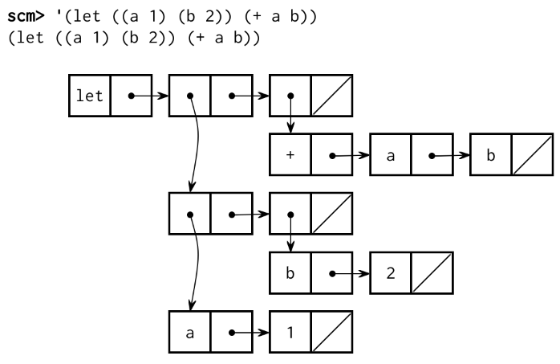

# Project 4: Scheme Interpreter


> Adapted from cs61a of UC Berkeley.


<center>Eval calls apply, which just calls eval again! When does it all end?</center>


## Introduction

> The Scheme project involves writing an interpreter for the Scheme language which is no small task! Start working on the project *now*! There are many parts and students often get stuck throughout the project so it's best to solve these problems early while there's still plenty of time. Remember that you can ask questions about the project in the comment section.
>
> We've also written a language specification and built-in procedure reference (which is in the same folder with this handout) for the SICP subset of Scheme that you'll be building in this project. Reading the entirety of either of these documents should not be necessary, but we'll point out useful sections from the documentation in each part of the project.

In this project, you will develop an interpreter for a subset of the Scheme language. As you proceed, think about the issues that arise in the design of a programming language; many quirks of languages are byproducts of implementation decisions in interpreters and compilers. The subset of the language used in this project is described in the [functional programming](http://composingprograms.com/pages/32-functional-programming.html) section of Composing Programs. Since we only include a subset of the language, your interpreter will not exactly match the behavior of other interpreters.

You will also implement some small programs in Scheme. Scheme is a simple but powerful functional language. You should find that much of what you have learned about Python transfers cleanly to Scheme as well as to other programming languages.


## Download starter files

To get started, download all of the project code.

```shell
git clone https://github.com/JacyCui/sicp-proj04.git
cd sicp-proj04
unzip scheme.zip
```

This project includes several files, but all of your changes will be made to only four: `scheme.py`, `scheme_reader.py`, `questions.scm`, and `tests.scm`. Here are all the files included in the `scheme.zip` archive:

- `scheme.py`: implements the REPL and a evaluator for Scheme expressions
- `scheme_reader.py`: implements the reader for Scheme input. The `Pair` class and `nil` definition can be found here.
- `scheme_tokens.py`: implements the tokenizer for Scheme input
- `scheme_builtins.py`: implements built-in Scheme procedures in Python
- `buffer.py`: implements the `Buffer` class, used in `scheme_reader.py`
- `ucb.py`: utility functions for use in SICP projects
- `questions.scm`: contains skeleton code for Phase III
- `tests.scm`: a collection of test cases written in Scheme
- `ok`: the autograder
- `tests`: a directory of tests used by `ok`
- `mytests.rst`: a file where you can add your own tests


## Logistics

You will turn in the following files:

- `scheme_reader.py`
- `scheme.py`
- `questions.scm`
- `tests.scm`

You do not need to modify or turn in any other files to complete the project.

For the functions that we ask you to complete, there may be some initial code that we provide. If you would rather not use that code, feel free to delete it and start from scratch. You may also add new function definitions as you see fit.

However, please do **not** modify any other functions. Doing so may result in your code failing our autograder tests. Also, please do not change any function signatures (names, argument order, or number of arguments).

Throughout this project, you should be testing the correctness of your code. It is good practice to test often, so that it is easy to isolate any problems. However, you should not be testing *too* often, to allow yourself time to think through problems.

We have provided an **autograder** called `ok` to help you with testing your code and tracking your progress.

The primary purpose of `ok` is to test your implementations.

As you are not a student of UC Berkeley, You should always run ok like this:

```shell
python3 ok --local
```

If you want to test your code interactively, you can run

```shell
 python3 ok -q [question number] -i --local
```

with the appropriate question number (e.g. `01`) inserted. This will run the tests for that question until the first one you failed, then give you a chance to test the functions you wrote interactively.

You can also use the debug printing feature in OK by writing

```python
 print("DEBUG:", x)
```

which will produce an output in your terminal without causing OK tests to fail with extra output.


## Interpreter details

### Scheme features

**Read-Eval-Print.** The interpreter reads Scheme expressions, evaluates them, and displays the results.

```scheme
scm> 2
2
scm> (+ 2 3)
5
scm> ((lambda (x) (* x x)) 5)
25
```

The starter code for your Scheme interpreter in `scheme.py` can successfully evaluate the first expression above, since it consists of a single number. The second (a call to a built-in procedure) and the third (a computation of 5 squared) will not work just yet.

**Load.** You can load a file by passing in a symbol for the file name. For example, to load `tests.scm`, evaluate the following call expression.

```scheme
scm> (load 'tests)
```

**Symbols.** Various dialects of Scheme are more or less permissive about identifiers (which serve as symbols and variable names).

Our rule is that:

> An identifier is a sequence of letters (a-z and A-Z), digits, and characters in `!$%&*/:<=>?@^_~-+.` that do not form a valid integer or floating-point numeral and are not existing special form shorthands.

Our version of Scheme is case-insensitive: two identifiers are considered identical if they match except possibly in the capitalization of letters. They are internally represented and printed in lower case:

```scheme
scm> 'Hello
hello
```

**Turtle Graphics.** In addition to standard Scheme procedures, we include procedure calls to the Python `turtle` package.

You can read the [turtle module documentation](http://docs.python.org/py3k/library/turtle.html) online.

*Note*: The `turtle` Python module may not be installed by default on your personal computer. So, if you wish to create turtle graphics for this project, then you'll need to setup `turtle` on your personal computer.

### Implementation overview

Here is a brief overview of each of the Read-Eval-Print Loop components in our interpreter. Refer to this section as you work through the project as a reminder of how all the small pieces fit together!

- **Read**: This step parses user input (a string of Scheme code) into our interpreter's internal Python representation of Scheme expressions (e.g. Pairs).
    - *Lexical analysis* has already been implemented for you in the `tokenize_lines` function in `scheme_tokens.py`. This function returns a `Buffer` (from `buffer.py`) of tokens. You do not need to read or understand the code for this step.
    - *Syntactic analysis* happens in `scheme_reader.py`, in the `scheme_read` and `read_tail` functions. Together, these mutually recursive functions parse Scheme tokens into our interpreter's internal Python representation of Scheme expressions. You will complete both functions.
- **Eval**: This step evaluates Scheme expressions (represented in Python) to obtain values. Code for this step is in the main `scheme.py` file.
    - *Eval* happens in the `scheme_eval` function. If the expression is a call expression, it gets evaluated according to the rules for evaluating call expressions (you will implement this). If the expression being evaluated is a special form, the corresponding `do_?_form` function is called. You will complete several of the `do_?_form` functions.
    - *Apply* happens in the `scheme_apply` function. If the function is a built-in procedure, `scheme_apply` calls the `apply` method of that `BuiltInProcedure` instance. If the procedure is a user-defined procedure, `scheme_apply` creates a new call frame and calls `eval_all` on the body of the procedure, resulting in a mutually recursive eval-apply loop.
- **Print**: This step prints the `__str__` representation of the obtained value.
- **Loop**: The logic for the loop is handled by the `read_eval_print_loop` function in `scheme.py`. You do not need to understand the entire implementation.

**Exceptions.** As you develop your Scheme interpreter, you may find that Python raises various uncaught exceptions when evaluating Scheme expressions. As a result, your Scheme interpreter will halt. Some of these may be the results of bugs in your program, but some might just be errors in user programs. The former should be fixed by debugging your interpreter and the latter should be handled by your code, usually by raising a `SchemeError`. All `SchemeError` exceptions are handled and printed as error messages by the `read_eval_print_loop` function in `scheme.py`. Ideally, there should *never* be unhandled Python exceptions for any input to your interpreter.

### Running the interpreter

To start an interactive Scheme interpreter session, type:

```shell
python3 scheme.py
```

You can use your Scheme interpreter to evaluate the expressions in an input file by passing the file name as a command-line argument to `scheme.py`:

```shell
python3 scheme.py tests.scm
```

Currently, your Scheme interpreter can handle a few simple expressions, such as:

```scheme
scm> 1
1
scm> 42
42
scm> true
#t
```

To exit the Scheme interpreter, press `Ctrl-d` or evaluate the `exit` procedure (after completing problems 3 and 4):

```scheme
scm> (exit)
```


## Part 0: Testing Your Interpreter

The `tests.scm` file contains a long list of sample Scheme expressions and their expected values. Many of these examples are from Chapters 1 and 2 of Structure and Interpretation of Computer Programs, the textbook from which Composing Programs is adapted.


## Part I: The Reader

> All changes in this part should be made in `scheme_reader.py`.

In Parts I and II, you will develop the interpreter in several stages:

- Reading Scheme expressions
- Symbol evaluation
- Calling built-in procedures
- Definitions
- Lambda expressions and procedure definition
- Calling user-defined procedures
- Evaluation of special forms

The first part of this project deals with reading and parsing user input. Our reader will parse Scheme code into Python values with the following representations:

| Input Example  | Scheme Expression Type | Our Internal Representation                                  |
| :------------- | :--------------------- | :----------------------------------------------------------- |
| `scm> 1`       | Numbers                | Python's built-in `int` and `float` values                   |
| `scm> x`       | Symbols                | Python's built-in `string` values                            |
| `scm> #t`      | Booleans (`#t`, `#f`)  | Python's built-in `True`, `False` values                     |
| `scm> (+ 2 3)` | Combinations           | Instances of the `Pair` class, defined in `scheme_reader.py` |
| `scm> nil`     | `nil`                  | The `nil` object, defined in `scheme_reader.py`              |

When we refer to combinations in this project, we are referring to both call expressions and special forms.

If you haven't already, make sure to read the Implementation overview section above to understand how the reader is broken up into parts.

In our implementation, we store tokens ready to be parsed in `Buffer` instances. For example, a buffer containing the input `(+ (2 3))` would have the tokens `'('`, `'+'`, `'('`, `2`, `3`, `')'`, and `')'`. See the doctests in `buffer.py` for more examples. You do not have to understand the code in this file.

You will write the parsing functionality, which consists of two mutually recursive functions `scheme_read` and `read_tail`. These functions each take in a single parameter, `src`, which is an instance of `Buffer`.

There are two methods defined in `buffer.py` that you'll use to interact with `src`:

- `src.pop_first()`: mutates `src` by removing the **first** token in `src` and returns it. For the sake of simplicity, if we imagine `src` as a Buffer containing `[4, 3, ')']`, `src.pop_first()` will return `4`, and `src` will be left with `[3, ')']`.
- `src.current()`: returns the **first** token in `src` without removing it. For example, if `src` currently contains the tokens `[4, 3, ')']`, then `src.current()` will return `4` but `src` will remain the same.

Note that you cannot index into the Buffer object (i.e. `buffer[1]` is not valid).


### Problem 1

First, implement `scheme_read` and `read_tail` so that they can parse combinations and atomic expressions. The expected behavior is as follows:

- `scheme_read` removes enough tokens from `src` to form a single expression and returns that expression in the correct internal representation (see above table).
- `read_tail` expects to read the rest of a list or pair, assuming the open parenthesis of that list or pair has already been removed by `scheme_read`. It will read expressions (and thus remove tokens) until the matching closing parenthesis `)` is seen. This list of expressions is returned as a linked list of `Pair` instances.

In short, `scheme_read` returns the next single complete expression in the buffer and `read_tail` returns the rest of a list or pair in the buffer. Both functions mutate the buffer, removing the tokens that have already been processed.

The behavior of both functions depends on the first token currently in `src`. They should be implemented as follows:

`scheme_read`:

- If the current token is the string `"nil"`, return the `nil` object.
- If the current token is `(`, the expression is a pair or list. Call `read_tail` on the rest of `src` and return its result.
- If the current token is `'`, the rest of the buffer should be processed as a `quote` expression. You don't have to worry about this until Problem 6.
- If the next token is not a delimiter, then it must be a primitive expression (i.e. a number, boolean). Return it. **(provided)**
- If none of the above cases apply, raise an error. **(provided)**

`read_tail`:

- If there are no more tokens, then the list is missing a close parenthesis and we should raise an error. **(provided)**
- If the token is `)`, then we've reached the end of the list or pair. **Remove this token from the buffer** and return the `nil` object.
- If none of the above cases apply, the next token is the operator in a combination, e.g. src contains `+ 2 3)`. To parse this:
    1. `scheme_read` the next complete expression in the buffer.
    2. Call `read_tail` to read the rest of the combination until the matching closing parenthesis.
    3. Return the results as a `Pair` instance, where the first element is the next complete expression from (1) and the second element is the rest of the combination from (2).

For more hints and a start on how to approach this problem, take a look at this portion of lecture for additional skeleton code.

Before writing any code, test your understanding of the problem:

```shell
python3 ok -q 01 -u --local
```

After writing code, test your implementation:

```shell
python3 ok -q 01 --local
```

Now that your parser is complete, you should test the read-eval-print loop by running `python3 scheme_reader.py --repl`. Every time you type in a value into the prompt, both the `str` and `repr` values of the parsed expression are printed. You can try the following inputs

```scheme
read> 42
str : 42
repr: 42
read> nil
str : ()
repr: nil
read> (1 (2 3) (4 (5)))
str : (1 (2 3) (4 (5)))
repr: Pair(1, Pair(Pair(2, Pair(3, nil)), Pair(Pair(4, Pair(Pair(5, nil), nil)), nil)))
```

To exit the interpreter, you can type `exit`.


## Part II: The Evaluator

In the starter implementation given to you, the evaluator can only evaluate self-evaluating expressions: numbers, booleans, and `nil`.

Read the first two sections of `scheme.py`, called Eval/Apply and Environments.

- `scheme_eval` evaluates a Scheme expression in the given environment. This function is nearly complete but is missing the logic for call expressions.
- When evaluating a special form, `scheme_eval` redirects evaluation to an appropriate `do_?_form` function found in the Special Forms section in `scheme.py`.
- `scheme_apply` applies a procedure to some arguments. This function is complete.
- The `.apply` methods in subclasses of `Procedure` and the `make_call_frame` function assist in applying built-in and user-defined procedures.
- The `Frame` class implements an environment frame.
- The `LambdaProcedure` class (in the Procedures section) represents user-defined procedures.

These are all of the essential components of the interpreter; the rest of `scheme.py` defines special forms and input/output behavior.

Test your understanding of how these components fit together by unlocking the tests for `eval_apply`.

```shell
python3 ok -q eval_apply -u --local
```

### Some Core Functionality

#### Problem 2

Implement the `define` and `lookup` methods of the `Frame` class. Each `Frame` object has the following instance attributes:

- `bindings` is a dictionary representing the bindings in the frame. It maps Scheme symbols (represented as Python strings) to Scheme values.
- `parent` is the parent `Frame` instance. The parent of the Global Frame is `None`.

1.  `define` takes a symbol (represented by a Python string) and a value and binds the value to that symbol in the frame.

2.  `lookup` takes a symbol and returns the value bound to that name in the first `Frame` that the name is found in the current environment. Recall that an *environment* is defined as a frame, its parent frame, and all its ancestor frames, including the Global Frame. Therefore,

- If the name is found in the current frame, return its value.
- If the name is not found in the current frame and the frame has a parent frame, continue lookup in the parent frame.
- If the name is not found in the current frame and there is no parent frame, raise a `SchemeError` **(provided)**.

Before writing any code, test your understanding of the problem:

```shell
python3 ok -q 02 -u --local
```

After writing code, test your implementation:

```shell
python3 ok -q 02 --local
```

After you complete this problem, you can open your Scheme interpreter (with `python3 scheme.py`). You should be able to look up built-in procedure names:

```scheme
scm> +
#[+]
scm> odd?
#[odd?]
scm> display
#[display]
```

However, your Scheme interpreter will still not be able to call these procedures. Let's fix that.

Remember, at this point you can only exit the interpreter by pressing `Ctrl-d`.


#### Problem 3

To be able to call built-in procedures, such as `+`, you need to complete the `apply` method in the class `BuiltinProcedure`. Built-in procedures are applied by calling a corresponding Python function that implements the procedure. For example, the `+` procedure in Scheme is implemented as the `add` function in Python.

> To see a list of all Scheme built-in procedures used in the project, look in the `scheme_builtins.py` file. Any function decorated with `@builtin` will be added to the globally-defined `BUILTINS` list.

A `BuiltinProcedure` has two instance attributes:

- `fn` is the *Python* function that implements the built-in Scheme procedure.
- `use_env` is a Boolean flag that indicates whether or not this built-in procedure will expect the current environment to be passed in as the last argument. The environment is required, for instance, to implement the built-in `eval` procedure.

The `apply` method of `BuiltinProcedure` takes a list of argument values and the current environment. Note that `args` is a Scheme list represented as a `Pair` object. Your implementation should do the following:

- Convert the Scheme list to a Python list of arguments. *Hint:* `args` is a Pair, which has a `.first` and `.rest` similar to a Linked List. Think about how you would put the values of a Linked List into a list.
- If `self.use_env` is `True`, then add the current environment `env` as the last argument to this Python list.
- Call `self.fn` on all of those arguments using `*args` notation (`f(1, 2, 3)` is equivalent to `f(*[1, 2, 3]`)) **Provided**
- If calling the function results in a `TypeError` exception being raised, then the wrong number of arguments were passed. Use a `try`/`except` block to intercept the exception and raise an appropriate `SchemeError` in its place. **Provided**

Before writing any code, test your understanding of the problem:

```shell
python3 ok -q 03 -u --local
```

After writing code, test your implementation:

```shell
python3 ok -q 03 --local
```


#### Problem 4

`scheme_eval` evaluates a Scheme expression, represented as a sequence of `Pair` objects, in a given environment. Most of `scheme_eval` has already been implemented for you. It currently looks up names in the current environment, returns self-evaluating expressions (like numbers) and evaluates special forms.

Implement the missing part of `scheme_eval`, which evaluates a call expression. To evaluate a call expression, we do the following:

1. Evaluate the operator (which should evaluate to an instance of `Procedure`)
2. Evaluate all of the operands
3. Apply the procedure on the evaluated operands, and return the result

You'll have to recursively call `scheme_eval` in the first two steps. Here are some other functions/methods you should use:

- The `validate_procedure` function raises an error if the provided argument is not a Scheme procedure. You can use this to validate that your operator indeed evaluates to a procedure.
- The `map` method of `Pair` returns a new Scheme list constructed by applying a *one-argument function* to every item in a Scheme list.
- The `scheme_apply` function applies a Scheme procedure to a Scheme list of arguments.

Note: Please do not mutate the passed in `expr`.

Before writing any code, test your understanding of the problem:

```shell
python3 ok -q 04 -u --local
```

After writing code, test your implementation:

```shell
python3 ok -q 04 --local
```

> Note: some of these tests call a primitive (built-in) procedure called `print-then-return`. This is a "dummy" procedure used only in this project, so you will not need to use it elsewhere. You will only ever come across it if you are failing those tests.
>
> `print-then-return` takes in two arguments. It prints out its first argument and then returns its second.

Your interpreter should now be able to evaluate built-in procedure calls, giving you the functionality of the Calculator language and more.

```scheme
scm> (+ 1 2)
3
scm> (* 3 4 (- 5 2) 1)
36
scm> (odd? 31)
#t
```


#### Problem 5

Next, we'll implement defining names. Recall that the `define` special form in Scheme can be used to either assign a name to the value of a given expression or to create a procedure and bind it to a name:

```scheme
scm> (define a (+ 2 3))  ; Binds the name a to the value of (+ 2 3)
a
scm> (define (foo x) x)  ; Creates a procedure and binds it to the name foo
foo
```

The type of the first operand tells us what is being defined:

- If it is a symbol, e.g. `a`, then the expression is defining a name
- If it is a list, e.g. `(foo x)`, then the expression is defining a procedure.

> Read the Scheme Specifications to understand the behavior of the `define` special form! This problem only provides the behavior for binding expressions, not procedures, to names.

There are two missing parts in the `do_define_form` function, which handles the `(define ...)` special forms. For this problem, implement **just the first part**, which evaluates the second operand to obtain a value and binds the first operand, a symbol, to that value. `do_define_form` should return the name after performing the binding.

```scheme
scm> (define tau (* 2 3.1415926))
tau
```

Before writing any code, test your understanding of the problem:

```shell
python3 ok -q 05 -u --local
```

After writing code, test your implementation:

```shell
python3 ok -q 05 --local
```

You should now be able to give names to values and evaluate the resulting symbols. Note that `eval` takes an expression represented as a list and evaluates it.

```scheme
scm> (eval (define tau 6.28))
6.28
scm> (eval tau)
6.28
scm> tau
6.28
scm> (define x 15)
x
scm> (define y (* 2 x))
y
scm> y
30
scm> (+ y (* y 2) 1)
91
scm> (define x 20)
x
scm> x
20
```

Consider the following test:

```scheme
(define x 0)
; expect x
((define x (+ x 1)) 2)
; expect Error
x
; expect 1
```

Here, an Error is raised because the operator does not evaluate to a procedure. However, if the operator is evaluated multiple times before raising an error, `x` will be bound to 2 instead of 1, causing the test to fail. Therefore, if your interpreter fails this test, you'll want to make sure you only evaluate the operator once in `scheme_eval`.


#### Problem 6

To complete the core functionality, let's implement quoting in our interpreter. In Scheme, you can quote expressions in two ways: with the `quote` special form or with the symbol `'`. Recall that the `quote` special form returns its operand expression without evaluating it:

```scheme
scm> (quote hello)
hello
scm> '(cons 1 2)  ; Equivalent to (quote (cons 1 2))
(cons 1 2)
```

> Read the Scheme Specifications to understand the behavior of the `quote` special form.

Let's take care of the `quote` special form first. Implement the `do_quote_form` function so that it simply returns the unevaluated operand to the special form.

After completing this function, you should be able to evaluate quoted expressions. Try out some of the following in your interpreter!

```scheme
scm> (quote a)
a
scm> (quote (1 2))
(1 2)
scm> (quote (1 (2 three (4 5))))
(1 (2 three (4 5)))
scm> (car (quote (a b)))
a
```

Next, complete your implementation of `scheme_read` in `scheme_reader.py` by handling the case for `'`. First, notice that `'<expr>` translates to `(quote <expr>)`. That means that we need to wrap the expression following `'` (which you can get by recursively calling `scheme_read`) into the quote special form, which, like all special forms, is really just a list.

For example, `'bagel` should be represented as `Pair('quote', Pair('bagel', nil))`

For another example, `'(1 2)` should be represented as `Pair('quote', Pair(Pair(1, Pair(2, nil)), nil))`.

After completing your `scheme_read` implementation, the following quoted expressions should now work as well.

```scheme
scm> 'hello
hello
scm> '(1 2)
(1 2)
scm> '(1 (2 three (4 5)))
(1 (2 three (4 5)))
scm> (car '(a b))
a
scm> (eval (cons 'car '('(1 2))))
1
```

Before writing any code, test your understanding of the problem:

```shell
python3 ok -q 06 -u --local
```

**Note**: When you are completing the unlocking tests, make sure to write your answers using `Pair` representation when necessary.

After writing code, test your implementation:

```shell
python3 ok -q 06 --local
```

At this point in the project, your Scheme interpreter should support the following features:

- Evaluate atoms, which include numbers, booleans, nil, and symbols,
- Evaluate the `quote` special form,
- Define symbols, and
- Call built-in procedures, for example evaluating `(+ (- 4 2) 5)`.


### User-Defined Procedures

User-defined procedures are represented as instances of the `LambdaProcedure` class. A `LambdaProcedure` instance has three instance attributes:

- `formals` is a Scheme list of the formal parameters (symbols) that name the arguments of the procedure.
- `body` is a Scheme list of expressions; the body of the procedure.
- `env` is the environment in which the procedure was **defined**.

#### Problem 7

> Read the Scheme Specifications to understand the behavior of the `begin` special form!

Change the `eval_all` function in `scheme.py` (which is called from `do_begin_form`) to complete the implementation of the `begin` special form. A `begin` expression is evaluated by evaluating all sub-expressions in order. The value of the `begin` expression is the value of the final sub-expression.

```scheme
scm> (begin (+ 2 3) (+ 5 6))
11
scm> (define x (begin (display 3) (newline) (+ 2 3)))
3
x
scm> (+ x 3)
8
scm> (begin (print 3) '(+ 2 3))
3
(+ 2 3)
```

If `eval_all` is passed an empty list of expressions (`nil`), then it should return the Python value `None`, which represents the Scheme value `undefined`.

Before writing any code, test your understanding of the problem:

```shell
python3 ok -q 07 -u --local
```

After writing code, test your implementation:

```shell
python3 ok -q 07 --local
```


#### Problem 8

> Read the Scheme Specifications to understand the behavior of the `lambda` special form!

A `LambdaProcedure` represents a user-defined procedure. It has a list of `formals` (parameter names), a `body` of expressions to evaluate, and a parent frame `env`.

Implement the `do_lambda_form` function, which creates and returns a `LambdaProcedure` instance. While you cannot call a user-defined procedure yet, you can verify that you have created the procedure correctly by typing a lambda expression into the interpreter prompt:

```scheme
scm> (lambda (x y) (+ x y))
(lambda (x y) (+ x y))
```

In Scheme, it is legal to place more than one expression in the body of a procedure (there must be at least one expression). The `body` attribute of a `LambdaProcedure` instance is a Scheme list of body expressions.

Before writing any code, test your understanding of the problem:

```shell
python3 ok -q 08 -u --local
```

After writing code, test your implementation:

```shell
python3 ok -q 08 --local
```


#### Problem 9

> Read the Scheme Specifications to understand the behavior of the `define` special form! In this problem, we'll finish defining the `define` form for procedures.

Currently, your Scheme interpreter is able to bind symbols to user-defined procedures in the following manner:

```scheme
scm> (define f (lambda (x) (* x 2)))
f
```

However, we'd like to be able to use the shorthand form of defining named procedures:

```scheme
scm> (define (f x) (* x 2))
```

Modify the `do_define_form` function so that it correctly handles the shorthand procedure definition form above. Make sure that it can handle multi-expression bodies.

Your implementation should do the following:

- Using the given variables `target` and `expressions`, find the defined function's name, formals, and body.
- Create a `LambdaProcedure` instance using the formals and body. *Hint:* You can use what you've done in Problem 8 and call `do_lambda_form` on the appropriate arguments
- Bind the name to the `LambdaProcedure` instance

Before writing any code, test your understanding of the problem:

```shell
python3 ok -q 09 -u --local
```

After writing code, test your implementation:

```shell
python3 ok -q 09 --local
```

You should now find that defined procedures evaluate to `LambdaProcedure` instances. However, you can't call them yet - we'll implement that in the next two problems.

```scheme
scm> (define (square x) (* x x))
square
scm> square
(lambda (x) (* x x))
```


#### Problem 10

Implement the `make_child_frame` method of the `Frame` class which will be used to create new call frames for user-defined procedures. This method takes in two arguments: `formals`, which is a Scheme list of symbols, and `vals`, which is a Scheme list of values. It should return a new child frame, binding the formal parameters to the values.

To do this:

- If the number of argument values does not match with the number of formal parameters, raise a `SchemeError`. **Provided**
- Create a new `Frame` instance, the parent of which is `self`.
- Bind each formal parameter to its corresponding argument value in the newly created frame. The first symbol in `formals` should be bound to the first value in `vals`, and so on.
- Return the new frame.

> *Hint:* The `define` method of a `Frame` instance creates a binding in that frame.

Before writing any code, test your understanding of the problem:

```shell
python3 ok -q 10 -u --local
```

After writing code, test your implementation:

```shell
python3 ok -q 10 --local
```


#### Problem 11

Implement the `make_call_frame` method in `LambdaProcedure`, which is needed by `scheme_apply`. It should create and return a new `Frame` instance using the `make_child_frame` method of the appropriate parent frame, binding formal parameters to argument values.

Since lambdas are lexically scoped, your new frame should be a child of the frame in which the lambda is defined. The `env` provided as an argument to `make_call_frame` is instead the frame in which the procedure is called, which will be useful if you implement dynamically scoped procedures in problem 18 (Optional).

Before writing any code, test your understanding of the problem:

```shell
python3 ok -q 11 -u --local
```

After writing code, test your implementation:

```shell
python3 ok -q 11 --local
```

At this point in the project, your Scheme interpreter should support the following features:

- Create procedures using `lambda` expressions,
- Define named procedures using `define` expressions, and
- Call user-defined procedures.


### Special Forms

Logical special forms include `if`, `and`, `or`, and `cond`. These expressions are special because not all of their sub-expressions may be evaluated.

In Scheme, only `False` is a false value. All other values (including `0` and `nil`) are true values. You can test whether a value is a true or false value using the provided Python functions `is_true_primitive` and `is_false_primitive`, defined in `scheme_builtins.py`.

> Note: Scheme traditionally uses `#f` to indicate the false Boolean value. In our interpreter, that is equivalent to `false` or `False`. Similarly, `true`, `True`, and `#t` are all equivalent. However when unlocking tests, use `#t` and `#f`.

To get you started, we've provided an implementation of the `if` special form in the `do_if_form` function. Make sure you understand that implementation before starting the following questions.


#### Problem 12

> Read the Scheme Specifications to understand the behavior of the `and` and `or` special forms!

Implement `do_and_form` and `do_or_form` so that `and` and `or` expressions are evaluated correctly.

The logical forms `and` and `or` are *short-circuiting*. For `and`, your interpreter should evaluate each sub-expression from left to right, and if any of these evaluates to a false value, then `#f` is returned. Otherwise, it should return the value of the last sub-expression. If there are no sub-expressions in an `and` expression, it evaluates to `#t`.

```scheme
scm> (and)
#t
scm> (and 4 5 6)  ; all operands are true values
6
scm> (and 4 5 (+ 3 3))
6
scm> (and #t #f 42 (/ 1 0))  ; short-circuiting behavior of and
#f
```

For `or`, evaluate each sub-expression from left to right. If any sub-expression evaluates to a true value, return that value. Otherwise, return `#f`. If there are no sub-expressions in an `or` expression, it evaluates to `#f`.

```scheme
scm> (or)
#f
scm> (or 5 2 1)  ; 5 is a true value
5
scm> (or #f (- 1 1) 1)  ; 0 is a true value in Scheme
0
scm> (or 4 #t (/ 1 0))  ; short-circuiting behavior of or
4
```

Remember that you can use the provided Python functions `is_true_primitive` and `is_false_primitive` to test boolean values.

Before writing any code, test your understanding of the problem:

```shell
python3 ok -q 12 -u --local
```

After writing code, test your implementation:

```shell
python3 ok -q 12 --local
```


#### Problem 13

> Read the Scheme Specifications to understand the behavior of the `cond` special form!

Fill in the missing parts of `do_cond_form` so that it returns the value of the first result sub-expression corresponding to a true predicate, or the result sub-expression corresponding to `else`. Some special cases:

- When the true predicate does not have a corresponding result sub-expression, return the predicate value.
- When a result sub-expression of a `cond` case has multiple expressions, evaluate them all and return the value of the last expression. (*Hint*: Use `eval_all`.)

Your implementation should match the following examples and the additional tests in `tests.scm`.

```scheme
scm> (cond ((= 4 3) 'nope)
           ((= 4 4) 'hi)
           (else 'wait))
hi
scm> (cond ((= 4 3) 'wat)
           ((= 4 4))
           (else 'hm))
#t
scm> (cond ((= 4 4) 'here (+ 40 2))
           (else 'wat 0))
42
```

The value of a `cond` is `undefined` if there are no true predicates and no `else`. In such a case, `do_cond_form` should return `None`. If there is only an `else`, return its sub-expression. If it doesn't have one, return `#t`.

```scheme
scm> (cond (False 1) (False 2))
scm> (cond (else))
#t
```

Before writing any code, test your understanding of the problem:

```shell
python3 ok -q 13 -u --local
```

After writing code, test your implementation:

```shell
python3 ok -q 13 --local
```


#### Problem 14

> Read the Scheme Specifications to understand the behavior of the `let` special form!

The `let` special form binds symbols to values locally, giving them their initial values. For example:

```scheme
scm> (define x 5)
x
scm> (define y 'bye)
y
scm> (let ((x 42)
           (y (* x 10)))  ; x refers to the global value of x, not 42
       (list x y))
(42 50)
scm> (list x y)
(5 bye)
```

Implement `make_let_frame`, which returns a child frame of `env` that binds the symbol in each element of `bindings` to the value of its corresponding expression. The `bindings` scheme list contains pairs that each contain a symbol and a corresponding expression.

You may find the following functions and methods useful:

- `validate_form`: this function can be used to validate the structure of each binding. It takes in a list `expr` of expressions and a `min` and `max` length. If `expr` is not a proper list or does not have between `min` and `max` items inclusive, it raises an error. If no `max` is passed in, the default is infinity.
- `validate_formals`: this function validates that formal parameters are a Scheme list of symbols for which each symbol is distinct.
- `make_child_frame`: this method of the `Frame` class (which you implemented in Problem 11) takes a `Pair` of formal parameters (symbols) and a `Pair` of values, and returns a new frame with all the symbols bound to the corresponding values.

Before writing any code, test your understanding of the problem:

```shell
python3 ok -q 14 -u --local
```

After writing code, test your implementation:

```shell
python3 ok -q 14 --local
```

> To run the additional scheme tests (worth 1 point), run the command:
>
> ```shell
>   python3 ok -q tests.scm --local
> ```
>
> Make sure to remove all of the `(exit)` commands not in the optional section, so that all the tests are run! **The best way to check that you've passed all of the required tests and removed the correct `(exit)` commands is to use the score command in ok.** If you have passed all of the required cases, you should see 1/1 points received for `tests.scm` if you run `python ok --score --local`.
>
> If you'd like to check your score so far, use the following command:
>
> ```shell
> python3 ok --score --local
> ```

Congratulations! Your Scheme interpreter implementation is now complete!


## Part III: Write Some Scheme

> Not only is your Scheme interpreter itself a tree-recursive program, but it is flexible enough to evaluate *other* recursive programs. Implement the following procedures in Scheme in the `questions.scm` file.
>
> In addition, for this part of the project, you may find the built-in procedure reference very helpful if you ever have a question about the behavior of a built-in Scheme procedure, like the difference between `pair?` and `list?`.

The autograder tests for the interpreter are *not* comprehensive, so you may have uncaught bugs in your implementation. Therefore, you may find it useful to test your code for these questions in the staff interpreter or the [web editor](https://code.cs61a.org/scheme) and then try it in your own interpreter once you are confident your Scheme code is working.

### Scheme Editor

As you're writing your code, you can debug using the Scheme Editor. In your `scheme` folder you will find a new editor. To run this editor, run `python3 editor`. This should pop up a window in your browser; if it does not, please navigate to [localhost:31415](localhost:31415) and you should see it.

Make sure to run `python3 ok` in a separate tab or window so that the editor keeps running.

#### Problem 15

Implement the `enumerate` procedure, which takes in a list of values and returns a list of two-element lists, where the first element is the index of the value, and the second element is the value itself.

```scheme
scm> (enumerate '(3 4 5 6))
((0 3) (1 4) (2 5) (3 6))
scm> (enumerate '())
()
```

Test your implementation before moving on:

```shell
python3 ok -q 15 --local
```


#### Problem 16

Implement the `merge` procedure, which takes in a comparator and two sorted list arguments and combines them into one sorted list. A comparator is a function that compares two values. Here, sorted means sorted according to the comparator. For example:

```scheme
scm> (merge < '(1 4 6) '(2 5 8))
(1 2 4 5 6 8)
scm> (merge > '(6 4 1) '(8 5 2))
(8 6 5 4 2 1)
```

In case of a tie, you can choose to break the tie arbitrarily.

Test your implementation before moving on:

```shell
python3 ok -q 16 --local
```


#### Problem 17

Define a function `nondecreaselist`, which takes in a scheme list of numbers and outputs a list of lists, which overall has the same numbers in the same order, but grouped into lists that are non-decreasing.

For example, if the input is a list containing elements

```scheme
(1 2 3 4 1 2 3 4 1 1 1 2 1 1 0 4 3 2 1)
```

the output should contain elements

```scheme
((1 2 3 4) (1 2 3 4) (1 1 1 2) (1 1) (0 4) (3) (2) (1))
```

After writing code, test your implementation:

```shell
python3 ok -q 17 --local
```


#### Extra Credit

In Scheme, source code is data. Every non-atomic expression is written as a Scheme list, so we can write procedures that manipulate other programs just as we write procedures that manipulate lists.

Rewriting programs can be useful: we can write an interpreter that only handles a small core of the language, and then write a procedure that converts other special forms into the core language before a program is passed to the interpreter.

For example, the `let` special form is equivalent to a call expression that begins with a `lambda` expression. Both create a new frame extending the current environment and evaluate a body within that new environment.

```scheme
(let ((a 1) (b 2)) (+ a b))
;; Is equivalent to:
((lambda (a b) (+ a b)) 1 2)
```

These expressions can be represented by the following diagrams:

| Let             | Lambda                |
| --------------- | --------------------- |
|  |  |

Use this rule to implement a procedure called `let-to-lambda` that rewrites all `let` special forms into `lambda` expressions. If we quote a `let` expression and pass it into this procedure, an equivalent `lambda` expression should be returned: pass it into this procedure:

```scheme
scm> (let-to-lambda '(let ((a 1) (b 2)) (+ a b)))
((lambda (a b) (+ a b)) 1 2)
scm> (let-to-lambda '(let ((a 1)) (let ((b a)) b)))
((lambda (a) ((lambda (b) b) a)) 1)
```

In order to handle all programs, `let-to-lambda` must be aware of Scheme syntax. Since Scheme expressions are recursively nested, `let-to-lambda` must also be recursive. In fact, the structure of `let-to-lambda` is somewhat similar to that of `scheme_eval`--but in Scheme! As a reminder, atoms include numbers, booleans, nil, and symbols. You do not need to consider code that contains quasiquotation for this problem.

```scheme
(define (let-to-lambda expr)
  (cond ((atom?   expr) <rewrite atoms>)
        ((quoted? expr) <rewrite quoted expressions>)
        ((lambda? expr) <rewrite lambda expressions>)
        ((define? expr) <rewrite define expressions>)
        ((let?    expr) <rewrite let expressions>)
        (else           <rewrite other expressions>)))
```

> *Hint*: You may want to implement `zip` at the top of `questions.scm` and also use the built-in `map` procedure.
>
> ```scheme
> scm> (zip '((1 2) (3 4) (5 6)))
> ((1 3 5) (2 4 6))
> scm> (zip '((1 2)))
> ((1) (2))
> scm> (zip '())
> (() ())
> ```

Test your implementation by running

```shell
python3 ok -q EC --local
```

> *Note*: We used `let` while defining `let-to-lambda`. What if we want to run `let-to-lambda` on an interpreter that does not recognize `let`? We can pass `let-to-lambda` to itself to rewrite itself into an *equivalent program without* `let`:
>
> ```scheme
> ;; The let-to-lambda procedure
> (define (let-to-lambda expr)
>   ...)
> 
> ;; A list representing the let-to-lambda procedure
> (define let-to-lambda-code
>   '(define (let-to-lambda expr)
>      ...))
> 
> ;; A let-to-lambda procedure that does not use 'let'!
> (define let-to-lambda-without-let
>   (let-to-lambda let-to-lambda-code))
> ```


## Part IV: Optional

### Problem 18

> Read the Scheme Specifications to understand the behavior of the `mu` special form!

All of the Scheme procedures we've seen so far use *lexical scoping:* the parent of the new call frame is the environment in which the procedure was **defined**. Another type of scoping, which is not standard in Scheme, is called *dynamic scoping:* the parent of the new call frame is the environment in which the procedure was **evaluated**. With dynamic scoping, calling the same procedure in different parts of your code can lead to different results (because of varying parent frames).

In this problem, we will implement the `mu` special form, a non-standard Scheme expression type representing a procedure that is dynamically scoped.

In the example below, we use the `mu` keyword instead of `lambda` to define a dynamically scoped procedure `f`:

```scheme
scm> (define f (mu () (* a b)))
f
scm> (define g (lambda () (define a 4) (define b 5) (f)))
g
scm> (g)
20
```

The procedure `f` does not have an `a` or `b` defined; however, because `f` gets called within the procedure `g`, it has access to the `a` and `b` defined in `g`'s frame.

Implement `do_mu_form` to evaluate the `mu` special form. A `mu` expression is similar to a `lambda` expression, but evaluates to a `MuProcedure` instance that is **dynamically scoped**. Most of the `MuProcedure` class has been provided for you.

In addition to filling out the body of `do_mu_form`, you'll need to complete the `MuProcedure` class so that when a call on such a procedure is executed, it is dynamically scoped. This means that when a `MuProcedure` created by a `mu` expression is called, the parent of the new call frame is the environment in which the call expression was **evaluated**. As a result, a `MuProcedure` does not need to store an environment as an instance attribute. It can refer to names in the environment from which it was called.

Looking at `LambdaProcedure` should give you a clue about what needs to be done to `MuProcedure` to complete it. You will not need to modify any existing methods, but may wish to implement new ones.

Before writing any code, test your understanding of the problem:

```shell
python3 ok -q 18 -u --local
```

After writing code, test your implementation:

```shell
python3 ok -q 18 --local
```


### Problem 19

Complete the function `optimize_tail_calls` in `scheme.py`. It returns an alternative to `scheme_eval` that is properly tail recursive. That is, the interpreter will allow an unbounded number of active [tail calls](http://en.wikipedia.org/wiki/Tail_call) in constant space.

The `Thunk` class represents a [thunk](http://en.wikipedia.org/wiki/Thunk), an expression that needs to be evaluated in an environment. When `scheme_optimized_eval` receives a non-atomic expression in a `tail` context, then it returns an `Thunk` instance. Otherwise, it should repeatedly call `prior_eval_function` until the result is a value, rather than a `Thunk`.

**A successful implementation will require changes to several other functions, including some functions that we provided for you.** All expressions throughout your interpreter that are in a tail context should be evaluated by calling `scheme_eval` with `True` as a third argument. Your goal is to determine which expressions are in a tail context throughout your code.

Once you finish, uncomment the following line in `scheme.py` to use your implementation:

```python
scheme_eval = optimize_tail_calls(scheme_eval)
```

Test your implementation before moving on:

```shell
python3 ok -q 19 --local
```


### Problem 20

Macros allow the language itself to be extended by the user. Simple macros can be provided with the `define-macro` special form. This must be used like a procedure definition, and it creates a procedure just like `define`. However, this procedure has a special evaluation rule: it is applied to its arguments without first evaluating them. Then the result of this application is evaluated.

This final evaluation step takes place in the caller's frame, as if the return value from the macro was literally pasted into the code in place of the macro.

Here is a simple example:

```scheme
scm> (define (map f lst) (if (null? lst) nil (cons (f (car lst)) (map f (cdr lst)))))
scm> (define-macro (for formal iterable body)
....     (list 'map (list 'lambda (list formal) body) iterable))
scm> (for i '(1 2 3)
....     (print (* i i)))
1
4
9
(None None None)
```

The code above defines a macro `for` that acts as a `map` except that it doesn't need a lambda around the body.

In order to implement `define-macro`, implement complete the implementation for `do_define_macro`, which should create a `MacroProcedure` and bind it to the given name as in `do_define_form`. Then, update `scheme_eval` so that calls to macro procedures are evaluated correctly.

> *Hint* : Use the `apply_macro` method in the `MacroProcedure` class to apply a macro to the operands in its call expression. This procedure is written to interact well with tail call optimization.

Test your implementation before moving on:

```shell
python3 ok -q 20 --local
```


## Conclusion

**Congratulations!** You have just implemented an interpreter for an entire language! If you enjoyed this project and want to extend it further, you may be interested in looking at more advanced features, like [let* and letrec](http://schemers.org/Documents/Standards/R5RS/HTML/r5rs-Z-H-7.html#%_sec_4.2.2), [unquote splicing](http://schemers.org/Documents/Standards/R5RS/HTML/r5rs-Z-H-7.html#%_sec_4.2.6), [error tracing](https://en.wikipedia.org/wiki/Stack_trace), and [continuations](https://en.wikipedia.org/wiki/Call-with-current-continuation).


